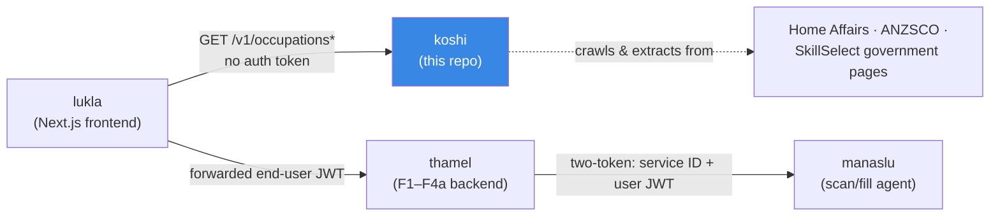
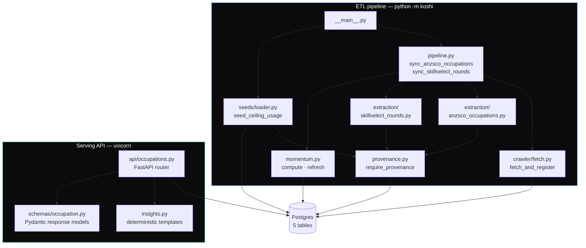
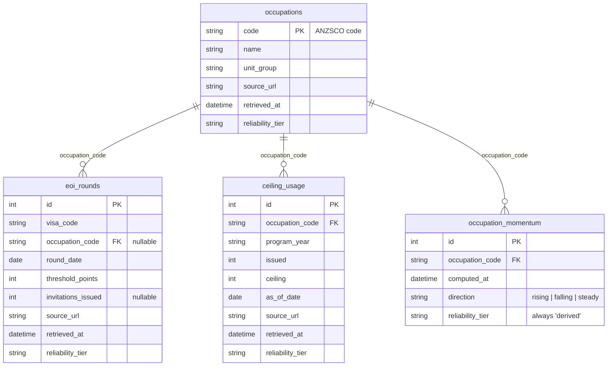
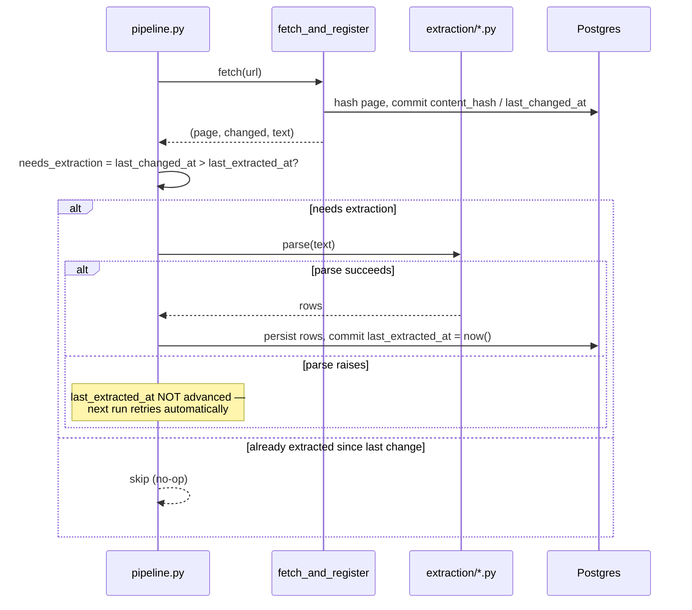

# koshi — Architecture

**Status:** Reflects the implementation as merged to `main` (occupation
vertical slice — see `docs/superpowers/plans/2026-08-14-koshi-occupation-slice-v2.md`).
**Date:** 2026-08-15

This doc explains how koshi is actually built: the components, how data
flows through them, the data model, and the design principles that shape
every piece. For *why* koshi exists and its full intended data model (most
of which isn't built yet), see
[`docs/superpowers/specs/2026-08-14-koshi-design.md`](superpowers/specs/2026-08-14-koshi-design.md) —
this doc describes the subset that's real today.

## 1. Where koshi sits

> **📐 Full ETL pipeline design** (all 16 sources, the complete data model,
> fault tolerance, sequencing, target scheduling/deployment, and the full
> technology-alternatives record) lives in the canonical
> [`docs/superpowers/specs/2026-08-16-koshi-etl-architecture.md`](superpowers/specs/2026-08-16-koshi-etl-architecture.md).
> This file documents the subset that's *actually built* today; that doc is
> the target architecture. The earlier
> `docs/ETL-PIPELINE-ARCHITECTURE.md` is an independent draft that doc's own
> banner explains and supersedes.

koshi is one of five repos in the Saathi product family. It's the only one
with no end-user identity anywhere in it — the data it serves is public and
identical for every caller.

koshi never calls thamel or manaslu, and they never call it. lukla is the
only consumer today, reached with no auth token at all (production
deployment will restrict this to Cloud Run IAM invoker identities — see §6).

## 2. Two runtime shapes, one codebase

koshi has no server-side scheduler yet. It runs as two separate processes,
both importing the same `src/koshi/` package:

- **ETL pipeline** — `python -m koshi` (`src/koshi/__main__.py`). A one-shot
  script that does exactly what "ETL" names: **E**xtract (fetch raw HTML off
  a government page), **T**ransform (parse it into typed rows, plus derive
  momentum from rows already stored), **L**oad (persist into Postgres) —
  with a validation gate (`provenance.py`) in between transform and load.
  Run manually today; the design spec's intended production shape is a
  Cloud Run Job on a schedule (design spec §5) — not built yet.
- **Serving API** — `uvicorn koshi.main:app`. The FastAPI app that answers
  HTTP requests against whatever the ETL pipeline has already persisted.
  Read-only; it never fetches, parses, or crawls anything itself. This is
  the part that isn't ETL — koshi is an ETL pipeline *feeding* a serving
  API, not ETL alone.

| ETL stage | Module | |
|---|---|---|
| **E**xtract | `crawler/fetch.py` | Raw HTTP fetch + content hash, nothing parsed yet |
| **T**ransform | `extraction/anzsco_occupations.py`, `extraction/skillselect_rounds.py`, `momentum.py` | Raw HTML → typed rows; momentum derives a new fact from rows already loaded |
| *(validate)* | `provenance.py` | Rejects a row before it can be loaded — a data-quality gate, not one of the three letters, but standard ETL practice |
| **L**oad | `pipeline.py` (`session.add`/`merge` + `commit`) | Persists into Postgres |

**A naming collision worth knowing about, not glossing over:** koshi's own
code calls the *Transform* step "**extraction**" (the `extraction/`
folder, "extraction tier," "extraction watermark" — matching the design
spec's own vocabulary throughout). That's a different use of the word from
ETL's *Extract*, which in koshi's code is the plain HTTP fetch
(`crawler/fetch.py`). Same word, two different pipeline stages, in two
different vocabularies — the table above is the one place to check which
is meant.

## 3. Component reference

### `crawler/fetch.py` — `fetch_and_register()`
Fetches one page, SHA-256-hashes its content, and upserts a row in
`source_pages` (koshi's own crawl registry — see §8 for why this replaced
a separate crawler repo + Notion). Returns `(page, changed, text)`. It does
**not** know whether the page was successfully parsed — that's a separate
concern, deliberately (§5).

### `pipeline.py` — `sync_anzsco_occupations()`, `sync_skillselect_rounds()`
The orchestration layer: calls `fetch_and_register`, decides whether
extraction is actually needed (`_needs_extraction`, §5), calls the right
parser, dedups, persists, and — for EOI rounds — triggers a momentum
refresh for every occupation a new round touched. This is the module that
makes "the crawler feeds the parsers" true in code, not just in the design.

### `extraction/anzsco_occupations.py`, `extraction/skillselect_rounds.py`
Deterministic BeautifulSoup4/lxml parsers, one per known page shape. Each
calls `require_provenance()` before constructing a single row — provenance
is checked before data exists, not after. No LLM anywhere in this repo yet
(design spec §5 describes a PDF tier and a Claude-fallback tier for pages
that resist templating; neither is built — see §9).

### `seeds/loader.py` — `load_ceiling_usage_seed()`, `seed_ceiling_usage()`
Occupation ceiling data comes from a periodic PDF report, not a scrapable
table (design spec §4). Rather than build a PDF parser for two data points,
this slice ships a hand-curated, cited YAML file
(`seeds/ceiling_usage_manual.yaml`) and a loader that validates and
upserts it — the same `reliability_tier="official_curated"` honesty the
design spec calls for when a real source resists automation.

### `momentum.py` — `compute_momentum()`, `refresh_momentum()`
The one *derived* table in this slice: momentum is never scraped, always
computed from koshi's own `eoi_rounds` rows (trailing 3-round threshold
delta, newest vs. oldest, tie-broken by round `id`). `reliability_tier` is
always `"derived"` and there's no `source_url` — the row cites the rounds
it was computed from, not an external page.

### `provenance.py` — `require_provenance()`
The single validation gate every fact-bearing row passes through before
insertion: `reliability_tier` must be one of the three valid values, and
unless it's `"derived"`, `source_url` must be non-empty and `retrieved_at`
must be a real, non-future datetime. This is what makes "no row ships
without a source" an enforced invariant instead of a convention.

### `api/occupations.py` — the FastAPI router
Two endpoints (`GET /v1/occupations`, `GET /v1/occupations/{code}`),
read-only, no writes. Combines the latest row from each relevant table,
calls `insights.py` for the "what this means" text, and serializes every
scraped/curated fact as a `SourcedFact` (value + tier + timestamp + URL)
and the one derived fact (momentum) as a `DerivedFact` (value + tier +
timestamp, no URL) — see §7 and `docs/API.md`.

### `insights.py` — `generate_ceiling_insight()`
A pure string template, zero imports beyond the standard library, zero
side effects. Given `(issued, ceiling, direction)` it returns plain-language
text — and *never* asserts a trend it hasn't observed: when `direction` is
`None` (fewer than 3 rounds exist), the trend sentence is omitted entirely
rather than defaulting to "steady," which would be a fabricated claim. Every
output is checked by a phrase-ban test against advice language ("you
should," "you can," "you're eligible," "you qualify," "you will").

## 4. Data model

Five tables. `source_pages` is metadata about pages, not a fact; the other
four are fact tables and every one of them carries `source_url` /
`retrieved_at` / `reliability_tier` (except `occupation_momentum`, which
has no `source_url` — see §7).

`source_pages` (not shown above — no FK relationship to the fact tables) is
the crawl registry: `url` (unique), `domain`, `category`, `content_hash`,
`first_seen_at`, `last_checked_at`, `last_changed_at`, `last_extracted_at`
(nullable), `status`.

**Two schema-level integrity rules worth knowing about**, both added after
a whole-branch review found real gaps the per-table reviews couldn't see:

- `eoi_rounds` has a unique constraint on `(visa_code, occupation_code, round_date)`
  — a page re-crawled with an unrelated byte change (a footer date, a build
  stamp) can't silently duplicate a round and manufacture fake momentum.
- `ceiling_usage` has a CHECK constraint (`issued <= ceiling AND ceiling > 0`)
  — nonsensical data (e.g. a curation typo) is rejected at the database
  layer, not just hoped to be caught by application code.

Both constraints are declared on the SQLAlchemy models too
(`__table_args__`), not only in the Alembic migration — `tests/test_alembic_migrations.py`
runs the real migration chain against a scratch database and fails if the
two ever drift apart.

## 5. The extraction watermark — why two "last changed" concepts exist

`fetch_and_register` commits `content_hash` / `last_changed_at` on every
call, **before** the caller has attempted to parse anything. If parsing
then fails (a site redesign, a malformed row), naively trusting the
`changed` boolean it returns would mean: next run, the hash hasn't moved,
`changed` is `False`, and the page is silently skipped forever — a page
permanently frozen by one bad parse.

`pipeline.py` avoids this with a second watermark, `last_extracted_at`,
which only advances after a parse **and** a persist both succeed:

## 6. Auth & security

No end-user identity anywhere in this service, on purpose — the data is
public and identical for every caller, so there's no "whose data is this"
question to answer. Locally, the API has no auth at all. In production
(not yet deployed), the design calls for Cloud Run IAM invoker as the only
gate — `lukla`'s service account is the sole granted identity, not a
public endpoint. See design spec §8.

## 7. Provenance and the two fact shapes the API returns

Every response distinguishes *how confident* a fact is, not just what its
value is. Two Pydantic shapes carry this (`schemas/occupation.py`):

| Shape | Used for | Fields |
|---|---|---|
| `SourcedFact` | Anything scraped or manually curated from a real external page | `value`, `reliability_tier`, `retrieved_at`, `source_url` |
| `DerivedFact` | The one computed fact (momentum) | `value`, `reliability_tier` (always `"derived"`), `computed_at` — no `source_url`, because there isn't one |

`reliability_tier` is one of three values in this slice:
`official_scraped` (deterministic parser), `official_curated` (hand-entered
against a cited source), `derived` (computed from koshi's own rows). A
fourth value, `community_sourced`, is reserved in the design spec for a
future case where no official source exists — nothing uses it yet.

## 8. Why koshi owns its own crawler

Earlier in this project, koshi was designed to consume page-discovery and
change-detection from a separate repo (`research/au-visa-sources`), which
tracked pages in a Notion database. That model made adding a new source
domain a cross-repo coordination problem and left "what triggers
extraction" an unclear hand-off. koshi now owns the whole pipeline —
discover → detect change → extract → validate → store — inside this repo,
with `source_pages` as its own Postgres-backed registry. See design spec §5
for the full reasoning; `research/au-visa-sources`'s ongoing role (archived,
repurposed, or kept as a historical reference) is an open question in that
repo, not this one.

## 9. What's real vs. what's specified but not built

This slice deliberately covers one vertical: the Occupation view. The
design spec describes a much larger system. Concretely, **not yet built**:

- State nomination status, visa comparison, national/reference endpoints —
  separate future plans (design spec §10).
- PDF extraction tier and Claude-fallback extraction tier (design spec
  §5) — the two pages this slice scrapes are both clean HTML tables, so
  neither tier was needed yet.
- A scheduled Cloud Run Job triggering ingestion — `python -m koshi` is run
  by hand today.
- Cloud SQL / Terraform / any GCP deployment — deliberately deferred until
  local development is solid (design spec §11); see `README.md`.

See `docs/data-sources.md` for exactly which of the design spec's 16
cataloged data sources have real extraction code today versus which remain
spec-only.

## 10. Testing philosophy

Every database-touching test runs against a real local Postgres via
`tests/conftest.py`'s `db_session` fixture — never a mock, never SQLite.
The crawler's HTTP layer is the one thing mocked (`httpx.MockTransport`),
since it's the actual network boundary. `tests/test_alembic_migrations.py`
additionally runs the real Alembic migration chain against an isolated
scratch database (via `monkeypatch.setenv("DATABASE_URL", ...)`, required
because `alembic/env.py` reads the environment variable directly and would
otherwise silently target whatever database happens to be configured) and
checks it produces exactly what the SQLAlchemy models declare — the
migration chain a real deployment runs is exercised by the test suite, not
bypassed by it.
