# koshi — Complete Data Model

**Status:** Canonical (single source of truth for every koshi table)
**Date:** 2026-08-16
**Author:** Prabin Karki (assembled from `feedback.md` control/data-plane specs, `2026-08-16-koshi-etl-architecture.md` §6, and `2026-08-15-koshi-etl-finalization-design.md` §4)

> This document models **every entity** across the control plane, data/execution plane, and the 18 domain fact tables.
> Sources: `docs/superpowers/specs/feedback.md` (target architecture), `docs/superpowers/specs/2026-08-16-koshi-etl-architecture.md` §6 (domain tables), `docs/superpowers/specs/2026-08-15-koshi-etl-finalization-design.md` §4 (domain definitions).

---

## Table of Contents

1. [Conventions](#conventions)
2. [Entity-Relationship Diagram](#entity-relationship-diagram)
3. [Medallion-Layer Map](#medallion-layer-map)
4. [A. Control Plane Entities](#a-control-plane-entities)
   - [A1. sources](#a1-sources)
   - [A2. resources](#a2-resources)
   - [A3. extraction_strategies](#a3-extraction_strategies)
   - [A4. contracts](#a4-contracts)
   - [A5. quality_policies](#a5-quality_policies)
   - [A6. schedules](#a6-schedules)
5. [B. Data / Execution Plane Entities](#b-data--execution-plane-entities)
   - [B1. snapshots (Bronze)](#b1-snapshots)
   - [B2. snapshot_manifests (Bronze)](#b2-snapshot_manifests)
   - [B3. pipeline_runs (lineage)](#b3-pipeline_runs)
   - [B4. quarantine](#b4-quarantine)
   - [B5. dataset_releases](#b5-dataset_releases)
6. [C. Domain Fact Tables (Silver / Gold)](#c-domain-fact-tables)
   - [C1. occupations (built)](#c1-occupations)
   - [C2. eoi_rounds (built)](#c2-eoi_rounds)
   - [C3. ceiling_usage (built)](#c3-ceiling_usage)
   - [C4. occupation_momentum (built, derived)](#c4-occupation_momentum)
   - [C5. source_pages (built)](#c5-source_pages)
   - [C6. visa_subclasses](#c6-visa_subclasses)
   - [C7. english_test_bands](#c7-english_test_bands)
   - [C8. assessing_bodies](#c8-assessing_bodies)
   - [C9. occupation_assessing_bodies](#c9-occupation_assessing_bodies)
   - [C10. points_criteria_reference](#c10-points_criteria_reference)
   - [C11. policy_events](#c11-policy_events)
   - [C12. state_nomination_status](#c12-state_nomination_status)
   - [C13. list_change_log](#c13-list_change_log)
   - [C14. processing_times](#c14-processing_times)
   - [C15. program_allocation](#c15-program_allocation)
   - [C16. application_funnel](#c16-application_funnel)
   - [C17. eligibility_requirements](#c17-eligibility_requirements)
   - [C18. skills_priority_ratings](#c18-skills_priority_ratings)
7. [Provenance & Derived Conventions](#provenance--derived-conventions)

---

## Conventions

| Convention | Rule |
|---|---|
| **Provenance trio** | `source_url` (TEXT), `retrieved_at` (TIMESTAMPTZ), `reliability_tier` (TEXT) — the last three columns on every fact table |
| **reliability_tier values** | `official_scraped`, `official_curated`, `derived`, `community_sourced` (reserved, unused) |
| **Derived tables** | Omit `source_url`; `reliability_tier` is always `derived` |
| **SQLAlchemy** | 2.0 `Mapped[...]`, one model file per table, constraints in `__table_args__` |
| **Migrations** | One Alembic migration per table; numbered `0007`–`0019` for new domain tables (continuing from `0006`) |
| **PK pattern** | `id` surrogate PK (INTEGER, autoincrement) on all except reference tables with a strong natural key (`occupations.code`, `visa_subclasses.code`, `assessing_bodies.body_name`, `eligibility_requirements.requirement_type`) |
| **`source_pages`** | Metadata, not a fact — carries **no** provenance trio (it *is* the source) |
| **JSONB** | Used for `documents_required` (state_nomination_status), `config` (extraction_strategies), `schema` (contracts), `metadata` (pipeline_runs/dataset_releases) |

---

## Entity-Relationship Diagram

```mermaid
erDiagram
    %% =========================================================================
    %% CONTROL PLANE
    %% =========================================================================
    sources ||--o{ resources : "source_id"
    sources ||--o{ schedules : "source_id"
    sources ||--o{ pipeline_runs : "source_id"
    sources ||--o{ snapshots : "source_id"
    resources ||--o{ extraction_strategies : "resource config links"
    resources ||--o{ snapshots : "resource_id"
    contracts ||--o{ quality_policies : "contract_id"
    contracts ||--o{ pipeline_runs : "contract_id"
    contracts ||--o{ dataset_releases : "contract_id"
    pipeline_runs ||--o{ pipeline_runs : "parent_run_id"
    pipeline_runs ||--o{ quarantine : "run_id"
    pipeline_runs ||--o{ snapshot_manifests : "run_id"
    snapshots ||--o{ snapshot_manifests : "snapshot_id"

    %% =========================================================================
    %% DOMAIN FACT TABLES
    %% =========================================================================
    occupations ||--o{ eoi_rounds : "occupation_code (nullable)"
    occupations ||--o{ ceiling_usage : "occupation_code"
    occupations ||--o{ occupation_momentum : "occupation_code"
    occupations ||--o{ state_nomination_status : "occupation_code"
    occupations ||--o{ skills_priority_ratings : "occupation_code"
    occupations ||--o{ occupation_assessing_bodies : "occupation_code"
    occupations ||--o{ list_change_log : "occupation_code"

    visa_subclasses ||--o| visa_subclasses : "onward_pathway_code (self-FK, nullable)"
    visa_subclasses ||--o{ processing_times : "visa_code"
    visa_subclasses ||--o{ application_funnel : "visa_code"
    visa_subclasses ||--o{ policy_events : "visa_code (nullable)"

    assessing_bodies ||--o{ occupation_assessing_bodies : "body_name"

    %% =========================================================================
    %% CONTROL PLANE — TABLE DEFINITIONS
    %% =========================================================================
    sources {
        string source_id PK "e.g., 'homeaffairs-visa-fees'"
        string name
        string description
        string domain "e.g., 'homeaffairs.gov.au'"
        timestamptz created_at
        timestamptz updated_at
    }

    resources {
        string resource_id PK "e.g., '/visa-fees'"
        string source_id FK
        string resource_type "url | pdf | api | file"
        jsonb locator "{url, method, headers}"
        string acquisition_strategy "http | browser | api_client | managed"
        timestamptz created_at
        timestamptz updated_at
    }

    extraction_strategies {
        string strategy_id PK
        string resource_id FK "(implicit — configures a resource)"
        string strategy_type "html_table | pdf_parser | semantic_extraction | api_parser"
        string provider "custom | firecrawl | apify | zyte | llm"
        int priority "fallback order, 1 = primary"
        jsonb config "schema, prompt, selectors"
        bool enabled
        timestamptz created_at
    }

    contracts {
        string contract_id PK
        string name "e.g., 'VisaFeeRecord'"
        string version "e.g., 'v1'"
        jsonb schema "Pydantic model as JSON schema"
        string domain "visa | occupation | state | reference"
        timestamptz created_at
        timestamptz updated_at
    }

    quality_policies {
        string policy_id PK
        string contract_id FK
        int expected_min_records
        int expected_max_records
        numeric max_change_percent
        text required_fields "Postgres ARRAY"
        text uniqueness_fields "Postgres ARRAY"
        text block_on "Postgres ARRAY: schema_error, required_field_missing, etc."
        timestamptz created_at
        timestamptz updated_at
    }

    schedules {
        string schedule_id PK
        string source_id FK
        string cadence "daily | weekly | monthly | quarterly | annual | on_demand"
        interval freshness_sla "max tolerable staleness"
        int priority "1–10"
        bool enabled
        timestamptz created_at
    }

    %% =========================================================================
    %% DATA / EXECUTION PLANE — TABLE DEFINITIONS
    %% =========================================================================
    snapshots {
        uuid snapshot_id PK
        string source_id FK
        string resource_id FK
        timestamptz retrieved_at
        string acquisition_strategy
        string content_hash "SHA-256"
        text storage_path "GCS or local path"
        int http_status
        string content_type
        jsonb request_headers
        jsonb response_headers
        string etag
        string last_modified
        int content_size_bytes
        int acquisition_duration_ms
    }

    snapshot_manifests {
        uuid manifest_id PK
        uuid snapshot_id FK
        uuid run_id FK
        jsonb payload "Full manifest JSON (as in §2.1)"
    }

    pipeline_runs {
        uuid run_id PK
        uuid parent_run_id FK "self, for nested tasks"
        string run_type "acquisition | extraction | validation | quality | publication"
        string source_id FK
        string resource_id
        string contract_id FK
        uuid snapshot_id FK "(optional — links to acquired snapshot)"
        string status "pending | running | success | failure | blocked | warning"
        timestamptz started_at
        timestamptz finished_at
        jsonb input "serialized inputs to this stage"
        jsonb output "serialized outputs (row counts, etc.)"
        text error "error message if failed"
        jsonb metadata
    }

    quarantine {
        uuid quarantine_id PK
        uuid run_id FK "the pipeline run that produced these rejects"
        string contract_id FK
        text record_payload "the rejected record as JSON"
        text rejection_reasons "comma-separated quality-check failures"
        string severity "INFO | WARNING | ERROR | BLOCKER"
        timestamptz quarantined_at
    }

    dataset_releases {
        uuid release_id PK
        timestamptz created_at
        string status "complete | partial | degraded"
        string contract_id FK
        uuid pipeline_run_ids "Postgres ARRAY of UUIDs"
        jsonb metadata
        bool is_current
        string previous_release_id "for rollback chain"
    }

    %% =========================================================================
    %% DOMAIN FACT TABLES — KEY TABLES
    %% =========================================================================
    occupations {
        string code PK "ANZSCO occupation code"
        string name
        string unit_group
        string source_url
        timestamptz retrieved_at
        string reliability_tier
    }

    eoi_rounds {
        int id PK
        string visa_code
        string occupation_code FK "nullable"
        date round_date
        int threshold_points
        int invitations_issued "nullable"
        string source_url
        timestamptz retrieved_at
        string reliability_tier
    }

    ceiling_usage {
        int id PK
        string occupation_code FK
        string program_year
        int issued
        int ceiling
        date as_of_date
        string source_url
        timestamptz retrieved_at
        string reliability_tier
    }

    occupation_momentum {
        int id PK
        string occupation_code FK
        timestamptz computed_at
        string direction "rising | falling | steady"
        string reliability_tier "always 'derived'"
    }

    source_pages {
        int id PK
        string url UK
        string domain
        string category
        string content_hash
        timestamptz first_seen_at
        timestamptz last_checked_at
        timestamptz last_changed_at
        string status "active | dead | redirected"
        timestamptz last_extracted_at "nullable"
    }

    visa_subclasses {
        string code PK
        string name
        string family
        string permanence
        string age_limit
        string work_rights_description
        string family_inclusion_rule
        string residency_requirement_description
        bool occupation_list_required
        string onward_pathway_code FK "self, nullable, 2-pass seed"
        numeric base_application_cost
        bool points_test_required
        string source_url
        timestamptz retrieved_at
        string reliability_tier
    }

    assessing_bodies {
        string body_name PK
        string turnaround_estimate
        string cost
        string source_url
        timestamptz retrieved_at
        string reliability_tier
    }
```



> **Not drawn above (for legibility):** the remaining domain tables — `english_test_bands`, `points_criteria_reference`, `policy_events`, `state_nomination_status`, `list_change_log`, `processing_times`, `program_allocation`, `application_funnel`, `eligibility_requirements`, `skills_priority_ratings`, and `occupation_assessing_bodies`. See §C7–C18 for their full column definitions and relationships.

---

## Medallion-Layer Map

```
┌──────────────────────────────────────────────────────────────────┐
│                        CONTROL PLANE                              │
│  sources   resources   extraction_strategies                     │
│  contracts   quality_policies   schedules                        │
│  (Metadata — not a medallion tier; defines what happens)         │
└──────────────────────────────────────────────────────────────────┘

┌──────────────────────────────────────────────────────────────────┐
│                          BRONZE (Raw)                             │
│  snapshots          — immutable raw source artifacts             │
│  snapshot_manifests  — acquisition metadata (manifest.json)       │
│  source_pages       — crawl registry + content hashes            │
│  (Immutability, content hash, replayable without re-acquisition)  │
└──────────────────────────┬───────────────────────────────────────┘
                           │ extraction + validation
┌──────────────────────────▼───────────────────────────────────────┐
│                         SILVER (Validated)                        │
│  pipeline_runs      — lineage across all ETL stages              │
│  quarantine         — rejected records (failed quality gates)    │
│  (Quality-checked, deduplicated, provenance-attached rows)       │
│                                                                   │
│  Domain tables — scraped/curated, one row = one sourced fact:     │
│  ┌─────────────────────────────────────────────────────────────┐ │
│  │ occupations · eoi_rounds · ceiling_usage                    │ │
│  │ visa_subclasses · english_test_bands · assessing_bodies     │ │
│  │ occupation_assessing_bodies · points_criteria_reference     │ │
│  │ policy_events · state_nomination_status · list_change_log   │ │
│  │ processing_times · program_allocation · application_funnel  │ │
│  │ eligibility_requirements · skills_priority_ratings          │ │
│  └─────────────────────────────────────────────────────────────┘ │
└──────────────────────────┬───────────────────────────────────────┘
                           │ normalization + derivation
┌──────────────────────────▼───────────────────────────────────────┐
│                          GOLD (Serving)                           │
│  dataset_releases    — versioned, rollback-able publication      │
│  occupation_momentum — derived fact (computed from Silver rows)  │
│  (API-ready, current-release-only views, derived computations)   │
└──────────────────────────────────────────────────────────────────┘
```

---

## A. Control Plane Entities

The control plane defines **what should happen** — configuration, policies, schedules, and the registry of sources/resources/contracts. It does not hold acquired data.

### A1. sources

**Purpose:** Registry of every external data source koshi acquires from. One source may have multiple resources (URLs, PDFs, APIs).

| Column | PostgreSQL Type | Nullable / Default | Constraints |
|---|---|---|---|
| `source_id` | `TEXT` | NOT NULL | **PK** |
| `name` | `TEXT` | NOT NULL | — |
| `description` | `TEXT` | NULL | — |
| `domain` | `TEXT` | NOT NULL | e.g. `homeaffairs.gov.au` |
| `created_at` | `TIMESTAMPTZ` | NOT NULL, `now()` | — |
| `updated_at` | `TIMESTAMPTZ` | NOT NULL, `now()` | — |

**Relationships:**
- `sources.source_id` ← `resources.source_id` (FK)
- `sources.source_id` ← `schedules.source_id` (FK)
- `sources.source_id` ← `pipeline_runs.source_id` (FK — optional, tracing)
- `sources.source_id` ← `snapshots.source_id` (FK)

**Source reference:** N/A — this is a control-plane registry. Populated at system-config time from `src/koshi/sources/domains.yaml` and explicit `SourceSpec` declarations.

---

### A2. resources

**Purpose:** Each physical resource belonging to a source — a specific URL, PDF file, API endpoint, or file location.

| Column | PostgreSQL Type | Nullable / Default | Constraints |
|---|---|---|---|
| `resource_id` | `TEXT` | NOT NULL | **PK** |
| `source_id` | `TEXT` | NOT NULL | **FK** → `sources.source_id` |
| `resource_type` | `TEXT` | NOT NULL | `CHECK (resource_type IN ('url','pdf','api','file'))` |
| `locator` | `JSONB` | NOT NULL | `{url: "...", method: "GET", headers: {...}}` |
| `acquisition_strategy` | `TEXT` | NOT NULL | `CHECK (acquisition_strategy IN ('http','browser','api_client','managed'))` |
| `created_at` | `TIMESTAMPTZ` | NOT NULL, `now()` | — |
| `updated_at` | `TIMESTAMPTZ` | NOT NULL, `now()` | — |

**Relationships:**
- `resources.source_id` → `sources.source_id`
- `resources.resource_id` ← `extraction_strategies.resource_id` (FK)
- `resources.resource_id` ← `snapshots.resource_id` (FK)

**Source reference:** N/A — control-plane declaration. Derived from the source catalog in `2026-08-16-koshi-etl-architecture.md` §4 (16 sources, each with ≥1 resources).

---

### A3. extraction_strategies

**Purpose:** Defines how a resource gets extracted — which parser/provider/strategy to use, in priority (fallback) order.

| Column | PostgreSQL Type | Nullable / Default | Constraints |
|---|---|---|---|
| `strategy_id` | `TEXT` | NOT NULL | **PK** |
| `resource_id` | `TEXT` | NOT NULL | **FK** → `resources.resource_id` |
| `strategy_type` | `TEXT` | NOT NULL | `CHECK (strategy_type IN ('html_table','pdf_parser','semantic_extraction','api_parser'))` |
| `provider` | `TEXT` | NOT NULL | `CHECK (provider IN ('custom','firecrawl','apify','zyte','llm'))` |
| `priority` | `INTEGER` | NOT NULL, `1` | Fallback order (1 = primary) |
| `config` | `JSONB` | NOT NULL, `'{}'` | Provider-specific config: CSS selectors, LLM prompt, schema mapping |
| `enabled` | `BOOLEAN` | NOT NULL, `true` | — |
| `created_at` | `TIMESTAMPTZ` | NOT NULL, `now()` | — |

**Relationships:**
- `extraction_strategies.resource_id` → `resources.resource_id`

**Source reference:** N/A — control-plane configuration. Models the quality-aware fallback chain described in `feedback.md` §2.2.

---

### A4. contracts

**Purpose:** Canonical Pydantic schema for a domain record — decouples extraction from storage. Domain-specific, not domain-agnostic.

| Column | PostgreSQL Type | Nullable / Default | Constraints |
|---|---|---|---|
| `contract_id` | `TEXT` | NOT NULL | **PK** |
| `name` | `TEXT` | NOT NULL | e.g. `VisaFeeRecord`, `OccupationRecord` |
| `version` | `TEXT` | NOT NULL | e.g. `v1` |
| `schema` | `JSONB` | NOT NULL | Pydantic model serialized as JSON Schema |
| `domain` | `TEXT` | NOT NULL | `CHECK (domain IN ('visa','occupation','state','reference','editorial','aggregate'))` |
| `created_at` | `TIMESTAMPTZ` | NOT NULL, `now()` | — |
| `updated_at` | `TIMESTAMPTZ` | NOT NULL, `now()` | — |

**Relationships:**
- `contracts.contract_id` ← `quality_policies.contract_id` (FK)
- `contracts.contract_id` ← `pipeline_runs.contract_id` (FK — optional)
- `contracts.contract_id` ← `dataset_releases.contract_id` (FK)

**Source reference:** One contract per domain table. Defined inline from the Pydantic model in `extraction/` and `schemas/`.

---

### A5. quality_policies

**Purpose:** Per-contract quality rules — row-count expectations, uniqueness constraints, severity-based blocking. Drives the quality engine gate.

| Column | PostgreSQL Type | Nullable / Default | Constraints |
|---|---|---|---|
| `policy_id` | `TEXT` | NOT NULL | **PK** |
| `contract_id` | `TEXT` | NOT NULL | **FK** → `contracts.contract_id` |
| `expected_min_records` | `INTEGER` | NULL | — |
| `expected_max_records` | `INTEGER` | NULL | — |
| `max_change_percent` | `NUMERIC(5,2)` | NULL | e.g. 30.00 means 30% |
| `required_fields` | `TEXT[]` | NULL | Postgres array |
| `uniqueness_fields` | `TEXT[]` | NULL | Postgres array — natural key columns |
| `block_on` | `TEXT[]` | NOT NULL, `'{}'` | `schema_error`, `required_field_missing`, `duplicate_primary_key`, etc. |
| `created_at` | `TIMESTAMPTZ` | NOT NULL, `now()` | — |
| `updated_at` | `TIMESTAMPTZ` | NOT NULL, `now()` | — |

**Relationships:**
- `quality_policies.contract_id` → `contracts.contract_id`

**Source reference:** N/A — control-plane policy. Defined per-contract (see `feedback.md` §2.4 YAML examples for `VisaFeeRecord` and `EOIRoundRecord`).

---

### A6. schedules

**Purpose:** Cadence and freshness SLA for each source — defines when acquisition should trigger.

| Column | PostgreSQL Type | Nullable / Default | Constraints |
|---|---|---|---|
| `schedule_id` | `TEXT` | NOT NULL | **PK** |
| `source_id` | `TEXT` | NOT NULL | **FK** → `sources.source_id` |
| `cadence` | `TEXT` | NOT NULL | `CHECK (cadence IN ('daily','weekly','monthly','quarterly','annual','on_demand'))` |
| `freshness_sla` | `INTERVAL` | NULL | e.g. `'1 day'`, `'7 days'` |
| `priority` | `INTEGER` | NOT NULL, `5` | `CHECK (priority BETWEEN 1 AND 10)` |
| `enabled` | `BOOLEAN` | NOT NULL, `true` | — |
| `created_at` | `TIMESTAMPTZ` | NOT NULL, `now()` | — |

**Relationships:**
- `schedules.source_id` → `sources.source_id`

**Source reference:** N/A — maps to cadence groups in `2026-08-16-koshi-etl-architecture.md` §9.1 (nightly/weekly/monthly/quarterly/annual/on-demand).

---

## B. Data / Execution Plane Entities

The data plane executes **what needs to happen** — acquisition, extraction, validation, quality gating, and publication.

### B1. snapshots

**Purpose:** Immutable raw source artifact — the Bronze layer. Stores the original response (HTML, JSON, PDF) before any processing, enabling replay without re-acquisition.

| Column | PostgreSQL Type | Nullable / Default | Constraints |
|---|---|---|---|
| `snapshot_id` | `UUID` | NOT NULL, `gen_random_uuid()` | **PK** |
| `source_id` | `TEXT` | NOT NULL | **FK** → `sources.source_id` |
| `resource_id` | `TEXT` | NOT NULL | **FK** → `resources.resource_id` |
| `retrieved_at` | `TIMESTAMPTZ` | NOT NULL | When acquisition occurred |
| `acquisition_strategy` | `TEXT` | NOT NULL | `http`, `browser`, `api_client`, `managed` |
| `content_hash` | `TEXT` | NOT NULL | SHA-256 of raw response bytes |
| `storage_path` | `TEXT` | NOT NULL | GCS path or local filesystem path to raw artifact |
| `http_status` | `INTEGER` | NULL | HTTP response status code |
| `content_type` | `TEXT` | NULL | e.g. `text/html`, `application/pdf` |
| `request_headers` | `JSONB` | NULL | Request headers sent |
| `response_headers` | `JSONB` | NULL | Response headers received |
| `etag` | `TEXT` | NULL | HTTP ETag from response |
| `last_modified` | `TEXT` | NULL | HTTP Last-Modified from response |
| `content_size_bytes` | `INTEGER` | NULL | Raw response size |
| `acquisition_duration_ms` | `INTEGER` | NULL | Time spent fetching |

**Relationships:**
- `snapshots.source_id` → `sources.source_id`
- `snapshots.resource_id` → `resources.resource_id`
- `snapshots.snapshot_id` ← `snapshot_manifests.snapshot_id` (FK)
- `snapshots.snapshot_id` ← `pipeline_runs.snapshot_id` (FK — optional)

**Source reference:** Models the raw snapshot structure from `feedback.md` §2.1 (the `gs://koshi-raw/` bucket layout). Unique natural key: `(source_id, resource_id, retrieved_at, content_hash)`.

---

### B2. snapshot_manifests

**Purpose:** The `manifest.json` metadata from each acquisition — acquisition parameters, timing, request ID. Stored as a row for queryability alongside the raw file.

| Column | PostgreSQL Type | Nullable / Default | Constraints |
|---|---|---|---|
| `manifest_id` | `UUID` | NOT NULL, `gen_random_uuid()` | **PK** |
| `snapshot_id` | `UUID` | NOT NULL | **FK** → `snapshots.snapshot_id` |
| `run_id` | `UUID` | NULL | **FK** → `pipeline_runs.run_id` |
| `payload` | `JSONB` | NOT NULL | Full manifest JSON (schema: see `feedback.md` §2.1) |

**Relationships:**
- `snapshot_manifests.snapshot_id` → `snapshots.snapshot_id` (one-to-one conceptually)
- `snapshot_manifests.run_id` → `pipeline_runs.run_id`

**Source reference:** Schema from `feedback.md` §2.1 manifest JSON: `{source_id, resource_id, retrieved_at, acquisition_strategy, http_status, content_type, content_hash, etag, last_modified, request_id, acquisition_duration_ms}`.

---

### B3. pipeline_runs

**Purpose:** Unified lineage table across all ETL stages. Every acquisition/extraction/validation/quality/publication step is one row. Supports nested tasks (parent/child), tracing, and replay.

| Column | PostgreSQL Type | Nullable / Default | Constraints |
|---|---|---|---|
| `run_id` | `UUID` | NOT NULL, `gen_random_uuid()` | **PK** |
| `parent_run_id` | `UUID` | NULL | **FK** → `pipeline_runs.run_id` (self-referential, for nested tasks) |
| `run_type` | `TEXT` | NOT NULL | `CHECK (run_type IN ('acquisition','extraction','validation','quality','publication'))` |
| `source_id` | `TEXT` | NULL | **FK** → `sources.source_id` |
| `resource_id` | `TEXT` | NULL | — |
| `contract_id` | `TEXT` | NULL | **FK** → `contracts.contract_id` |
| `snapshot_id` | `UUID` | NULL | **FK** → `snapshots.snapshot_id` |
| `status` | `TEXT` | NOT NULL, `'pending'` | `CHECK (status IN ('pending','running','success','failure','blocked','warning'))` |
| `started_at` | `TIMESTAMPTZ` | NULL | — |
| `finished_at` | `TIMESTAMPTZ` | NULL | — |
| `input` | `JSONB` | NULL | Serialized inputs to this stage |
| `output` | `JSONB` | NULL | Serialized outputs (row counts, records produced, etc.) |
| `error` | `TEXT` | NULL | Error message if status = `failure` |
| `metadata` | `JSONB` | NULL | Provider used, retry count, duration breakdown |

**Relationships:**
- `pipeline_runs.parent_run_id` → `pipeline_runs.run_id` (self-FK, hierarchical lineage)
- `pipeline_runs.source_id` → `sources.source_id`
- `pipeline_runs.contract_id` → `contracts.contract_id`
- `pipeline_runs.snapshot_id` → `snapshots.snapshot_id`
- `pipeline_runs.run_id` ← `pipeline_runs.parent_run_id`
- `pipeline_runs.run_id` ← `quarantine.run_id`
- `pipeline_runs.run_id` ← `snapshot_manifests.run_id`
- `pipeline_runs.run_id` ← `dataset_releases.pipeline_run_ids` (array, not FK)

**Source reference:** Schema from `feedback.md` §2.5. Derived from the generic execution model design.

---

### B4. quarantine

**Purpose:** Stores records rejected by quality gates — schema violations, uniqueness failures, semantic drift, etc. Enables human review and replay after fixes.

| Column | PostgreSQL Type | Nullable / Default | Constraints |
|---|---|---|---|
| `quarantine_id` | `UUID` | NOT NULL, `gen_random_uuid()` | **PK** |
| `run_id` | `UUID` | NOT NULL | **FK** → `pipeline_runs.run_id` |
| `contract_id` | `TEXT` | NOT NULL | **FK** → `contracts.contract_id` |
| `record_payload` | `JSONB` | NOT NULL | The rejected record as JSON |
| `rejection_reasons` | `TEXT` | NOT NULL | Comma-separated quality-check failure identifiers |
| `severity` | `TEXT` | NOT NULL | `CHECK (severity IN ('INFO','WARNING','ERROR','BLOCKER'))` |
| `quarantined_at` | `TIMESTAMPTZ` | NOT NULL, `now()` | — |

**Relationships:**
- `quarantine.run_id` → `pipeline_runs.run_id`
- `quarantine.contract_id` → `contracts.contract_id`

**Source reference:** Designed from `feedback.md` §2.4's publication gate logic: `quarantine(quality_result.rejected_records)` on BLOCKER. Phase 3 deliverable (`feedback.md` §Implementation Roadmap, Phase 3).

---

### B5. dataset_releases

**Purpose:** Versioned publication of a contract's data. Supports release lifecycle (candidate → published), the `is_current` flag for API serving, and rollback.

| Column | PostgreSQL Type | Nullable / Default | Constraints |
|---|---|---|---|
| `release_id` | `UUID` | NOT NULL, `gen_random_uuid()` | **PK** |
| `created_at` | `TIMESTAMPTZ` | NOT NULL, `now()` | — |
| `status` | `TEXT` | NOT NULL | `CHECK (status IN ('complete','partial','degraded'))` |
| `contract_id` | `TEXT` | NOT NULL | **FK** → `contracts.contract_id` |
| `pipeline_run_ids` | `UUID[]` | NULL | Postgres array of UUIDs — all runs contributing to this release |
| `metadata` | `JSONB` | NULL | Source freshness, partial flags, quality summary |
| `is_current` | `BOOLEAN` | NOT NULL, `false` | Only one row per `contract_id` should have `is_current = true` |
| `previous_release_id` | `UUID` | NULL | Self-referential for rollback chain |

**Relationships:**
- `dataset_releases.contract_id` → `contracts.contract_id`
- `dataset_releases.pipeline_run_ids` references `pipeline_runs.run_id` (logical, unenforced array)
- `dataset_releases.previous_release_id` → `dataset_releases.release_id` (self-FK, rollback chain)

**Source reference:** Schema from `feedback.md` §2.6. Rollback workflow: set old `is_current = false`, set target release `is_current = true`.

---

## C. Domain Fact Tables

These 18 tables are the Silver/Gold normalized output — the actual sourced facts about the Australian skilled-migration system. Five are already built; the remaining 13 are target.

### C1. occupations

**Purpose:** ANZSCO occupation master list — the canonical occupation dimension fed by the ABS ANZSCO search page via deterministic HTML scraping.

| Column | PostgreSQL Type | Nullable / Default | Constraints |
|---|---|---|---|
| `code` | `TEXT` | NOT NULL | **PK** — ANZSCO occupation code (e.g. `261312`) |
| `name` | `TEXT` | NOT NULL | — |
| `unit_group` | `TEXT` | NOT NULL | ANZSCO unit group code (e.g. `2613`) |
| `source_url` | `TEXT` | NOT NULL | Provenance trio |
| `retrieved_at` | `TIMESTAMPTZ` | NOT NULL | Provenance trio |
| `reliability_tier` | `TEXT` | NOT NULL, `'official_scraped'` | Provenance trio |

**Relationships:**
- `occupations.code` ← `eoi_rounds.occupation_code` (FK, nullable)
- `occupations.code` ← `ceiling_usage.occupation_code` (FK)
- `occupations.code` ← `occupation_momentum.occupation_code` (FK)
- `occupations.code` ← `state_nomination_status.occupation_code` (FK)
- `occupations.code` ← `skills_priority_ratings.occupation_code` (FK)
- `occupations.code` ← `occupation_assessing_bodies.occupation_code` (FK)
- `occupations.code` ← `list_change_log.occupation_code` (FK)

**Source reference:** ANZSCO occupations → `occupations`. Scraped from `https://www.abs.gov.au/ausstats/abs@.nsf/Latestproducts/...` (ABS ANZSCO search page). Tier 2 (deterministic HTML).

**Status:** ✅ Built (migration `0001`).

---

### C2. eoi_rounds

**Purpose:** SkillSelect Expression of Interest invitation rounds — threshold points and invitations issued per visa/occupation/round date.

| Column | PostgreSQL Type | Nullable / Default | Constraints |
|---|---|---|---|
| `id` | `INTEGER` | NOT NULL | **PK**, `auto_increment` |
| `visa_code` | `TEXT` | NOT NULL | e.g. `189`, `491` |
| `occupation_code` | `TEXT` | NULL | **FK** → `occupations.code` (nullable — rounds may have non-ANZSCO codes) |
| `round_date` | `DATE` | NOT NULL | — |
| `threshold_points` | `INTEGER` | NOT NULL | Minimum points invited |
| `invitations_issued` | `INTEGER` | NULL | May be blank in source |
| `source_url` | `TEXT` | NOT NULL | Provenance trio |
| `retrieved_at` | `TIMESTAMPTZ` | NOT NULL | Provenance trio |
| `reliability_tier` | `TEXT` | NOT NULL, `'official_scraped'` | Provenance trio |

**Unique constraint:** `(visa_code, occupation_code, round_date)` — prevents duplicate re-insertion on whole-page hash changes.

**Relationships:**
- `eoi_rounds.occupation_code` → `occupations.code`

**Source reference:** SkillSelect invitation rounds → `eoi_rounds` + `application_funnel` (submitted/invited counts). Scraped from `https://immi.homeaffairs.gov.au/visas/working-in-australia/skillselect/invitation-rounds`. Tier 2 (deterministic HTML).

**Status:** ✅ Built (migration `0002`).

---

### C3. ceiling_usage

**Purpose:** Annual occupation ceiling utilization — how many invitations have been issued against each occupation's ceiling for a program year.

| Column | PostgreSQL Type | Nullable / Default | Constraints |
|---|---|---|---|
| `id` | `INTEGER` | NOT NULL | **PK**, `auto_increment` |
| `occupation_code` | `TEXT` | NOT NULL | **FK** → `occupations.code` |
| `program_year` | `TEXT` | NOT NULL | e.g. `2025-26` |
| `issued` | `INTEGER` | NOT NULL | Invitations issued to date |
| `ceiling` | `INTEGER` | NOT NULL | Annual ceiling |
| `as_of_date` | `DATE` | NOT NULL | The date this snapshot reflects |
| `source_url` | `TEXT` | NOT NULL | Provenance trio — URL of the PDF report |
| `retrieved_at` | `TIMESTAMPTZ` | NOT NULL | Provenance trio |
| `reliability_tier` | `TEXT` | NOT NULL, `'official_curated'` | Provenance trio |

**Check constraint:** `issued <= ceiling AND ceiling > 0`.

**Relationships:**
- `ceiling_usage.occupation_code` → `occupations.code`

**Source reference:** Occupation ceilings PDF (planning-levels report) → `ceiling_usage` + `program_allocation`. Tier 5 (manual YAML curation from PDF report).

**Status:** ✅ Built (migration `0003`).

---

### C4. occupation_momentum

**Purpose:** Derived trend direction for an occupation — computed from `eoi_rounds` threshold-point history, never scraped.

| Column | PostgreSQL Type | Nullable / Default | Constraints |
|---|---|---|---|
| `id` | `INTEGER` | NOT NULL | **PK**, `auto_increment` |
| `occupation_code` | `TEXT` | NOT NULL | **FK** → `occupations.code` |
| `computed_at` | `TIMESTAMPTZ` | NOT NULL | When this momentum was computed |
| `direction` | `TEXT` | NOT NULL | `CHECK (direction IN ('rising','falling','steady'))` |
| `reliability_tier` | `TEXT` | NOT NULL, `'derived'` | Always derived |

**Note:** No `source_url` — this is the only table that omits it (always `derived`). Cites the koshi rows it was computed from (the `eoi_rounds` that fed the computation).

**Relationships:**
- `occupation_momentum.occupation_code` → `occupations.code`

**Source reference:** Derived — computed from `eoi_rounds.threshold_points` history. No external source URL. Tier: N/A (derived).

**Status:** ✅ Built (migration `0004`).

---

### C5. source_pages

**Purpose:** Crawl registry — tracks every known source URL, its content hash, freshness, and extraction watermark. Metadata, not a fact table.

| Column | PostgreSQL Type | Nullable / Default | Constraints |
|---|---|---|---|
| `id` | `INTEGER` | NOT NULL | **PK**, `auto_increment` |
| `url` | `TEXT` | NOT NULL | **UNIQUE** |
| `domain` | `TEXT` | NOT NULL | e.g. `homeaffairs.gov.au` |
| `category` | `TEXT` | NOT NULL | e.g. `visa_fees`, `occupations` |
| `content_hash` | `TEXT` | NOT NULL | SHA-256 of raw bytes |
| `first_seen_at` | `TIMESTAMPTZ` | NOT NULL, `now()` | — |
| `last_checked_at` | `TIMESTAMPTZ` | NOT NULL, `now()` | Last fetch attempt |
| `last_changed_at` | `TIMESTAMPTZ` | NOT NULL, `now()` | Last time content hash changed |
| `status` | `TEXT` | NOT NULL, `'active'` | `CHECK (status IN ('active','dead','redirected'))` |
| `last_extracted_at` | `TIMESTAMPTZ` | NULL | Watermark — only advanced after successful parse + persist |

**Note:** No provenance trio — this table *is* the source metadata.

**Relationship:** Referenced by `snapshots` via logical URL matching (not a direct FK).

**Source reference:** Every source in the catalog (16 sources, `2026-08-16-koshi-etl-architecture.md` §4).

**Status:** ✅ Built (migration `0005`).

---

### C6. visa_subclasses

**Purpose:** Static reference facts for each visa subclass — family, permanence, age limit, onward pathway, base application cost, and other near-unchanging attributes.

| Column | PostgreSQL Type | Nullable / Default | Constraints |
|---|---|---|---|
| `code` | `TEXT` | NOT NULL | **PK** — visa subclass code (e.g. `189`, `491`) |
| `name` | `TEXT` | NOT NULL | e.g. `Skilled Independent visa (subclass 189)` |
| `family` | `TEXT` | NOT NULL | e.g. `skilled`, `student`, `family` |
| `permanence` | `TEXT` | NOT NULL | `CHECK (permanence IN ('permanent','provisional','temporary'))` |
| `age_limit` | `TEXT` | NULL | e.g. `Under 45`, `No limit` |
| `work_rights_description` | `TEXT` | NULL | Free-text description |
| `family_inclusion_rule` | `TEXT` | NULL | Free-text rule |
| `residency_requirement_description` | `TEXT` | NULL | Free-text description |
| `occupation_list_required` | `BOOLEAN` | NOT NULL | Whether the visa requires an occupation list |
| `onward_pathway_code` | `TEXT` | NULL | **FK** → `visa_subclasses.code` (self-referential — e.g. `491` → `191`) |
| `base_application_cost` | `NUMERIC(10,2)` | NULL | Main applicant fee (AUD) |
| `points_test_required` | `BOOLEAN` | NOT NULL | — |
| `source_url` | `TEXT` | NOT NULL | Provenance trio |
| `retrieved_at` | `TIMESTAMPTZ` | NOT NULL | Provenance trio |
| `reliability_tier` | `TEXT` | NOT NULL, `'official_curated'` | Provenance trio |

**Self-referential FK:** `onward_pathway_code → visa_subclasses.code` — requires **2-pass seed**: all rows inserted with `NULL` first, then a second pass sets pathway codes.

**Relationships:**
- `visa_subclasses.code` ← `visa_subclasses.onward_pathway_code` (self-FK)
- `visa_subclasses.code` ← `processing_times.visa_code` (FK)
- `visa_subclasses.code` ← `application_funnel.visa_code` (FK)
- `visa_subclasses.code` ← `policy_events.visa_code` (FK, nullable)

**Source reference:** Visa subclass static facts (189/190/491/485/500/482) → `visa_subclasses` (6 rows, rare cadence). Tier 5 (manual YAML curation). `base_application_cost` updated from visa-fees page (Tier 2, update-by-PK) — see open design question #5 in `2026-08-16-koshi-etl-architecture.md` §13.

**Status:** Target (migration `0007`).

---

### C7. english_test_bands

**Purpose:** English language test score bands and their migration points — IELTS, PTE, TOEFL, Cambridge, OET score mappings.

| Column | PostgreSQL Type | Nullable / Default | Constraints |
|---|---|---|---|
| `id` | `INTEGER` | NOT NULL | **PK**, `auto_increment` |
| `test_name` | `TEXT` | NOT NULL | e.g. `IELTS`, `PTE Academic`, `TOEFL iBT`, `Cambridge C1`, `OET` |
| `band_level` | `TEXT` | NOT NULL | e.g. `Functional`, `Vocational`, `Competent`, `Proficient`, `Superior` |
| `score_requirement` | `TEXT` | NOT NULL | e.g. `IELTS 6.0 in each band`, `PTE 50 in each skill` |
| `points_awarded` | `INTEGER` | NOT NULL | Migration points (0, 10, or 20) |
| `cost` | `TEXT` | NULL | Approximate test cost (varies by country) |
| `validity_period` | `TEXT` | NULL | e.g. `3 years from test date` |
| `source_url` | `TEXT` | NOT NULL | Provenance trio |
| `retrieved_at` | `TIMESTAMPTZ` | NOT NULL | Provenance trio |
| `reliability_tier` | `TEXT` | NOT NULL, `'official_scraped'` | Provenance trio |

**Unique constraint:** `(test_name, band_level)`.

**Relationships:** None — standalone reference table.

**Source reference:** English test score pages → `english_test_bands`. Scraped from the Home Affairs English language requirements page. Tier 2 (deterministic HTML).

**Status:** Target (migration `0008`).

---

### C8. assessing_bodies

**Purpose:** Skills assessing authorities — the bodies that assess qualifications/experience for each occupation.

| Column | PostgreSQL Type | Nullable / Default | Constraints |
|---|---|---|---|
| `body_name` | `TEXT` | NOT NULL | **PK** — e.g. `ACS`, `Engineers Australia`, `VETASSESS` |
| `turnaround_estimate` | `TEXT` | NULL | e.g. `8–12 weeks` |
| `cost` | `TEXT` | NULL | e.g. `$500–$1,050 AUD` |
| `source_url` | `TEXT` | NOT NULL | Provenance trio |
| `retrieved_at` | `TIMESTAMPTZ` | NOT NULL | Provenance trio |
| `reliability_tier` | `TEXT` | NOT NULL, `'official_curated'` | Provenance trio |

**Relationships:**
- `assessing_bodies.body_name` ← `occupation_assessing_bodies.body_name` (FK)

**Source reference:** MARA / assessing body pages → `assessing_bodies`. Tier 5 (manual YAML curation, domain: `mara.gov.au`).

**Status:** Target (migration `0009`).

---

### C9. occupation_assessing_bodies

**Purpose:** Many-to-many join — which assessing body/bodies serve each ANZSCO occupation.

| Column | PostgreSQL Type | Nullable / Default | Constraints |
|---|---|---|---|
| `occupation_code` | `TEXT` | NOT NULL | **PK (composite)**, **FK** → `occupations.code` |
| `body_name` | `TEXT` | NOT NULL | **PK (composite)**, **FK** → `assessing_bodies.body_name` |
| `source_url` | `TEXT` | NOT NULL | Provenance trio |
| `retrieved_at` | `TIMESTAMPTZ` | NOT NULL | Provenance trio |
| `reliability_tier` | `TEXT` | NOT NULL, `'official_curated'` | Provenance trio |

**Composite PK:** `(occupation_code, body_name)`.

**Relationships:**
- `occupation_assessing_bodies.occupation_code` → `occupations.code`
- `occupation_assessing_bodies.body_name` → `assessing_bodies.body_name`

**Source reference:** MARA / assessing body pages → `occupation_assessing_bodies`. Tier 5 (manual YAML curation, domain: `mara.gov.au`).

**Status:** Target (migration `0010`).

---

### C10. points_criteria_reference

**Purpose:** The General Skilled Migration points test — what earns how many points (age bands, English, experience, qualifications, etc.).

| Column | PostgreSQL Type | Nullable / Default | Constraints |
|---|---|---|---|
| `id` | `INTEGER` | NOT NULL | **PK**, `auto_increment` |
| `criterion_name` | `TEXT` | NOT NULL | e.g. `Age`, `English Language Ability`, `Australian Work Experience` |
| `band_description` | `TEXT` | NOT NULL | e.g. `18–24 years`, `25–32 years`, `IELTS 8.0 in each band` |
| `points_value` | `INTEGER` | NOT NULL | Points awarded for this band |
| `source_url` | `TEXT` | NOT NULL | Provenance trio |
| `retrieved_at` | `TIMESTAMPTZ` | NOT NULL | Provenance trio |
| `reliability_tier` | `TEXT` | NOT NULL, `'official_scraped'` | Provenance trio |

**Unique constraint:** `(criterion_name, band_description)`.

**Relationships:** None — standalone reference table.

**Source reference:** Points test criteria page → `points_criteria_reference`. Scraped from `https://immi.homeaffairs.gov.au/visas/getting-a-visa/visa-listing/skilled-independent-189/points-tested`. Tier 2 (deterministic HTML).

**Status:** Target (migration `0011`).

---

### C11. policy_events

**Purpose:** Editorial log of policy changes — budget announcements, legislative changes, program adjustments. Timestamped, linked to a visa subclass where applicable.

| Column | PostgreSQL Type | Nullable / Default | Constraints |
|---|---|---|---|
| `id` | `INTEGER` | NOT NULL | **PK**, `auto_increment` |
| `event_date` | `DATE` | NOT NULL | When the policy event occurred |
| `visa_code` | `TEXT` | NULL | **FK** → `visa_subclasses.code` (nullable — national events don't target a specific visa) |
| `title` | `TEXT` | NOT NULL | Short headline |
| `description` | `TEXT` | NOT NULL | Full event description |
| `source_url` | `TEXT` | NOT NULL | Provenance trio |
| `retrieved_at` | `TIMESTAMPTZ` | NOT NULL | Provenance trio |
| `reliability_tier` | `TEXT` | NOT NULL, `'official_curated'` | Provenance trio |

**Relationships:**
- `policy_events.visa_code` → `visa_subclasses.code` (nullable)

**Source reference:** Budget / treasury announcements → `policy_events`. Tier 5 (manual YAML curation, editorial; domains: `budget.gov.au`, `treasury.gov.au`).

**Status:** Target (migration `0012`).

---

### C12. state_nomination_status

**Purpose:** Per-state, per-occupation nomination program status — open/limited/closed, with fees, requirements, and document checklists.

| Column | PostgreSQL Type | Nullable / Default | Constraints |
|---|---|---|---|
| `id` | `INTEGER` | NOT NULL | **PK**, `auto_increment` |
| `state_code` | `TEXT` | NOT NULL | e.g. `NSW`, `VIC`, `QLD`, `WA`, `SA` |
| `occupation_code` | `TEXT` | NOT NULL | **FK** → `occupations.code` |
| `status` | `TEXT` | NOT NULL | `CHECK (status IN ('open','limited','closed'))` |
| `fee` | `TEXT` | NULL | Nomination application fee |
| `points_minimum` | `INTEGER` | NULL | Minimum points required |
| `job_offer_required` | `BOOLEAN` | NOT NULL, `false` | — |
| `residency_commitment_description` | `TEXT` | NULL | — |
| `decision_time_estimate` | `TEXT` | NULL | e.g. `6–8 weeks` |
| `documents_required` | `JSONB` | NULL | Display-only checklist (not a join table) |
| `approval_pattern_note` | `TEXT` | NULL | Free-text observation about pattern |
| `as_of_date` | `DATE` | NOT NULL | The date this status snapshot reflects |
| `source_url` | `TEXT` | NOT NULL | Provenance trio |
| `retrieved_at` | `TIMESTAMPTZ` | NOT NULL | Provenance trio |
| `reliability_tier` | `TEXT` | NOT NULL, `'official_curated'` | Provenance trio |

**Unique constraint:** `(state_code, occupation_code, as_of_date)`.

**Relationships:**
- `state_nomination_status.occupation_code` → `occupations.code`

**Source reference:** State government nomination pages (NSW/VIC/QLD/WA/SA) → `state_nomination_status`. Tier 5 (manual YAML curation — highest per-row curation effort; deliberately built last, per §11 build order).

**Status:** Target (migration `0013`).

---

### C13. list_change_log

**Purpose:** Change log of occupations being added to or removed from skilled occupation lists — MLTSSL, STSOL, ROL, and individual state lists.

| Column | PostgreSQL Type | Nullable / Default | Constraints |
|---|---|---|---|
| `id` | `INTEGER` | NOT NULL | **PK**, `auto_increment` |
| `list_name` | `TEXT` | NOT NULL | e.g. `MLTSSL`, `STSOL`, `ROL`, or a state code like `NSW` |
| `occupation_code` | `TEXT` | NOT NULL | **FK** → `occupations.code` |
| `change_type` | `TEXT` | NOT NULL | `CHECK (change_type IN ('added','removed'))` |
| `effective_date` | `DATE` | NOT NULL | When the change took effect |
| `source_url` | `TEXT` | NOT NULL | Provenance trio |
| `retrieved_at` | `TIMESTAMPTZ` | NOT NULL | Provenance trio |
| `reliability_tier` | `TEXT` | NOT NULL, `'official_scraped'` | Provenance trio |

**Unique constraint:** `(list_name, occupation_code, change_type, effective_date)` — mirrors `eoi_rounds` dedup precedent.

**Relationships:**
- `list_change_log.occupation_code` → `occupations.code`

**Source reference:** 
- Legislation.gov.au (MLTSSL/STSOL/ROL changes) → `list_change_log`. Tier 2 (deterministic HTML — HTML structure must be confirmed at build time, open design question #1).
- State occupation list change pages → `list_change_log`. Tier 1→5 (`source_pages` hash-diff triggers human review, YAML seed writes). 

**Status:** Target (migration `0014`).

---

### C14. processing_times

**Purpose:** Current visa processing time estimates — median days per visa subclass, as regularly published by Home Affairs.

| Column | PostgreSQL Type | Nullable / Default | Constraints |
|---|---|---|---|
| `id` | `INTEGER` | NOT NULL | **PK**, `auto_increment` |
| `visa_code` | `TEXT` | NOT NULL | **FK** → `visa_subclasses.code` |
| `as_of_date` | `DATE` | NOT NULL | The date this estimate reflects |
| `median_days` | `INTEGER` | NOT NULL | Median calendar days until decision |
| `source_url` | `TEXT` | NOT NULL | Provenance trio |
| `retrieved_at` | `TIMESTAMPTZ` | NOT NULL | Provenance trio |
| `reliability_tier` | `TEXT` | NOT NULL, `'official_scraped'` | Provenance trio |

**Unique constraint:** `(visa_code, as_of_date)`.

**Relationships:**
- `processing_times.visa_code` → `visa_subclasses.code`

**Source reference:** Processing times page → `processing_times`. Scraped from `https://immi.homeaffairs.gov.au/visas/getting-a-visa/visa-processing-times`. Tier 2 (deterministic HTML, same shape as SkillSelect parser).

**Status:** Target (migration `0015`).

---

### C15. program_allocation

**Purpose:** Annual migration program planning levels — how many places are allocated per stream (skilled independent, state nominated, employer sponsored, etc.).

| Column | PostgreSQL Type | Nullable / Default | Constraints |
|---|---|---|---|
| `id` | `INTEGER` | NOT NULL | **PK**, `auto_increment` |
| `program_year` | `TEXT` | NOT NULL | e.g. `2025-26` |
| `stream_name` | `TEXT` | NOT NULL | e.g. `Skilled Independent (189)`, `State/Territory Nominated (190)`, `Employer Sponsored` |
| `places` | `INTEGER` | NOT NULL | Number of places allocated |
| `source_url` | `TEXT` | NOT NULL | Provenance trio |
| `retrieved_at` | `TIMESTAMPTZ` | NOT NULL | Provenance trio |
| `reliability_tier` | `TEXT` | NOT NULL, `'official_curated'` | Provenance trio |

**Unique constraint:** `(program_year, stream_name)`.

**Relationships:** None — standalone aggregate table.

**Source reference:** Planning-levels PDF → `program_allocation` + `ceiling_usage`. Tier 5 (manual YAML curation — same PDF source as `ceiling_usage`).

**Status:** Target (migration `0016`).

---

### C16. application_funnel

**Purpose:** Visa application volumes at each funnel stage — submitted, invited, granted — per visa subclass and program year.

| Column | PostgreSQL Type | Nullable / Default | Constraints |
|---|---|---|---|
| `id` | `INTEGER` | NOT NULL | **PK**, `auto_increment` |
| `visa_code` | `TEXT` | NOT NULL | **FK** → `visa_subclasses.code` |
| `program_year` | `TEXT` | NOT NULL | e.g. `2025-26` |
| `as_of_date` | `DATE` | NOT NULL | The date this snapshot reflects |
| `submitted_count` | `INTEGER` | NULL | EOI/lodgement count |
| `invited_count` | `INTEGER` | NULL | Invitations issued this period |
| `granted_count` | `INTEGER` | NULL | Visas granted (weakest-sourced; may be NULL) |
| `source_url` | `TEXT` | NOT NULL | Provenance trio (for submitted/invited) |
| `retrieved_at` | `TIMESTAMPTZ` | NOT NULL | Provenance trio (for submitted/invited) |
| `reliability_tier` | `TEXT` | NOT NULL, `'official_scraped'` | Provenance trio (for submitted/invited) |
| `granted_source_url` | `TEXT` | NULL | **Second provenance trio** — scoped to `granted_count` |
| `granted_retrieved_at` | `TIMESTAMPTZ` | NULL | Second provenance trio |
| `granted_reliability_tier` | `TEXT` | NULL | Second provenance trio (typically `official_curated`) |

**Unique constraint:** `(visa_code, program_year, as_of_date)`.

**Funnel-order check:** Where both sides non-null: `submitted_count >= invited_count >= granted_count`.

**Second provenance trio:** `submitted_count`/`invited_count` come from a monthly `official_scraped` SkillSelect page; `granted_count` comes from an annual `official_curated` PDF — two sources on one row require a second, nullable provenance triple scoped to `granted_count` alone (open design question #3).

**Relationships:**
- `application_funnel.visa_code` → `visa_subclasses.code`

**Source reference:** 
- SkillSelect rounds → `application_funnel` (submitted/invited). Tier 2 (piggybacked on existing SkillSelect fetch — don't fetch the same URL twice).
- Annual PDF report → `application_funnel.granted_count`. Tier 5 (YAML seed once confirmed) or launches NULL.

**Status:** Target (migration `0017`).

---

### C17. eligibility_requirements

**Purpose:** Prose reference for the three near-static eligibility requirements — health, character, and English language — cited from government pages, not tabular data.

| Column | PostgreSQL Type | Nullable / Default | Constraints |
|---|---|---|---|
| `id` | `INTEGER` | NOT NULL | **PK**, `auto_increment` |
| `requirement_type` | `TEXT` | NOT NULL | **UNIQUE**; `CHECK (requirement_type IN ('health','character','english_language'))` |
| `summary` | `TEXT` | NOT NULL | Curated prose summary of the requirement |
| `source_url` | `TEXT` | NOT NULL | Provenance trio |
| `retrieved_at` | `TIMESTAMPTZ` | NOT NULL | Provenance trio |
| `reliability_tier` | `TEXT` | NOT NULL, `'official_curated'` | Provenance trio |

**Relationships:** None — standalone reference table (3 rows, near-static).

**Source reference:** Health/character/English requirement pages → `eligibility_requirements`. Tier 5 (manual YAML curation — 3 near-static prose pages, not tabular data).

**Status:** Target (migration `0018`).

---

### C18. skills_priority_ratings

**Purpose:** Jobs and Skills Australia's occupation shortage and future-demand ratings — conceptually distinct from MLTSSL/STSOL/ROL list membership.

| Column | PostgreSQL Type | Nullable / Default | Constraints |
|---|---|---|---|
| `id` | `INTEGER` | NOT NULL | **PK**, `auto_increment` |
| `occupation_code` | `TEXT` | NOT NULL | **FK** → `occupations.code` |
| `shortage_rating` | `TEXT` | NOT NULL | Shortage level (exact vocabulary TBD at build time) |
| `future_demand_rating` | `TEXT` | NULL | Future demand outlook (exact vocabulary TBD at build time) |
| `as_of_date` | `DATE` | NOT NULL | The date this rating reflects |
| `source_url` | `TEXT` | NOT NULL | Provenance trio |
| `retrieved_at` | `TIMESTAMPTZ` | NOT NULL | Provenance trio |
| `reliability_tier` | `TEXT` | NOT NULL, `'official_scraped'` | Provenance trio |

**Unique constraint:** `(occupation_code, as_of_date)`.

**Note:** Exact rating vocabulary must be confirmed against the live JSA page at implementation time (open design question #2).

**Relationships:**
- `skills_priority_ratings.occupation_code` → `occupations.code`

**Source reference:** Skills priority list (JSA) → `skills_priority_ratings`. Tier 2 (BS4/lxml or pandas/openpyxl if downloadable dataset exists — confirm format at build time).

**Status:** Target (migration `0019`).

---

## Provenance & Derived Conventions

### The Provenance Trio

Every fact table carries these last three columns:

| Column | Meaning |
|---|---|
| `source_url` | The exact URL the row was extracted from (or the PDF/manual source URL) |
| `retrieved_at` | UTC timestamp of acquisition |
| `reliability_tier` | One of four values (see below) |

### Reliability Tier Values

| Value | Meaning | Used By |
|---|---|---|
| `official_scraped` | Directly extracted from an official government HTML page | `occupations`, `eoi_rounds`, `english_test_bands`, `points_criteria_reference`, `processing_times`, `skills_priority_ratings`, `list_change_log` (legislation.gov.au), `application_funnel` (submitted/invited) |
| `official_curated` | Human-reviewed from an official source (PDF, complex page, or manual tracking) | `ceiling_usage`, `visa_subclasses`, `assessing_bodies`, `occupation_assessing_bodies`, `policy_events`, `state_nomination_status`, `program_allocation`, `eligibility_requirements`, `application_funnel.granted_count` |
| `derived` | Computed from other koshi rows — cites those rows, not an external URL | `occupation_momentum` (the only derived table today) |
| `community_sourced` | Reserved for a future non-official source | Nothing uses this yet |

### Derived Table Rules

1. **Only `occupation_momentum` is derived** — all other fact tables carry a genuine external source URL.
2. Derived tables **omit `source_url`** entirely — the `reliability_tier = 'derived'` signals that the source is koshi's own computation.
3. Derived computations cite the rows they were computed from (e.g., `occupation_momentum` is computed from `eoi_rounds.threshold_points` history — the `computed_at` timestamp and the `occupation_code` FK are the implicit citation).

### Special Provenance Cases

1. **`application_funnel` dual provenance** — two sources on one row (`submitted`/`invited` from scraped SkillSelect; `granted_count` from curated annual PDF) require a second nullable provenance triple (`granted_source_url`, `granted_retrieved_at`, `granted_reliability_tier`). This is a deliberate schema extension beyond the single-triple convention (open design question #3).

2. **`visa_subclasses.base_application_cost`** — a tier-2-scraped fee value written onto an `official_curated` row erases the fee's true source. Open question #5: consider a separate `visa_fees` time-series table or a second provenance triple scoped to `base_application_cost`.

3. **`source_pages` no provenance** — this is metadata, not a fact. It is the registry of *where* facts come from; it does not itself carry the trio.

### Snapshot vs. Overwrite (Open Design Question #9)

Most reference tables do not specify whether a change **overwrites** (losing prior value + `retrieved_at`) or **appends** (keeping history). Per-table decision required at build time:

| Table | Strategy | Rationale |
|---|---|---|
| `occupations` | Upsert-by-PK (overwrite) | ANZSCO name changes are corrections, not history |
| `visa_subclasses` | Upsert-by-PK (overwrite) | Reference facts, not time-series |
| `ceiling_usage` | Append (new row per `as_of_date`) | Time-series — need history |
| `processing_times` | Append (new row per `as_of_date`) | Time-series — need history |
| `eoi_rounds` | Append (unique constraint on natural key) | Time-series — one row per round |
| `state_nomination_status` | Append (unique constraint includes `as_of_date`) | Time-series — status changes over time |
| `list_change_log` | Append-only (log) | It *is* a log |

---

## Table Index

| # | Table | Plane | Medallion | Status | Migration |
|---|---|---|---|---|---|
| A1 | `sources` | Control | — | Target | — |
| A2 | `resources` | Control | — | Target | — |
| A3 | `extraction_strategies` | Control | — | Target | — |
| A4 | `contracts` | Control | — | Target | — |
| A5 | `quality_policies` | Control | — | Target | — |
| A6 | `schedules` | Control | — | Target | — |
| B1 | `snapshots` | Data | Bronze | Target | — |
| B2 | `snapshot_manifests` | Data | Bronze | Target | — |
| B3 | `pipeline_runs` | Data | Silver | Target | — |
| B4 | `quarantine` | Data | Silver | Target | — |
| B5 | `dataset_releases` | Data | Gold | Target | — |
| C1 | `occupations` | Domain | Silver | ✅ Built | 0001 |
| C2 | `eoi_rounds` | Domain | Silver | ✅ Built | 0002 |
| C3 | `ceiling_usage` | Domain | Silver | ✅ Built | 0003 |
| C4 | `occupation_momentum` | Domain | Gold | ✅ Built | 0004 |
| C5 | `source_pages` | Domain | Bronze | ✅ Built | 0005 |
| C6 | `visa_subclasses` | Domain | Silver | Target | 0007 |
| C7 | `english_test_bands` | Domain | Silver | Target | 0008 |
| C8 | `assessing_bodies` | Domain | Silver | Target | 0009 |
| C9 | `occupation_assessing_bodies` | Domain | Silver | Target | 0010 |
| C10 | `points_criteria_reference` | Domain | Silver | Target | 0011 |
| C11 | `policy_events` | Domain | Silver | Target | 0012 |
| C12 | `state_nomination_status` | Domain | Silver | Target | 0013 |
| C13 | `list_change_log` | Domain | Silver | Target | 0014 |
| C14 | `processing_times` | Domain | Silver | Target | 0015 |
| C15 | `program_allocation` | Domain | Silver | Target | 0016 |
| C16 | `application_funnel` | Domain | Silver | Target | 0017 |
| C17 | `eligibility_requirements` | Domain | Silver | Target | 0018 |
| C18 | `skills_priority_ratings` | Domain | Silver | Target | 0019 |

**Total: 29 entities** (6 control-plane, 5 data-plane, 18 domain-fact).

---

## Document History

| Date | Change |
|---|---|
| 2026-08-16 | Initial: complete data model synthesized from `feedback.md` (control/data plane), `2026-08-16-koshi-etl-architecture.md` §6 (domain tables), and `2026-08-15-koshi-etl-finalization-design.md` §4 (domain definitions). |