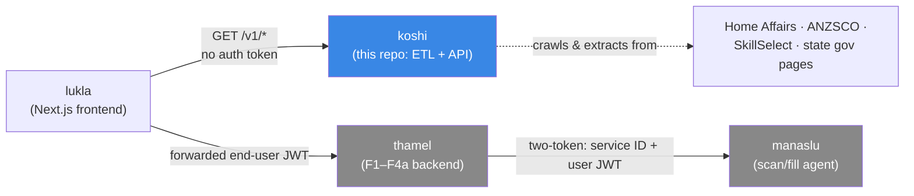
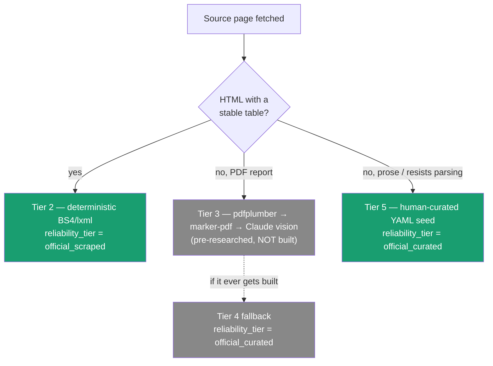
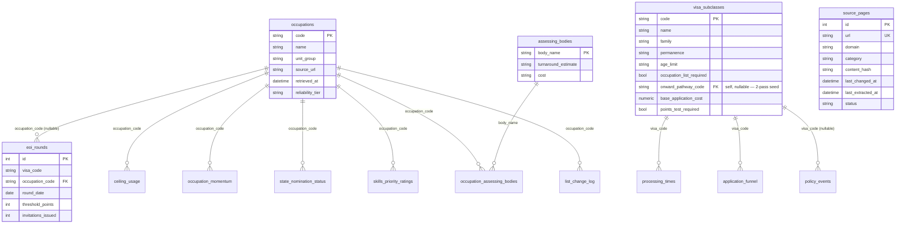
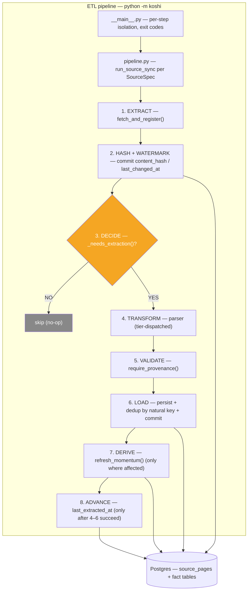
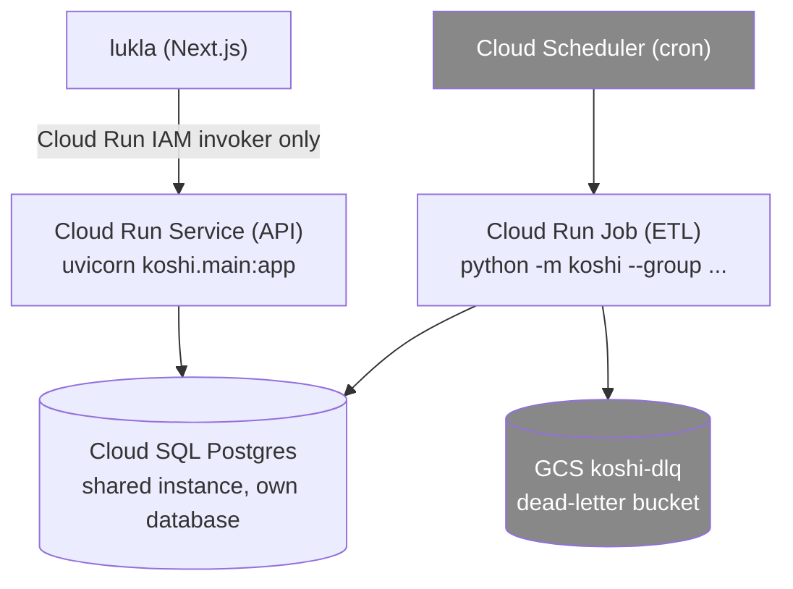

# koshi — ETL Pipeline Architecture (Canonical)

**Status:** Canonical — this is the single source of truth for koshi's ETL
design. It merges two prior, independently-produced documents and is the one
to build against.
**Date:** 2026-08-16
**Author:** Prabin Karki (merged from prior drafts; see §0)

> This doc **supersedes** both
> [`docs/ETL-PIPELINE-ARCHITECTURE.md`](../../ETL-PIPELINE-ARCHITECTURE.md)
> (the broader industry-survey draft) and
> [`docs/superpowers/specs/2026-08-15-koshi-etl-finalization-design.md`](2026-08-15-koshi-etl-finalization-design.md)
> (the code-grounded reconciliation). Both remain on disk as reference. Where
> the two disagreed, the **2026-08-15 spec wins** — its decisions were made
> against a live codebase audit, not a desk survey.

---

## Table of Contents

1. [§0 Provenance — what this doc merges](#0-provenance--what-this-doc-merges)
2. [§1 Executive summary](#1-executive-summary)
3. [§2 Where koshi sits, and why the pipeline looks the way it does](#2-where-koshi-sits-and-why-the-pipeline-looks-the-way-it-does)
4. [§3 Industry survey — the three generations of ETL and koshi's place](#3-industry-survey--the-three-generations-of-etl-and-koshis-place)
5. [§4 The complete source catalog (16 sources, 5 tiers)](#4-the-complete-source-catalog-16-sources-5-tiers)
6. [§5 Extraction tier strategy](#5-extraction-tier-strategy)
7. [§6 The complete data model (18 tables)](#6-the-complete-data-model-18-tables)
8. [§7 Pipeline architecture — the eight-stage flow](#7-pipeline-architecture--the-eight-stage-flow)
9. [§8 Fault tolerance & resilience](#8-fault-tolerance--resilience)
10. [§9 Scheduling & target deployment](#9-scheduling--target-deployment)
11. [§10 Serving layer (target — out of scope this pass)](#10-serving-layer-target--out-of-scope-this-pass)
12. [§11 Implementation roadmap](#11-implementation-roadmap)
13. [§12 Technology alternatives — every stack considered, why each was kept or dropped](#12-technology-alternatives--every-stack-considered-why-each-was-kept-or-dropped)
14. [§13 Open design questions](#13-open-design-questions)
15. [§14 Success criteria](#14-success-criteria)

---

## 0. Provenance — what this doc merges

Two comprehensive ETL designs were produced around the same time:

- **`docs/ETL-PIPELINE-ARCHITECTURE.md`** — a desk-level survey: industry
  framing, a 19-domain source inventory, an ASCII ERD, a four-tier extraction
  scheme, a full serving-layer section, deployment costing, and an appendix of
  tooling comparisons. Broad and well-researched, but produced *without* a
  live codebase audit, so some of its tier assignments and its sequencing
  assumed building PDF/LLM extraction now.
- **`docs/superpowers/specs/2026-08-15-koshi-etl-finalization-design.md`** —
  a code-grounded design produced against the actual `src/koshi/` source. It
  audited the fault-tolerance gap (`grep`-verified: zero `except`, zero
  `logger`), confirmed every remaining source resolves to deterministic HTML
  or manual curation, and fixed the data-model gaps.

**This doc keeps the 2026-08-15 spec's decisions as ground truth** (they are
the ones reconciled against the code) and folds the 2026-08-14/15 draft's
genuinely additive material back in: the industry survey (§3), the ERD — now
rendered as mermaid instead of ASCII (§6), the cadence-group scheduling model
(§9), the serving-layer target (§10), the deployment costing (§9), and the
expanded tooling comparisons (§12).

Where the two drafts disagreed, the resolutions stand:

| Disagreement | Resolution (final) | Why |
|---|---|---|
| Build PDF (tier 3) / Claude (tier 4) extraction now? | **No.** All 12 remaining sources resolve to deterministic HTML or manual curation. | Confirmed against the live codebase — see §5. |
| Include "how to present this data" logic? | **Documented as a target only, not built.** | Requested as a separate, later round. |
| Tier numbering (5-tier vs 4-tier) | **5-tier** (1 crawl, 2 HTML, 3 PDF, 4 LLM, 5 manual). | Matches the existing code and `docs/data-sources.md`. |
| Health/character/English → fold into `english_test_bands`? | **No.** Separate `eligibility_requirements` table. | Prose reference ≠ test-score band table. |
| Design production deployment now? | **Documented target only, not scheduled work.** | Local-first rule (design spec §11) still holds. |

---

## 1. Executive summary

koshi is a **headless ETL pipeline feeding a read-only REST API**. It extracts
structured, sourced facts about the Australian skilled-migration system from
government pages and serves them with **no end-user identity anywhere** — the
data is public and identical for every caller.

| Property | Value |
|---|---|
| **Type** | Headless ETL + read-only API microservice |
| **Domain** | AU skilled-migration public data |
| **Auth** | None (public data); production = Cloud Run IAM invoker only |
| **Consumer** | `lukla` (Next.js frontend) — the only caller |
| **Stack** | Python 3.11, httpx, BeautifulSoup4/lxml, SQLAlchemy 2.0, Alembic, FastAPI, Postgres, tenacity |
| **Infra (target)** | Cloud Run Job (ETL) + Cloud Run Service (API) + Cloud SQL Postgres + GCS DLQ |

| Layer | Today | Target (this doc) |
|---|---|---|
| Sources extracted | 2 (ANZSCO, SkillSelect rounds) | 16 cataloged sources |
| Tables populated | 5 | 18 (13 new — see §6) |
| Extraction tiers in use | 1 (deterministic HTML) | 2 (+ manual curation); tiers 3/4 pre-researched, not built |
| Fault tolerance | None (grep-verified) | Retry/backoff, per-item isolation, structured logging, run summaries |
| Scheduling | Manual (`python -m koshi`) | Still manual this pass; cadence groups documented for later |
| Deployment | Local only | Still local this pass; GCP target documented for later |

### Architecture principles (every decision below must hold these)

1. **Every row carries provenance** — `source_url`, `retrieved_at`,
   `reliability_tier` on every fact table. `derived` rows cite the koshi rows
   they were computed from instead.
2. **Honesty over completeness** — when a source doesn't exist or resists
   automation, say so; never ship a fabricated number.
3. **Deterministic where possible** — no LLM extraction is scheduled at all in
   this pass; everything parses cleanly or gets curated by hand.
4. **The fetcher doesn't know about the parser** — content hash and
   `last_changed_at` commit *before* parsing is attempted, so a failed parse
   retries automatically next run.
5. **Derived ≠ scraped** — computed facts (momentum) cite the rows they were
   computed from, never an external URL.
6. **One bounded context** — koshi calls nothing else in the Saathi family,
   and nothing calls into it except `lukla`.

---

## 2. Where koshi sits, and why the pipeline looks the way it does



koshi is one of five repos in the Saathi family, and the only one with no
end-user identity. It **never** calls thamel or manaslu, and they never call
it. Its data model is *public-reference*, not *personal* — which is why the
entire pipeline is built around provenance ("where did this fact come from")
rather than authorization ("whose fact is this").

koshi runs as **two processes over one codebase**:

- **ETL pipeline** — `python -m koshi`. Extract (fetch raw HTML) → Transform
  (parse into typed rows + derive momentum) → Load (persist to Postgres), with
  a provenance validation gate between transform and load.
- **Serving API** — `uvicorn koshi.main:app`. Read-only; never fetches or
  parses anything itself.

> **Naming collision worth knowing:** koshi's own code calls the *Transform*
> step "**extraction**" (the `extraction/` folder, "extraction tier",
> "extraction watermark"). That's a different word from ETL's *Extract*, which
> is the plain HTTP fetch in `crawler/fetch.py`. Same word, two stages, two
> vocabularies.

---

## 3. Industry survey — the three generations of ETL and koshi's place

### 3.1 The three generations

| Generation | Era | Paradigm | Examples | Best for |
|---|---|---|---|---|
| **Gen 1 — Batch ETL** | 1990s–2010s | Scheduled bulk extraction, staging tables, SQL transforms | Informatica, Talend, SSIS | Enterprise data warehousing |
| **Gen 2 — Stream processing** | 2010s– | Event-driven, real-time, append-only logs | Kafka, Flink, Spark Streaming | High-throughput event data |
| **Gen 3 — ELT** | 2015s– | Raw lands first, transform in-warehouse | Fivetran, Airbyte, dbt | Cloud data warehouses (Snowflake/BigQuery) |
| **Gen 3.5 — AI-augmented** | 2023– | LLMs for unstructured extraction, schema inference | Unstructured.io, LlamaParse, Claude | Semi-structured docs, PDFs, layout-drift scraping |

**koshi is Gen 3.5 in shape but Gen 1 in discipline.** Its sources are
unstructured government HTML/PDF that resist naive scraping (hence the tier
strategy and the reserved LLM fallback), but its *operating model* is
classic batch ETL — 16 known pages, monthly/quarterly cadence, no real-time
requirement. It is deliberately **not** streaming and **not** ELT-in-a-warehouse.

### 3.2 The five production patterns koshi adopts (or consciously declines)

| Pattern | Adopted? | Where it lands in koshi |
|---|---|---|
| **1. Watermark** (hash → `last_changed_at` vs `last_extracted_at`) | ✅ Already built | `pipeline.py::_needs_extraction` — the anti-freeze mechanism |
| **2. Multi-tier extraction** (Zillow/Airbnb/Stripe) | ✅ Adopted, trimmed | §5 — only tiers 2 & 5 are active this pass |
| **3. Idempotency by natural key** (Stripe/GitHub) | ✅ Already built | `eoi_rounds` unique constraint + in-batch `staged_keys` dedup |
| **4. Dead-letter queue** (Netflix/Uber) | ⏳ Documented, not built | §8 — GCS `koshi-dlq/` + `replay` command |
| **5. Content-freshness monitoring** | ⏳ Documented, not built | `source_pages.last_checked_at` exists; a staleness check is deferred |

### 3.3 The fastest path to production (and the shape of that stack)

```
Cloud Run Job (per-source, per-cadence)          ← later; manual `python -m koshi` today
        ↓
Python 3.11 + httpx (fetch) + BS4/lxml (deterministic) + [Claude Haiku — reserved, not built]
        ↓
Postgres (source_pages → extraction → fact tables)
        ↓
FastAPI (Cloud Run Service) → lukla
```

Full per-tool alternatives and reasoning live in §12.

---

## 4. The complete source catalog (16 sources, 5 tiers)

**Confirmed decision: no PDF (tier 3) or Claude-fallback (tier 4) extraction
is built in this pass.** Every remaining source resolves to tier 2
(deterministic HTML) or tier 5 (manual YAML curation). This deliberately
deviates from the original spec's tentative tier-4 assignment for a couple of
small-row-count sources.

| # | Source | Tier | Tooling | Feeds | Note |
|---|---|---|---|---|---|
| 1 | ANZSCO occupations | 2 | httpx + BS4/lxml | `occupations` | ✅ built |
| 2 | EOI invitation rounds | 2 | httpx + BS4/lxml | `eoi_rounds` | ✅ built |
| 3 | Occupation ceilings | 5 | YAML seed | `ceiling_usage`, `program_allocation` | PDF source, curated |
| 4 | Visa fees | 2 | httpx + BS4/lxml | `visa_subclasses.base_application_cost` | Update-by-PK, not insert |
| 5 | Points test criteria | 2 | httpx + BS4/lxml | `points_criteria_reference` | |
| 6 | Visa subclass static facts (189/190/491/485/500/482) | 5 | YAML seed | `visa_subclasses` | 6 rows, rare cadence — tier 4 skipped |
| 7 | Health/character/English requirements | 5 | YAML seed | `eligibility_requirements` | 3 rows, rare cadence |
| 8 | Processing times | 2 | httpx + BS4/lxml | `processing_times` | Same shape as SkillSelect parser |
| 9 | MLTSSL/STSOL/ROL → list changes | 2 | httpx + BS4/lxml | `list_change_log` | Confirm legislation.gov.au HTML at build time |
| 10 | Skills priority list | 2 | BS4/lxml or pandas/openpyxl | `skills_priority_ratings` | Confirm JSA rating vocabulary at build time |
| 11 | State nomination status (NSW/VIC/QLD/WA/SA) | 5 | YAML seed | `state_nomination_status` | Highest per-row curation effort |
| 12 | State occupation list changes | 1→5 | `source_pages` hash-diff → YAML seed | `list_change_log` | Tier 1 is the trigger, tier 5 the write |
| 13 | Assessing bodies + join | 5 | Two YAML seeds | `assessing_bodies`, `occupation_assessing_bodies` | New domain: `mara.gov.au` |
| 14 | Policy events | 5 | YAML seed | `policy_events` | Editorial; new domains `budget.gov.au`/`treasury.gov.au` |
| 15 | Application funnel — submitted/invited | 2 | Piggybacked on existing SkillSelect fetch | `application_funnel` | Don't fetch the same URL twice |
| 16 | Application funnel — granted | 5 (or `NULL`) | YAML seed once confirmed | `application_funnel.granted_count` | Weakest-sourced field |
| — | Occupation momentum | derived | computed | `occupation_momentum` | Never scraped |
| — | Points distribution | deferred | — | `points_distribution` | No confirmed source exists |

**Tiers 3/4 stay tooling-pre-researched, not built.** If a future source
genuinely needs them: PDF → `pdfplumber` first, `marker-pdf` (free, local) or
Claude vision second; Claude fallback → **Haiku** (not Sonnet/Opus — prose
extraction is a Haiku-class task, ~$0.001/page vs Sonnet's $0.015),
structured-output JSON-schema mode, `max_retries=1` (bato's documented lesson:
`bato/api/llm.py:38-40`). This research is real and worth keeping even though
nothing in this pass schedules building it.

---

## 5. Extraction tier strategy

Five tiers, of which **two are active** this pass.

| Tier | Name | Reliability tier | Built this pass? |
|---|---|---|---|
| 1 | Crawl (discovery/change-detection) | — | ✅ (as `source_pages` hash-diff) |
| 2 | Deterministic HTML | `official_scraped` | ✅ |
| 3 | PDF | `official_curated` | ❌ pre-researched |
| 4 | LLM fallback | `official_curated` | ❌ pre-researched |
| 5 | Manual curation (YAML → git → loader) | `official_curated` | ✅ |

### 5.1 The tier decision tree



### 5.2 Tier 2 — deterministic parser (the only extraction tier this pass)

Each parser is one module in `extraction/`, calls `require_provenance()` before
constructing a single row, uses an explicit selector (CSS id/class, never
"find any table"), and raises on missing expected structure so the watermark
retries next run. Test fixtures are real saved HTML in `tests/fixtures/`.

### 5.3 Tier 5 — manual curation (the honest fallback)

koshi already ships this pattern (`seeds/ceiling_usage_manual.yaml` +
`seeds/loader.py`). Curated YAML is version-controlled in git, carries a
`source_url` + `retrieved_at` + `reliability_tier="official_curated"`, and is
reviewed against the live source on a documented cadence. This is **bato's
pattern** — reuse it, don't reinvent it. `documents_required` (a display-only
list) is stored as `jsonb` rather than a join table.

---

## 6. The complete data model (18 tables)

Convention, matching the 5 already-built tables: SQLAlchemy 2.0 `Mapped[...]`,
one model file per table, the provenance trio as the last three columns
(except on derived tables), constraints declared via `__table_args__` (so
`tests/test_alembic_migrations.py` keeps catching drift), one Alembic migration
per table.

### 6.1 Entity-relationship diagram



> **Not drawn above** (for readability): the remaining reference tables —
> `points_criteria_reference`, `english_test_bands`, `eligibility_requirements`,
> `program_allocation` — have no FKs (standalone reference/aggregate rows).
> `source_pages` (drawn) is the crawl registry — metadata, not a fact, so it
> carries no provenance trio.

### 6.2 New tables (migrations `0007`–`0019`)

| Migration | Table | Kind | Key constraints / notes |
|---|---|---|---|
| 0007 | `visa_subclasses` | reference | `code` PK; self-FK `onward_pathway_code` (nullable, **2-pass seed**) |
| 0008 | `english_test_bands` | reference | surrogate `id` PK + `UniqueConstraint(test_name, band_level)` |
| 0009 | `assessing_bodies` | reference | `body_name` PK |
| 0010 | `occupation_assessing_bodies` | join | composite PK `(occupation_code, body_name)` |
| 0011 | `points_criteria_reference` | reference | `UniqueConstraint(criterion_name, band_description)` |
| 0012 | `policy_events` | editorial | `visa_code` FK nullable (national events) |
| 0013 | `state_nomination_status` | fact | `status` CHECK `open/limited/closed`; `UniqueConstraint(state_code, occupation_code, as_of_date)`; `documents_required` jsonb |
| 0014 | `list_change_log` | fact | `change_type` CHECK `added/removed`; `UniqueConstraint(list_name, occupation_code, change_type, effective_date)` |
| 0015 | `processing_times` | fact | `UniqueConstraint(visa_code, as_of_date)` |
| 0016 | `program_allocation` | aggregate | `UniqueConstraint(program_year, stream_name)` |
| 0017 | `application_funnel` | fact | `UniqueConstraint(visa_code, program_year, as_of_date)`; funnel-order CHECK; **second nullable provenance triple** for `granted_count` |
| 0018 | `eligibility_requirements` | reference | `requirement_type` unique (`health`/`character`/`english_language`) |
| 0019 | `skills_priority_ratings` | fact | `UniqueConstraint(occupation_code, as_of_date)`; `shortage_rating` + `future_demand_rating` (nullable) |

### 6.3 Provenance convention (unchanged)

Every fact table carries `source_url` / `retrieved_at` / `reliability_tier`
(`official_scraped` | `official_curated` | `derived`). `occupation_momentum`
is the only table that omits `source_url` (always `derived`). A reserved
fourth value, `community_sourced`, exists in the design for a future
non-official source — nothing uses it yet.

### 6.4 The two previously-unassigned gaps — resolved

1. **Health/character/English reference pages** → `eligibility_requirements`
   (3 near-static prose pages, not tabular data).
2. **Skills priority list** (JSA's shortage/demand rating, conceptually
   distinct from MLTSSL/STSOL/ROL) → `skills_priority_ratings`.

`points_distribution` stays **deferred** — no confirmed source exists anywhere
in the crawl target list.

Migrations land **just-in-time, one per source slice** (§11's build order), not
all upfront as an unexercised empty schema.

---

## 7. Pipeline architecture — the eight-stage flow

### 7.1 The full flow



### 7.2 Stage-by-stage

1. **Extract** (`crawler/fetch.py`) — `httpx` GET with split timeout, SHA-256
   hash of raw bytes, upsert into `source_pages`. Returns `(page, changed,
   text)`; the parser reuses `text` to avoid a double fetch.
2. **Hash + watermark** — `content_hash` / `last_changed_at` commit **before**
   parsing is attempted. This is the "page content changed" watermark.
3. **Decide** — `_needs_extraction()` compares `last_changed_at` against the
   *second* watermark `last_extracted_at`. Two different watermarks = two
   different meanings; this is the anti-freeze mechanism (§8.6).
4. **Transform** — tier-dispatched parser returns `ParseResult(rows, skipped)`.
5. **Validate** — `require_provenance()` rejects invalid tier values,
   non-derived rows without `source_url`/`retrieved_at`, and future-dated
   `retrieved_at`.
6. **Load** — dedup by natural key (DB existence check **plus** in-batch
   `staged_keys`, required because `autoflush=False` means an earlier
   `session.add()` isn't visible to the next iteration's `SELECT`), then commit.
7. **Derive** — `refresh_momentum()` for every occupation a new round touched.
8. **Advance** — `last_extracted_at = now()` **only after** stages 4–6 all
   succeed.

### 7.3 Source-registry pattern (Phase 1 refactor)

Today, adding a source means a new hardcoded URL constant plus a hand-written
`sync_*` function copying the same fetch→decide→parse→persist→watermark→commit
skeleton. A new `src/koshi/source_registry.py` replaces that:

```python
class ExtractionTier(enum.IntEnum):
    CRAWL = 1; HTML = 2; PDF = 3; LLM_FALLBACK = 4; MANUAL_CURATION = 5

@dataclass(frozen=True)
class SourceSpec:
    key: str; url: str; domain: str; category: str
    tables: tuple[str, ...]      # one page can feed >1 table
    tier: ExtractionTier
    reliability_tier: str
    cadence: str = ""; notes: str = ""

def run_source_sync(session, spec, *, parser, persist, client=None) -> list[Base]:
    page, _changed, text = fetch_and_register(session, url=spec.url, ...)
    if not _needs_extraction(page):
        return []
    rows = parser(text, source_url=spec.url, retrieved_at=now)
    new_rows = persist(session, rows)
    page.last_extracted_at = now
    session.commit()
    return new_rows
```

`sync_anzsco_occupations` / `sync_skillselect_rounds` become thin wrappers with
a `persist_merge_by_pk` / `persist_dedup_by_natural_key` strategy each —
**existing public signatures don't change**, so `tests/test_pipeline.py` needs
no changes for this refactor alone. `__main__.py` becomes
`for spec in SOURCE_REGISTRY.values(): ...`.

**Domain config:** `src/koshi/sources/domains.yaml` ports
`research/au-visa-sources/config.yaml`'s domain list and politeness settings
(`max_pages_per_run: 300`, `max_pages_per_domain: 15`, `request_delay: 1.0s`,
`timeout: 15s`), plus the two flagged-missing domains. **Scoping call:** this
is politeness limits, **not** an autonomous link-following crawler — koshi's
whole catalog is specific, already-known URLs, each an explicit `SourceSpec`.

### 7.4 The orchestration contract

Every `sync_*` / registry entry holds: returns `list[Model]` (rows persisted);
empty is never an error ("nothing new"); a parse failure propagates and
`last_extracted_at` is **not** advanced; each source is independently runnable.

---

## 8. Fault tolerance & resilience

**Verified gap (grep, not impression):** `grep -rn "except" src/koshi/` and
`grep -rn "logger" src/koshi/` both return **zero** matches today. The retrofit
below is Phase 0 (§11).

### 8.1 New modules & changes

| Change | What it does |
|---|---|
| `logging_config.py` | dual stdout + `RotatingFileHandler` (5MB × 3) → `logs/koshi.log` |
| `resilience.py` | `isolated_item()` (savepoint-scoped per-row isolation), `Throttler`, `parse_int_loose()` |
| `run_summary.py` | JSON run summary per invocation → `logs/summaries/run_<ts>.json` |
| `crawler/fetch.py` | split timeout (`connect=10/read=15/write=10/pool=10`), tenacity retry (5 attempts, exp backoff 1→30s), typed `FetchError` |
| both parsers | per-row `try/except`, `parse_int_loose`, return `ParseResult(rows, skipped)` |
| `seeds/loader.py` | per-entry isolation → generalized `load_seed_rows(path, *, row_builder, extra_validators)` |
| `pipeline.py` | per-occupation try/except around the momentum loop |
| `__main__.py` | per-step try/except + rollback + exit codes + run-summary wiring |

### 8.2 `isolated_item` — why a bare try/except isn't enough

A bare `try/except` around `session.add()` does **not** isolate a bad row:
Postgres aborts the *whole transaction* on a failed statement unless a
SAVEPOINT scopes the failure. `isolated_item()` uses `session.begin_nested()`
(a Postgres SAVEPOINT), logs, and swallows the exception so one bad item
doesn't poison the enclosing transaction.

### 8.3 Failure modes — reference table

| Failure mode | Current behavior | Target behavior |
|---|---|---|
| Network timeout / transient 5xx | Unhandled, crashes the sync | Retry w/ backoff (tenacity), then `FetchError` |
| 404/410 | Unhandled | See §8.4 (an open decision — don't silently drop it) |
| Malformed row | Whole page/file aborts | Skip + log that row, keep the rest |
| DB commit failure | No rollback, propagates | `session.rollback()` per step; `isolated_item()` per row |
| One step fails | Later steps never run | Per-step try/except — every step attempts; summary + exit code report which |

### 8.4 Hard-fail vs soft-fail — layered, not a single switch

- **Per-row/per-entry:** soft-fail — skip, log, continue.
- **Per-source:** soft-fail at orchestration level — mark the step failed in
  the run summary, move to the next source.
- **Whole-run signaling:** the **exit code is the alerting mechanism** —
  `0` clean, `2` partial failure (the *expected* common state at 16 sources),
  `3` total failure, `1` reserved for fatal init (DB unreachable before any
  step runs). A cron wrapper — and later Cloud Scheduler + Cloud Monitoring —
  acts on `2`/`3` without koshi needing any notification integration.

### 8.5 Retry policy — retry only what can succeed

Retry **transient** failures only: transport errors and HTTP `(429, 500, 502,
503, 504)`. Never retry a 404/400 or a parse error that will fail identically
next time — the watermark already handles retry-on-next-run for those.

### 8.6 Why two watermarks exist (the anti-freeze mechanism)

`fetch_and_register` commits `content_hash`/`last_changed_at` **before** the
caller parses. If parsing then fails, naively trusting the returned `changed`
bool would mean: next run, the hash hasn't moved, `changed` is `False`, and the
page is silently skipped forever. `last_extracted_at` only advances after a
parse **and** persist both succeed, so `_needs_extraction()` returns `True` on
every run until the parse finally succeeds. **Already built** — every new
source inherits it free via `run_source_sync`.

### 8.7 Dead-letter design — documented, not built

On exhausted-retry parse failure, save raw page content to
`GCS://koshi-dlq/<date>/<page>.html` + a `manifest.json` failure record
(`url`, `error`, `retry_count`, `content_hash`), replayable via
`python -m koshi replay --manifest ...` once a fix ships. Deferred alongside
§9's production infra — nothing in `karki-labs-infra` exists to host it yet.

### 8.8 Idempotency guarantee

1. **Content hash** — unchanged page → `_needs_extraction` returns `False` → no-op.
2. **Natural-key unique constraint** — re-parsed same data → DB rejects duplicates.
3. **`staged_keys`** — in-batch dedup prevents `UniqueViolation` rollback.
4. **`merge()`** for reference tables — upsert by primary key.

The whole pipeline is safe to re-run from scratch; a Cloud Run Job can be
retried without side effects.

---

## 9. Scheduling & target deployment

### 9.1 Cadence-group model (documented, not active now)

Running all 16 sources on one daily cron is wasteful — most change monthly or
less. The target is cadence-grouped:

| Cadence | Sources | Trigger (once deployed) |
|---|---|---|
| Nightly | EOI rounds, processing times, momentum | Cloud Scheduler, 03:00 AEST |
| Weekly | Visa fees, visa subclass facts, state list changes | Monday 03:00 |
| Monthly | Ceilings, points test, English/health refs, funnel | 1st of month |
| Quarterly | Legislation lists, skills priority | Jan/Apr/Jul/Oct 1st |
| Annual | Funnel granted, assessing bodies | 1 July (program year start) |
| On-demand | Policy events | Manual trigger |

`__main__.py` takes an optional `--group` argument once this matters. **Not
built this pass** — `python -m koshi` runs everything, every time, manually,
which is correct at 2–16 sources and zero deployment.

### 9.2 Target GCP architecture (documented, not scheduled)



### 9.3 Resource specs & marginal cost

| Resource | Spec | Monthly cost (est.) |
|---|---|---|
| Cloud Run Job (ETL) | 1 vCPU, 2GB, timeout 30 min | ~$0 (runs minutes/month) |
| Cloud Run Service (API) | 1 vCPU, 512MB, min-instances 0 | ~$0–5 |
| Cloud SQL Postgres | shared with saathi/thamel/manaslu | ~$25–50 (shared) |
| GCS DLQ bucket | standard, ~1GB | ~$0.02 |
| Cloud Scheduler | 5–6 schedules | Free tier |
| Claude API (reserved) | Haiku, ~10 calls/month | <$0.10 |

**Total marginal cost of koshi: <$10/month.** Deploy mechanism matches the
family: **Cloud Run (never GKE)**, **GitHub Actions + WIF (never Cloud Build)**,
**Terraform in `karki-labs-infra`** — and only once local setup has proven the
pipeline end to end. Local-first is still the deliberate current phase.

---

## 10. Serving layer (target — out of scope this pass)

Explicitly a separate, later round. Documented here so the ETL's shape (tables,
provenance, tiers) is designed to *feed* this — not built now.

### 10.1 Endpoint inventory (target)

| Endpoint | Returns | Source tables |
|---|---|---|
| `GET /v1/healthz` | liveness | — ✅ built |
| `GET /v1/occupations` | list + momentum | occupations, occupation_momentum ✅ built |
| `GET /v1/occupations/{code}` | full profile | occupations, ceiling_usage, eoi_rounds, occupation_momentum ✅ built |
| `GET /v1/visas`, `/{code}` | subclass list/detail + processing times | visa_subclasses, processing_times |
| `GET /v1/states`, `/{state}` | nomination summary/detail | state_nomination_status |
| `GET /v1/national/summary` | program allocation, funnel | program_allocation, application_funnel |
| `GET /v1/reference/*` | points test, English bands, assessing bodies | points_criteria_reference, english_test_bands, assessing_bodies |

### 10.2 The two fact shapes (already implemented)

`SourcedFact` (value + `reliability_tier` + `retrieved_at` + `source_url`) for
scraped/curated facts; `DerivedFact` (value + `reliability_tier="derived"` +
`computed_at`, no URL) for momentum. This is what lets the frontend render
`official_curated` differently from `official_scraped` differently from
`derived`.

### 10.3 Presentation rules (the "apply logic" layer)

1. Only state published facts — never "you should/can/are eligible." Phrase-ban tests enforce this.
2. Never fabricate a trend — <3 rounds → omit the trend sentence, don't say "steady."
3. Compare at query time, don't store comparisons.
4. Momentum is the only *stored* derived fact.
5. `NULL` is honest — render "not published," not a fake number.

### 10.4 Caching

| Layer | TTL | Rationale |
|---|---|---|
| API response cache | 5–10 min | Data changes monthly; cache serves >99% of reads |
| CDN/edge (static reference) | 24h | Points test / English bands change at most annually |
| No app-level Redis | — | Postgres is fast enough at <1M rows; don't over-engineer |

---

## 11. Implementation roadmap

Confirmed: **curation-effort order** over presentation-priority order.

- **Phase 0 — Fault-tolerance retrofit** on the 2 existing sources. Everything
  in §8's foundational list + new tests (malformed-row fixtures, bad-YAML,
  retry via `httpx.MockTransport`). Cheapest, highest-leverage — every source
  added afterward inherits it free.
- **Phase 1 — Source-registry refactor** (§7.3).
- **Phase 2 — New sources, in order:** `visa_subclasses` (tier 5, unblocks the
  FK) → visa fees (tier 2) → processing times (tier 2, proves the registry
  end-to-end) → points test → English bands → assessing bodies + join (first
  new domain) → policy events (second new domain) → eligibility requirements →
  skills priority → MLTSSL/STSOL/ROL + state list changes → **state nomination
  (deliberately last — highest per-row curation effort)** → program_allocation
  + application_funnel (granted ships `NULL` or curated).
- **Deferred:** `points_distribution` (no source); tiers 3/4 (only if step
  10/12's curation cadence proves unsustainable); serving layer (§10);
  deployment (§9).

---

## 12. Technology alternatives — every stack considered, why each was kept or dropped

This is the full decision record. For each category: what the options were,
what won, what was rejected and why, and **where the tool sits in the
pipeline**.

### 12.1 HTTP fetch (Extract)

| Option | Why considered | Verdict | How it fits the pipeline |
|---|---|---|---|
| **httpx** | Modern, sync+async, already in repo | ✅ **Chosen** | `crawler/fetch.py` — the Extract stage |
| requests | Ubiquitous, simple | ❌ Dropped — httpx already present, adds nothing | — |
| aiohttp | Async speed | ❌ Dropped — 16 known pages at monthly cadence; async adds complexity for zero throughput gain | — |
| **Scrapy** | Full crawler: spiders, item pipelines, auto-throttle | ❌ Dropped — built for thousands of *unknown* pages; koshi has ~16 *known* URLs | — |
| Playwright / Puppeteer | Handles JS-rendered pages | ⚠️ Reserved — only if a gov page becomes JS-rendered; 10–20× slower, memory-heavy | — |
| Selenium | Browser automation | ❌ Dropped — same as Playwright but heavier | — |

### 12.2 HTML parsing (Transform)

| Option | Why considered | Verdict | How it fits the pipeline |
|---|---|---|---|
| **BeautifulSoup4 + lxml** | Fast, forgiving, already in repo | ✅ **Chosen** | `extraction/*.py` — the Transform stage |
| lxml.etree (raw) | Fastest | ❌ Dropped — XPath-only, less ergonomic for messy gov HTML | — |
| parsel | Scrapy's selector, clean API | ⚠️ Equivalent; not worth a new dependency when BS4+lxml is proven | — |
| selectolax | C-speed, tiny | ⚠️ Fast, but BS4+lxml is sufficient and already standard | — |
| Playwright DOM | Handles JS | ❌ Dropped — same as 12.1 | — |

### 12.3 Discovery / crawling (Extract, tier 1)

| Option | Why considered | Verdict | How it fits the pipeline |
|---|---|---|---|
| Autonomous link-following crawler | Could auto-discover new pages | ❌ Dropped for this pass — materially heavier; koshi's catalog is specific known URLs | `source_pages` is the registry, not a frontier |
| **Explicit `SourceSpec` registry** | Every source is a declared, known URL | ✅ **Chosen** | §7.3 `source_registry.py` |
| `research/au-visa-sources` crawler | Already built, had discovery | ⚠️ Rebuilt-into-koshi; not a runtime dep anymore | its politeness/retry patterns were *ported*, not the code |

### 12.4 PDF extraction (Transform, tier 3 — pre-researched)

| Option | Cost | Quality | Verdict | How it fits |
|---|---|---|---|---|
| **pdfplumber** | Free | Good tables | ✅ First choice (project's stated default) | Tier-3 transform |
| **marker-pdf** | Free (local) | Good clean PDFs | ✅ Fallback #2 | Tier-3 transform |
| LlamaParse | ~$0.003/page | Excellent tables | ⚠️ Only if marker fails | Tier-3 transform |
| Claude vision | ~$0.01/page | Excellent, complex layouts | ⚠️ Last resort | Tier-3 transform |
| pypdf | Free | Text-only, loses tables | ❌ Dropped — not for tabular data | — |
| Camelot | Free | Good bordered tables | ⚠️ Niche layouts only | — |

### 12.5 LLM extraction (Transform, tier 4 — pre-researched)

| Model | In / 1K | Out / 1K | Verdict | How it fits |
|---|---|---|---|---|
| **Claude Haiku 4** | $0.001 | $0.005 | ✅ **Chosen if ever built** — prose extraction is a Haiku-class task | Tier-4 transform |
| Claude Sonnet 4 | $0.003 | $0.015 | ⚠️ PDF vision / complex reasoning only | Tier-4 fallback |
| Claude Opus 4 | $0.015 | $0.075 | ❌ Never justified for extraction | — |
| GPT-4o-mini | $0.00015 | $0.0006 | ⚠️ Cheapest, weaker structured output | — |
| GPT-4o | $0.0025 | $0.010 | ⚠️ Comparable to Sonnet, no vision advantage | — |

Use **structured-output JSON-schema mode** (eliminates hallucinated fields) and
`max_retries=1`, not the SDK default of 2 (bato's lesson — the caller's timeout
budget is tighter than the SDK assumes).

### 12.6 Orchestration / scheduling (Extract→Load trigger)

| Option | Why considered | Verdict | How it fits |
|---|---|---|---|
| **Manual `python -m koshi`** | Simplest | ✅ **Chosen today** | Whole pipeline trigger |
| **Cloud Run Jobs + Cloud Scheduler** | Serverless, per-cadence | ✅ **Chosen target** | Per-group trigger (§9) |
| Airflow / Prefect / Dagster | Rich DAGs, retries, UI | ❌ Dropped — operational overhead for 16 independent sources | — |
| Temporal | Durable workflows | ❌ Dropped — overkill for batch cadence | — |
| Celery + cron | Python-native queues | ❌ Dropped — requires an always-on worker | — |
| system cron | Zero infra | ⚠️ Works locally, but no retry/alerting | — |

Cloud Run Jobs earn their complexity only when you have hundreds of
interdependent DAGs; koshi has 16 *independent* sources.

### 12.7 Storage (Load)

| Option | Why considered | Verdict | How it fits |
|---|---|---|---|
| **Postgres (Cloud SQL)** | Relational, FK constraints, already the family standard | ✅ **Chosen** | Fact tables + `source_pages` |
| BigQuery | Analytics-scale | ❌ Dropped — <1M rows; Cloud SQL is simpler and shared | — |
| MongoDB | Flexible docs | ❌ Dropped — data is relational (occupations → rounds → momentum) | — |
| SQLite | Zero-infra | ❌ Dropped for prod — Postgres gives constraints + shared instance; tests already run on real Postgres | — |
| DuckDB | Fast local analytics | ⚠️ Not needed; the serving API is the consumer, not ad-hoc analytics | — |
| GCS (raw) | Cheap object store | ⚠️ Reserved — only for the DLQ (§8.7) | Dead-letter |

### 12.8 Transform layer (Transform, after extraction)

| Option | Why considered | Verdict | How it fits |
|---|---|---|---|
| **Custom Python** | Full control over HTML/PDF parsing | ✅ **Chosen** | `extraction/*.py` |
| dbt | SQL transforms on loaded data | ❌ Dropped — koshi's hard part is *extraction*, not SQL; could be added later for analytics | — |
| Spark | Distributed transforms | ❌ Dropped — <1M rows, no cluster | — |

### 12.9 Migrations / schema (Load)

| Option | Verdict | How it fits |
|---|---|---|
| **Alembic** | ✅ **Chosen** — versioned, autogenerate, already in repo | Schema lifecycle |
| Raw SQL files | ❌ Dropped — no downgrade/upgrade tracking | — |
| Prisma | ❌ Dropped — Node-first, doesn't fit a Python SQLAlchemy stack | — |

### 12.10 Serving / API (Serve)

| Option | Verdict | How it fits |
|---|---|---|
| **FastAPI** | ✅ **Chosen** — async, Pydantic validation, already in repo | `koshi.main:app` |
| Flask | ❌ Dropped — no native async/Pydantic | — |
| Django + DRF | ❌ Dropped — batteries too heavy for a read-only API | — |
| Litestar | ⚠️ Solid, but FastAPI is already standard here | — |

### 12.11 Caching (Serve)

| Option | Verdict | How it fits |
|---|---|---|
| In-process / fastapi-cache2 | ✅ Target — 5–10 min TTL | API read layer |
| CDN edge cache | ✅ Target — 24h for static reference endpoints | Serve |
| Redis | ❌ Dropped — unnecessary at <1M rows | — |

### 12.12 Fault tolerance (cross-cutting)

| Option | Verdict | How it fits |
|---|---|---|
| **tenacity** | ✅ **Chosen** — ported pattern from `research/au-visa-sources` | Retry/backoff in Extract |
| stamina | ⚠️ Equivalent; tenacity is already the family pattern | — |
| backoff | ⚠️ Equivalent; fewer features | — |
| manual `time.sleep` loop | ❌ Dropped — reinventing the wheel | — |
| stdlib `logging` | ✅ **Chosen** — dual stdout + rotating file + JSON run summary | Observability across all stages |

### 12.13 Deployment (whole-pipeline runtime)

| Option | Why considered | Verdict | How it fits |
|---|---|---|---|
| **Cloud Run** | Serverless, family standard | ✅ **Chosen** | ETL Job + API Service |
| GKE | Full control | ❌ Dropped — heavy, family rule is explicit | — |
| Cloud Functions | Simple functions | ❌ Dropped — jobs need long timeouts + job semantics | — |
| Compute Engine | Raw VMs | ❌ Dropped — unnecessary ops | — |
| **GitHub Actions + WIF** | Family CI/CD standard | ✅ **Chosen** | Deploy pipeline |
| Cloud Build | GCP-native CI | ❌ Dropped — family rule is explicit | — |
| **Terraform (karki-labs-infra)** | IaC | ✅ Target — only after local is proven | Provisioning |

---

## 13. Open design questions

Carried forward from the 2026-08-15 spec's own open items, **plus** unresolved
tensions surfaced during review. Resolve before implementing the affected slice.

1. **`list_change_log`** — legislation.gov.au's real HTML structure must be
   confirmed before committing to pure tier-2.
2. **`skills_priority_ratings`** — JSA's exact rating vocabulary must be
   confirmed against the live page.
3. **`application_funnel` dual provenance** — a genuine schema extension beyond
   the single-triple convention; second nullable triple scoped to
   `granted_count`.
4. **Parser return-type change** — `ParseResult(rows, skipped)` touches two
   already-reviewed test files.
5. **Provenance on `visa_subclasses.base_application_cost`** (review finding) —
   a tier-2-scraped fee written onto a `official_curated` row erases the fee's
   true source. Consider a `visa_fees` time-series table (also preserves annual
   indexation history) or a second provenance triple scoped to the cost field.
6. **404/410 handling** (review finding) — the failure-mode table says "mark
   `status='dead'`, skip" but `SourcePage.status` has no enum and the Phase-0
   plan raises `FetchError` instead. Pick one and reconcile.
7. **Multi-table `SourceSpec`** (review finding) — `tables` is a tuple but
   `run_source_sync` takes one parser/persist; the SkillSelect→funnel piggyback
   can't be expressed by the generalized contract.
8. **Migration numbering vs landing order** (review finding) — §6's numbers are
   a catalog index; §11 lands them in a different order. Re-sequence at landing
   time or relabel.
9. **Snapshot vs overwrite** (review finding) — most reference tables don't say
   whether a change overwrites (losing prior value + `retrieved_at`) or appends.
   Decide point-in-time vs current-state per table.
10. **Two-pass `visa_subclasses` seed** — the generalized `load_seed_rows`
    needs a deferred-FK hook the single-pass signature doesn't have.

---

## 14. Success criteria

Faithful to this doc if: every new table carries the provenance trio (or is
explicitly `derived`); no source needs a crawl domain outside
`sources/domains.yaml`; a malformed row in any parser or seed file is skipped
and logged, never crashing the run; `__main__.py`'s steps run independently;
every network call goes through retry/backoff with a split timeout; the run
summary and exit code correctly reflect partial vs total vs clean success; no
PDF or Claude-fallback code exists yet; no deployment/Terraform work happened
as a side effect; and — unchanged from the existing design — no row ships
without a source, no generated string states or implies a personalized
outcome, and koshi has zero end-user-identity code anywhere.

---

## Document history

| Date | Change |
|---|---|
| 2026-08-14 | Original design spec (why koshi exists + full intended model). |
| 2026-08-15 | Independent ETL architecture draft (survey + ERD + serving + deployment). |
| 2026-08-15 | Code-grounded ETL finalization spec (fault-tolerance audit, tier reconciliation). |
| 2026-08-16 | **This doc** — canonical merge of the two, mermaid diagrams, full technology-alternatives record. |
