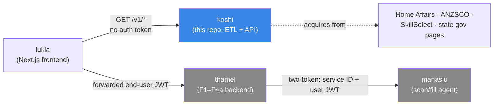
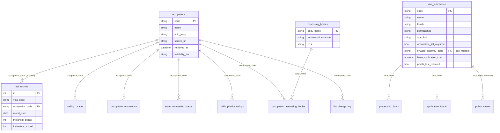
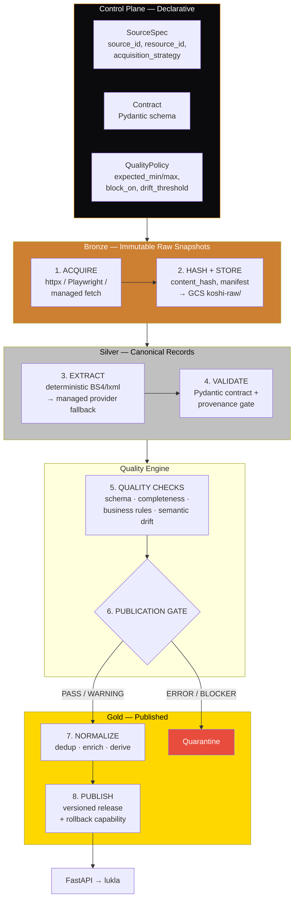
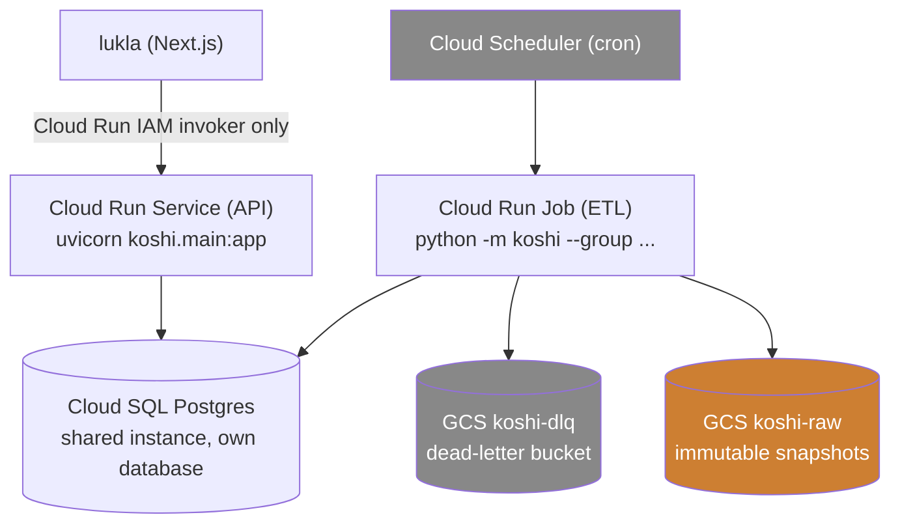

```mermaid
flowchart TB
    subgraph CONTROL["CONTROL PLANE"]
        SR["Source Registry"]
        CT["Contracts (Pydantic)"]
        SC["Schedules"]
        QP["Quality Policies"]
        PP["Provider Policies"]
        RM["Release Management"]
    end

    subgraph ACQUISITION["ACQUISITION — Bronze (Immutable)"]
        SRC["Source<br/>API / HTML / PDF / File"]
        ACQ["Acquisition<br/>HTTP · Browser · API client · Managed fetch"]
        RAW["Bronze Snapshot<br/>request.json · response.html · headers.json<br/>screenshot.png · manifest.json<br/>(Content-hashed, GCS koshi-raw/)"]
    end

    subgraph EXTRACTION["EXTRACTION → Silver"]
        EXT["Extraction<br/>HTML parser · PDF parser<br/>Firecrawl · Apify · Zyte · LLM"]
        CONTRACT["Canonical Contract<br/>Pydantic + version"]
    end

    subgraph QUALITY["QUALITY ENGINE"]
        QE["Quality Checks<br/>Schema · Completeness · Business rules<br/>Anomaly · Semantic drift"]
        GATE{"Publication Gate"}
    end

    subgraph STORAGE["GOLD — Published"]
        QUARANTINE["Quarantine"]
        NORM["Normalization"]
        GOLD["Gold Facts"]
        RELEASE["Versioned Release<br/>dataset_releases"]
        API["FastAPI → lukla"]
    end

    CONTROL --> ACQUISITION
    SRC --> ACQ
    ACQ --> RAW
    RAW --> EXT
    EXT --> CONTRACT
    CONTRACT --> QE
    QE --> GATE
    GATE -->|"PASS / WARNING"| NORM
    GATE -->|"BLOCKER"| QUARANTINE
    NORM --> GOLD
    GOLD --> RELEASE
    RELEASE --> API

    style CONTROL fill:#0b0b0d,color:#fff,stroke:#f5a623
    style ACQUISITION fill:#cd7f32,color:#fff,stroke:#cd7f32
    style EXTRACTION fill:#c0c0c0,color:#000,stroke:#c0c0c0
    style QUALITY fill:#888,color:#fff,stroke:#888
    style STORAGE fill:#ffd700,color:#000,stroke:#ffd700
    style QUARANTINE fill:#e74c3c,color:#fff
```

# koshi — ETL Pipeline Architecture (Canonical)

> ### 2026-08-18 revision — read this first
>
> The 2026-08-17 three-agent audit fetched and decoded all 23 sources. Five
> sections below changed materially:
>
> | § | Change |
> |---|---|
> | **6** | Source catalog: 16 → **23**; nine entries re-tiered or re-sourced |
> | **8** | **Tier decision tree rewritten** — it branched on "is it an HTML table?", and for every Home Affairs page the answer is *no*, which routed koshi's largest source family to PDF/manual extraction it never needed |
> | **9** | Provider bake-off: **premise dissolved.** No source needs JS rendering, a managed provider, PDF or LLM extraction. Playwright can be dropped |
> | **11** | New **§11.5 structural assertions** — the failure modes that survive row-level fault tolerance, including the 100%-skip-rate and soft-404 cases koshi hits *today* |
> | **14** | Build order re-sequenced — the old order optimised for curation effort, which is no longer the binding constraint |
> | **16** | Questions 1, 2, 12 closed; 5, 7 resolved; **14–18 added** |
>
> Evidence: `docs/superpowers/research/source-audit/`, summarised in
> `CONSOLIDATED-FINDINGS.md`.

**Status:** Canonical — single source of truth for koshi's architecture. This
revision incorporates the re-architecture feedback from `feedback.md` while
preserving all code-grounded decisions from the prior reconciliation.
**Date:** 2026-08-16 (rebuilt)
**Author:** Prabin Karki (merged from prior drafts + feedback.md re-architecture)

> This doc **supersedes** the prior
> `2026-08-16-koshi-etl-architecture.md` (itself a merge of two earlier
> drafts). The code-grounded decisions from
> [`2026-08-15-koshi-etl-finalization-design.md`](2026-08-15-koshi-etl-finalization-design.md)
> and the runtime-state audit from
> [`../../ARCHITECTURE.md`](../../ARCHITECTURE.md) are preserved unchanged.
> The delta introduced by `feedback.md` — medallion pipeline, control-plane/data-plane
> separation, acquisition/extraction split, quality engine, provider strategy,
> versioned releases — is called out explicitly in §15.

---

## Table of Contents

1. [§1 Executive Summary](#1-executive-summary)
2. [§2 Architecture Overview — The Medallion Pipeline](#2-architecture-overview--the-medallion-pipeline)
3. [§3 The Source → Resource → Snapshot Model](#3-the-source--resource--snapshot-model)
4. [§4 Control Plane](#4-control-plane)
5. [§5 Data Plane](#5-data-plane)
   - [§5.1 Acquisition Layer — Immutable Raw Snapshots](#51-acquisition-layer--immutable-raw-snapshots)
   - [§5.2 Extraction Layer — Quality-Aware Provider Fallback](#52-extraction-layer--quality-aware-provider-fallback)
   - [§5.3 Canonical Contracts (Silver)](#53-canonical-contracts-silver)
   - [§5.4 Quality Engine](#54-quality-engine)
   - [§5.5 Normalization & Gold Layer](#55-normalization--gold-layer)
   - [§5.6 Generic Execution Model (pipeline_runs)](#56-generic-execution-model-pipeline_runs)
   - [§5.7 Versioned Releases & Rollback](#57-versioned-releases--rollback)
6. [§6 Source Catalog (Summary)](#6-source-catalog-summary)
7. [§7 Domain Model (Summary)](#7-domain-model-summary)
8. [§8 Pipeline Architecture — The Full Flow](#8-pipeline-architecture--the-full-flow)
9. [§9 Provider Strategy & Phase-0 Bake-Off](#9-provider-strategy--phase-0-bake-off)
10. [§10 Regulatory Posture, Provenance & Watermarks](#10-regulatory-posture-provenance--watermarks)
11. [§11 Fault Tolerance & Resilience](#11-fault-tolerance--resilience)
12. [§12 Scheduling & Target Deployment](#12-scheduling--target-deployment)
13. [§13 Technology Alternatives — Every Stack Considered](#13-technology-alternatives--every-stack-considered)
14. [§14 Implementation Roadmap (Updated)](#14-implementation-roadmap-updated)
15. [§15 What Changed vs. the Prior Doc](#15-what-changed-vs-the-prior-doc)
16. [§16 Open Design Questions](#16-open-design-questions)
17. [§17 Success Criteria](#17-success-criteria)

---

## 1. Executive Summary

koshi is a **domain-agnostic ingestion and data-quality engine with
domain-specific contracts and normalization** for the Australian
skilled-migration system. It acquires structured data from web sources
(APIs, HTML, PDFs, files), validates it against canonical contracts, and
serves it as versioned, provenance-bearing facts via a read-only REST API.

The architecture adopts a **medallion (Bronze → Silver → Gold) pipeline**:

| Layer | Purpose | Immutability |
|---|---|---|
| **Bronze** | Raw, immutable snapshots of every source acquisition | ✅ Append-only, content-hashed |
| **Silver** | Cleaned, validated canonical records validated against Pydantic contracts | ✅ Filtered through quality gates |
| **Gold** | Normalized, query-optimized facts ready for the serving API | ✅ Published as versioned releases |

The engine separates **control** ("what should happen" — sources, contracts,
schedules, quality policies, provider policies) from **data** ("what needs to
happen" — acquisition, extraction, validation, publication), modeled as a
**source → resource → snapshot** hierarchy.

### Key Design Decisions

| Decision | Rationale |
|---|---|
| **Separate acquisition from extraction** | Raw snapshots capture the original source artifact before any processing for true replayability |
| **Deterministic-first extraction** | Use cheapest mechanism (httpx + BS4) for simple HTML; managed providers (Firecrawl/Apify/Zyte) only when deterministic extraction fails quality gates |
| **Quality-aware provider fallback** | Don't accept extraction just because `success=True`; validate against quality gates before trying next provider |
| **Control plane + data plane** | Separate "what should happen" (configuration) from "what needs to happen" (execution) |
| **Source → Resource → Snapshot model** | One source may have multiple resources (URL, PDF, API); each resource has independent snapshots |
| **Generic execution model** | Unified `pipeline_run` with child tasks (acquisition, extraction, validation, quality, publication) for full lineage |
| **Severity-based quality** | INFO, WARNING, ERROR, BLOCKER levels with configurable publication policies and a quarantine path |
| **Dataset-specific quality rules** | Each contract defines its own expected record counts, required fields, uniqueness constraints, and semantic-drift thresholds |
| **Semantic drift detection** | LLM compares source text across snapshots to detect meaning changes, not just schema changes |
| **Versioned releases with rollback** | Every publication is a named `dataset_release`; rollback reverts `is_current` to any prior known-good release |
| **Domain-agnostic, reusable engine** | The ingestion/quality pipeline is designed to power NepalEarth (trekking routes, conservation data) with new contracts only |

### What's Real Today vs. Target

| Layer | Today | Target (this doc) |
|---|---|---|
| Sources extracted | 2 (ANZSCO, SkillSelect rounds) | 16 cataloged sources |
| Tables populated | 5 | 18 (13 new) |
| Extraction tiers in use | 1 (deterministic HTML) | 2 (+ manual curation); tiers 3/4 pre-researched |
| Fault tolerance | None (grep-verified) | Retry/backoff, per-item isolation, structured logging, run summaries |
| Scheduling | Manual (`python -m koshi`) | Still manual this pass; cadence groups documented for later |
| Deployment | Local only | Local-first; GCP target documented for later |
| Medallion pipeline | Not yet built | Bronze snapshots → Silver contracts → Gold releases |

### Architecture Principles

1. **Every row carries provenance** — `source_url`, `retrieved_at`,
   `reliability_tier` on every fact table. `derived` rows cite the koshi rows
   they were computed from instead.
2. **Honesty over completeness** — when a source doesn't exist or resists
   automation, say so; never ship a fabricated number.
3. **Deterministic where possible** — no LLM extraction is scheduled at all in
   this pass; everything parses cleanly or gets curated by hand.
4. **The acquirer doesn't know about the extractor** — raw snapshots commit
   before extraction is attempted, so a failed extract retries from the
   immutable snapshot, not a re-fetch.
5. **Derived ≠ scraped** — computed facts (momentum) cite the rows they were
   computed from, never an external URL.
6. **One bounded context** — koshi calls nothing else in the Saathi family,
   and nothing calls into it except `lukla`.

---

## 2. Architecture Overview — The Medallion Pipeline

### 2.1 Context Diagram



koshi is one of five repos in the Saathi product family, and the only one
with no end-user identity anywhere.

### 2.2 Medallion Architecture — End-to-End Flow



### 2.3 Medallion Layer Definitions

| Layer | Medallion | Purpose | Immutability | Storage |
|---|---|---|---|---|
| **Raw Snapshots** | Bronze | Original source artifact — request/response/headers/manifest — captured before any processing | ✅ Append-only, never mutated | GCS `koshi-raw/` + manifest in Postgres |
| **Canonical Records** | Silver | Cleaned, validated records extracted via contracts — deduped by natural key, quality-checked | ✅ Idempotent inserts; existing rows never mutated | Postgres fact tables |
| **Normalized Facts** | Gold | Denormalized, query-optimized facts ready for the API — joined, enriched, versioned as releases | ✅ Published as immutable `dataset_releases` | Postgres (serving schema) + Parquet (analytics) |

---

## 3. The Source → Resource → Snapshot Model

The acquisition architecture models sources hierarchically:

```
Source (e.g., homeaffairs.gov.au)
  └── Resource (e.g., /visa-fees page)
        ├── Snapshot (2026-08-16, content_hash=abc123)
        │     ├── request.json
        │     ├── response.html
        │     ├── headers.json
        │     ├── manifest.json
        │     └── extraction_result.json  ← populated after extraction
        └── Snapshot (2026-09-01, content_hash=def456)
              └── ...
```

**Key insight**: One source may have multiple resources (a fees page, a PDF
report, an API endpoint), and each resource has independent snapshot history.
This lets koshi:

- Compare providers on the same input (re-extract from snapshot, not re-fetch).
- Replay extraction without re-acquiring (cost saving for managed providers).
- Debug extraction failures with full request/response context.
- Audit any published fact back to the exact bytes it came from.

### Source Types

| Type | Acquisition Strategy | Example |
|---|---|---|
| **URL** (HTML page) | `httpx` (deterministic) or Playwright (JS-rendered) or managed fetch (anti-bot) | Home Affairs visa fees page |
| **API** (JSON endpoint) | `httpx` with API-specific auth | Government open-data APIs |
| **PDF** (report) | `httpx` download → `pdfplumber` / `marker-pdf` | Occupation ceiling PDF |
| **File** (static dataset) | Download → `pandas` / `openpyxl` | JSA skills priority spreadsheet |

### Control Plane Tables

```sql
CREATE TABLE sources (
    source_id TEXT PRIMARY KEY,
    name TEXT,
    description TEXT,
    domain TEXT,
    created_at TIMESTAMPTZ,
    updated_at TIMESTAMPTZ
);

CREATE TABLE resources (
    resource_id TEXT PRIMARY KEY,
    source_id TEXT REFERENCES sources(source_id),
    resource_type TEXT,  -- "url" | "pdf" | "api" | "file"
    locator JSONB,       -- {url: "...", method: "GET", headers: {...}}
    acquisition_strategy TEXT,  -- "http" | "browser" | "api_client" | "managed"
    created_at TIMESTAMPTZ
);

CREATE TABLE snapshots (
    snapshot_id UUID PRIMARY KEY,
    resource_id TEXT REFERENCES resources(resource_id),
    retrieved_at TIMESTAMPTZ,
    acquisition_strategy TEXT,
    http_status INT,
    content_type TEXT,
    content_hash TEXT,    -- sha256:abc123...
    etag TEXT,
    last_modified TEXT,
    gcs_path TEXT,        -- gs://koshi-raw/source_id=.../resource_id=.../...
    request_json JSONB,
    response_headers JSONB,
    manifest JSONB,
    acquisition_duration_ms INT,
    created_at TIMESTAMPTZ
);
```

---

## 4. Control Plane

**Purpose**: Define what should happen — configuration, policies, schedules.
The control plane is declarative: adding a new source means registering it
in the control plane, not writing new boilerplate orchestration code.

### Tables

```sql
CREATE TABLE sources (           -- see §3)
CREATE TABLE resources (         -- see §3)
CREATE TABLE snapshots (         -- see §3)

CREATE TABLE extraction_strategies (
    strategy_id TEXT PRIMARY KEY,
    strategy_type TEXT,  -- "html_table" | "pdf_parser" | "semantic_extraction"
    provider TEXT,       -- "custom" | "firecrawl" | "apify" | "zyte"
    config JSONB,        -- schema, prompt, CSS selector
    priority INT,        -- 0 = first try, 1 = fallback
    created_at TIMESTAMPTZ
);

CREATE TABLE contracts (
    contract_id TEXT PRIMARY KEY,
    name TEXT,           -- "VisaFeeRecord", "OccupationRecord"
    version TEXT,        -- "v1"
    schema JSONB,        -- Pydantic schema as JSON
    domain TEXT,         -- "visa" | "nepal_earth"
    created_at TIMESTAMPTZ
);

CREATE TABLE quality_policies (
    policy_id TEXT PRIMARY KEY,
    contract_id TEXT REFERENCES contracts(contract_id),
    expected_min_records INT,
    expected_max_records INT,
    max_change_percent DECIMAL,
    required_fields TEXT[],
    uniqueness_fields TEXT[],
    block_on TEXT[],     -- ["schema_error", "required_field_missing", ...]
    semantic_drift_threshold DECIMAL DEFAULT 0.8,
    created_at TIMESTAMPTZ
);

CREATE TABLE schedules (
    schedule_id TEXT PRIMARY KEY,
    source_id TEXT REFERENCES sources(source_id),
    cadence TEXT,        -- "daily" | "weekly" | "monthly" | "quarterly" | "annual"
    freshness_sla INTERVAL,
    priority INT,        -- 1-10
    enabled BOOLEAN DEFAULT true
);
```

### Source Registry (Domain Config)

`src/koshi/sources/domains.yaml` ports the politeness settings from
`research/au-visa-sources/config.yaml`:

```yaml
domains:
  homeaffairs.gov.au:
    max_pages_per_domain: 15
    request_delay: 1.0
    timeout: 15
  jobsandskills.gov.au:
    max_pages_per_domain: 10
    request_delay: 1.0
    timeout: 15
  # ...

crawler:
  max_pages_per_run: 300
```

**Scoping call**: This is politeness limits, **not** an autonomous
link-following crawler. koshi's whole catalog is specific, already-known URLs,
each an explicit `SourceSpec` in the registry.

---

## 5. Data Plane

**Purpose**: Execute what needs to happen — acquisition, extraction,
validation, quality checks, normalization, and publication.

### 5.1 Acquisition Layer — Immutable Raw Snapshots

Acquisition is **separate from extraction**. The raw source artifact is
captured before any processing occurs.

**Acquisition strategies**:
- **HTTP**: `httpx` for HTML, PDF, JSON APIs.
- **Browser**: Playwright for JS-rendered pages.
- **API client**: Specialized clients (e.g., government API SDKs).
- **Managed fetch**: Zyte API for blocked/anti-bot sites.

**Snapshot storage layout** (GCS):

```text
gs://koshi-raw/
  source_id=homeaffairs-visa-fees/
    resource_id=/visa-fees/
      retrieved_date=2026-08-16/
        content_hash=abc123/
          request.json          # {method, url, headers, body}
          response.html         # or response.json, response.pdf
          headers.json          # HTTP response headers
          screenshot.png        # optional, for browser acquisition
          manifest.json         # metadata
          extraction_result.json  # populated after extraction
```

**Manifest schema**:

```json
{
  "source_id": "homeaffairs-visa-fees",
  "resource_id": "/visa-fees",
  "retrieved_at": "2026-08-16T03:00:00Z",
  "acquisition_strategy": "http",
  "http_status": 200,
  "content_type": "text/html",
  "content_hash": "sha256:abc123...",
  "etag": "\"xyz789\"",
  "last_modified": "2026-08-15T12:00:00Z",
  "request_id": "req_abc123",
  "acquisition_duration_ms": 1234
}
```

**Conditional requests**: Use ETag/Last-Modified to avoid re-downloading
unchanged content. The snapshot is only created when content actually changes.

**Why immutable snapshots matter**:
- Replay any extraction without re-acquiring (cost-saving for managed providers).
- Compare providers on identical input.
- Debug extraction failures with full context.
- Audit published facts back to original source bytes.

### 5.2 Extraction Layer — Quality-Aware Provider Fallback

**Deterministic-first, managed-fallback** strategy. The provider ladder:

1. **Custom (`httpx` + `lxml`/BeautifulSoup)** — zero cost, fastest, used for
   deterministic HTML tables.
2. **Firecrawl** — LLM-powered schema extraction for complex pages. ~$0.05/verified extraction.
3. **Apify** — Actor-based extraction with custom logic. ~$0.05–0.50/1K pages.
4. **Zyte** — Anti-bot / JS-rendered page extraction. Cost varies.

**Quality-aware fallback algorithm**:

```python
async def extract_with_quality_aware_fallback(
    resource: Resource,
    strategies: list[ExtractionStrategy],
    contract: Contract,
    quality_policy: QualityPolicy,
) -> ExtractionResult:
    """Try providers in priority order. Only accept if quality gates pass."""
    for strategy in sorted(strategies, key=lambda s: s.priority):
        # Try extraction
        result = await strategy.extract(resource, strategy.config)

        # Validate against contract schema
        if not validate_schema(result.records, contract.schema):
            logger.warning("Schema validation failed for provider=%s", strategy.provider)
            continue

        # Run quality checks
        quality = await run_quality_checks(
            result.records, quality_policy,
            previous_snapshot=resource.last_snapshot,
        )

        if quality.status == "PASS":
            return result
        elif quality.status == "WARNING":
            log_warnings(quality.warnings)
            return result  # Accept with warnings logged
        # If ERROR/BLOCKER, try next provider

    raise ExtractionFailedError("All providers failed quality gates")
```

**Provider selection config**:

```yaml
extraction_strategies:
  - strategy_id: homeaffairs-visa-fees-extract
    strategy_type: html_table
    provider: custom          # priority 0 — try first
    config:
      css_selector: "#visa-fees-table"
      field_mapping: { ... }

  - strategy_id: homeaffairs-visa-fees-extract-fallback
    strategy_type: semantic_extraction
    provider: firecrawl       # priority 1 — fallback
    config:
      schema: { ... }
```

**Cost optimization**:
- Custom HTML parser: ~$0 (your infra).
- Firecrawl: $0.05/verified extraction or credits + token subscription.
- Apify: $0.05–$0.50/1K pages depending on Actor.
- Zyte: Variable (anti-bot proxy costs).

Use managed providers only when deterministic extraction fails quality gates.

### 5.3 Canonical Contracts (Silver)

**Purpose**: Decouple extraction from storage. Domain-agnostic engine,
domain-specific contracts defined as Pydantic models.

```python
class VisaFeeRecord(BaseModel):
    """Silver contract for visa fee extraction."""
    visa_code: str
    base_application_cost: Decimal
    effective_date: date
    source_url: str
    retrieved_at: datetime
    reliability_tier: Literal["official_scraped", "official_curated", "derived"]
    provider: str
    extraction_timestamp: datetime
    schema_version: str = "v1"

class OccupationRecord(BaseModel):
    """Silver contract for ANZSCO occupation extraction."""
    code: str
    name: str
    unit_group: str
    source_url: str
    retrieved_at: datetime
    reliability_tier: Literal["official_scraped"]
    provider: str = "custom"
    extraction_timestamp: datetime
    schema_version: str = "v1"
```

**Benefits**:
- Parser tests are independent of database schema.
- Multiple storage projections (Postgres, Parquet, BigQuery).
- Schema evolution without breaking extraction.
- Validation at the boundary (Pydantic rejects invalid data before it reaches storage).

### 5.4 Quality Engine

The quality engine gates every record before it reaches Gold publication.

#### Severity Levels

| Level | Meaning | Publication Behavior |
|---|---|---|
| **INFO** | Minor anomalies | Logged, always passes |
| **WARNING** | Notable changes, may require review | Passes with warnings logged, alert sent |
| **ERROR** | Significant issues | Blocks publication unless explicitly overridden |
| **BLOCKER** | Critical failures | Always blocks publication; records → quarantine |

#### Quality Checks

| Check | Severity on Failure | Description |
|---|---|---|
| **Schema validation** | BLOCKER | Pydantic model validation rejects invalid records |
| **Row-count drift** | WARNING (>30%), BLOCKER (>80%) | Compare against dataset-specific expected range |
| **Duplicate detection** | BLOCKER | Natural key uniqueness constraint violation |
| **Required fields** | BLOCKER | Expected required fields missing |
| **Enumerated values** | ERROR | Value not in known vocabulary |
| **Date plausibility** | WARNING | `effective_date` in the future or implausible |
| **Cross-field consistency** | ERROR | e.g., `base_application_cost > 0` |
| **Semantic drift** | WARNING or ERROR | LLM-detected meaning change in source text |

#### Dataset-Specific Quality Policies

```yaml
quality_policies:
  - contract_id: VisaFeeRecord
    expected_min_records: 10
    expected_max_records: 50
    max_change_percent: 30
    required_fields: [visa_code, base_application_cost]
    uniqueness_fields: [visa_code]
    block_on: [schema_error, required_field_missing, duplicate_primary_key]

  - contract_id: EOIRoundRecord
    expected_min_records: 1
    expected_max_records: 10
    max_change_percent: 100  # EOI rounds vary widely
    required_fields: [visa_code, occupation_code, round_date]
    uniqueness_fields: [visa_code, occupation_code, round_date]
```

#### Semantic Drift Detection

Uses an LLM to compare source text across snapshots, detecting when the
*semantic meaning* changes — not just the schema or byte-level content:

```python
async def detect_semantic_drift(
    current_snapshot: Snapshot,
    previous_snapshot: Snapshot,
) -> SemanticDriftResult:
    prompt = f"""
    Compare these two versions of a government policy page.
    Has the meaning changed materially (not just formatting)?

    Previous version:
    {previous_snapshot.text[:5000]}

    Current version:
    {current_snapshot.text[:5000]}

    Respond with JSON:
    {{
      "semantic_drift_detected": true/false,
      "summary": "...",
      "confidence": 0.0-1.0
    }}
    """
    response = await llm.generate(prompt, response_format="json")
    return SemanticDriftResult(**response)
```

#### Publication Gate

```python
if quality_result.status == "PASS":
    publish(canonical_records)
elif quality_result.status == "WARNING":
    publish(canonical_records)
    alert_team(quality_result.warnings)
elif quality_result.status in ("ERROR", "BLOCKER"):
    quarantine(quality_result.rejected_records)
    alert_team(quality_result.errors)
    # Optionally: publish previous known-good release to avoid data gaps
```

### 5.5 Normalization & Gold Layer

Silver canonical records are normalized into Gold facts:

- **Deduplication** by natural key (DB unique constraint + in-batch `staged_keys`).
- **Enrichment** — joins across tables (e.g., occupation name onto EOI rounds).
- **Derivation** — computed facts (momentum) from Gold rows, citing source rows.
- **Projection** — storage-optimized schemas for Postgres serving and Parquet analytics.

### 5.6 Generic Execution Model (pipeline_runs)

Every run is tracked in a unified `pipeline_runs` table for end-to-end lineage:

```sql
CREATE TABLE pipeline_runs (
    run_id UUID PRIMARY KEY,
    parent_run_id UUID REFERENCES pipeline_runs(run_id),  -- for nested tasks
    run_type TEXT,  -- "acquisition" | "extraction" | "validation" | "quality" | "publication"
    source_id TEXT,
    resource_id TEXT,
    snapshot_id UUID REFERENCES snapshots(snapshot_id),
    status TEXT,    -- "pending" | "running" | "success" | "failure" | "blocked"
    started_at TIMESTAMPTZ,
    finished_at TIMESTAMPTZ,
    input JSONB,    -- serialized input (snapshot ref, contract ref, strategy ref)
    output JSONB,   -- serialized output (record count, quality result, release_id)
    error TEXT,
    metadata JSONB
);
```

**Benefits**:
- Unified lineage across all stages — trace any Gold fact back to its acquisition.
- Supports nested tasks (e.g., a publication run has child quality runs).
- Enables replay of specific stages without re-running the whole pipeline.
- Audit trail for every decision the quality engine made.

### 5.7 Versioned Releases & Rollback

Every publication creates an immutable `dataset_release`:

```sql
CREATE TABLE dataset_releases (
    release_id UUID PRIMARY KEY,
    created_at TIMESTAMPTZ,
    status TEXT,        -- "complete" | "partial" | "degraded"
    contract_id TEXT REFERENCES contracts(contract_id),
    pipeline_run_ids UUID[],
    record_count INT,
    quality_summary JSONB,
    metadata JSONB,
    is_current BOOLEAN DEFAULT false
);
```

**Release workflow**:
```
raw snapshot → extraction → canoncial records → quality gates → candidate release → published release
```

**API response metadata**:

```json
{
  "data": [...],
  "metadata": {
    "release_id": "2026-08-16T03:00:00Z",
    "status": "complete",
    "contract_id": "VisaFeeRecord",
    "source_last_updated": "2026-08-10T00:00:00Z",
    "freshness": "current",
    "partial": false
  }
}
```

**Rollback**: If a release is discovered to be wrong (semantic drift missed,
source error), roll back to any prior release:

```sql
-- Deactivate current release
UPDATE dataset_releases
SET is_current = false
WHERE contract_id = 'VisaFeeRecord' AND is_current = true;

-- Activate previous known-good release
UPDATE dataset_releases
SET is_current = true
WHERE release_id = 'previous_release_id';
```

The API always serves `is_current = true` releases. Rollback is instantaneous
— no data migration, no re-extraction.

---

## 6. Source Catalog (Summary)

> **Exhaustive URL catalog and source details are in the sibling doc:**
> [`docs/superpowers/research/2026-08-16-koshi-source-urls.md`](../research/2026-08-16-koshi-source-urls.md)
> — now **23 sources** with exact URLs, verified retrieval methods, tier
> assignments, cadence groups, and per-source notes.

**Revised 2026-08-18.** Strategy column replaces "Tooling" — the mechanism, not
the library, is what varies. Nine of the original 16 rows changed.

| # | Source | Tier | Strategy | Feeds | Status |
|---|---|---|---|---|---|
| 1 | ANZSCO occupations | 2 | *superseded by 18* | `occupations` | ⚠ built, re-source |
| 2 | EOI invitation rounds | 2 | `hidden_field_json` (`content`) | `eoi_rounds` | ⚠ built, **0 rows** |
| 3 | Migration program planning levels | **2** | `hidden_field_json` | `program_allocation` | was tier 5 |
| 3b | **Occupation ceilings** | — | — | — | ❌ **404 / not published** |
| 4 | Visa fees | 2 | **`json_api`** — 150 recs | `visa_fees` (C21) | |
| 5 | Points test criteria | 2 | `hidden_field_json` at **`/points-table`** | `points_criteria_reference` | URL corrected |
| 6 | Visa subclass static facts | 5 | YAML seed | `visa_subclasses` | 6 rows — too few |
| 7 | Health/character requirements | 5 | YAML seed | `eligibility_requirements` | 3 rows |
| 8 | Processing times | 2 | **`json_api`** — 76 combos | `processing_times` | ⚠ needs stream key |
| 9 | MLTSSL/STSOL/ROL | 2 | **`epub_table_positional`** | `occupation_list_membership` (C20) | |
| 10 | Skills priority list | 2 | embedded JSON (`splData`) | `skills_priority_ratings` | vocabulary confirmed |
| 11 | State nomination status | 5 | YAML seed | `state_nomination_status` | ⚠ most columns NO SOURCE |
| 12 | State occupation list changes | 1→5 | hash-diff → YAML seed | `list_change_log` | |
| 13 | Assessing bodies + join | **2** | **`epub_table_positional`** — LIN 19/051 T5/T6 | `assessing_bodies`, join | was MARA (wrong) |
| 14 | Policy events | 5 | YAML seed | `policy_events` | ⚠ primary URL soft-404 |
| 15 | Funnel — invited | 2 | piggyback on 2 | `application_funnel.invited_count` | `submitted_count` unpublished |
| 16 | Funnel — granted | **2** | **`xlsx_pivot_cache`** — BP0068 | `application_funnel.granted_count` | was "5 or NULL" |
| **17** | SkillSelect previous rounds | 2 | `hidden_field_json` (**`criteria`**) | `eoi_rounds` history | **new** — 19 rounds |
| **18** | ABS ANZSCO structure | 2 | XLSX Table 6 | `occupations`, `occupation_titles` | **new** — 1,425 pairs |
| **19** | ABS ANZSCO↔OSCA correspondence | 2 | XLSX | `anzsco_osca_crosswalk` (C19) | **new** |
| **20** | Name→code crosswalk | derived | LIN-first union | `occupation_titles` (C22) | **new** — 140/140 |
| **21** | BP0068 outcomes | 2 | `xlsx_pivot_cache` | funnel, visa taxonomy | **new** — 622,425 recs |
| **22** | English test bands | 2 | `epub_table_positional` (rowspan) | `english_test_bands` | **new** — replaces source 7 |
| **23** | legislation.gov.au OData | 2 | JSON API | `list_change_log.effective_date` | **new** — 7 versions |

**Tiers 3/4 (PDF/LLM) stay tooling-pre-researched, not built.** If a future
source genuinely needs them: PDF → `pdfplumber` first, `marker-pdf` second,
Claude vision third; LLM → **Haiku** (not Sonnet/Opus — extraction is a
Haiku-class task, ~$0.001/page), structured-output JSON-schema mode,
`max_retries=1`.

### Tier Decision Tree

> **⚠ Revised 2026-08-18.** The original tree branched first on *"HTML with a
> stable table?"* — and for **every** `immi.homeaffairs.gov.au` page the answer
> is **no**, because none of them contain a `<table>` tag. That routed koshi's
> single largest source family to Tier 3 (PDF) or Tier 5 (manual curation),
> when in fact all of them are deterministically parseable. The tree below
> branches on *delivery mechanism* rather than *markup shape*.


**What the audit changed about tiering:**

| Before | After |
|---|---|
| Home Affairs pages = "HTML tables" | **Zero `<table>` tags anywhere** — all hidden-field JSON |
| Planning levels = Tier 5 (PDF) | **Tier 2** — no PDFs on the page at all |
| Points table = may need Playwright | **Tier 2 static** — the catalogued URL was simply wrong |
| Assessing bodies = Tier 5 (MARA) | **Tier 2** — LIN 19/051 epub tables |
| Granted counts = Tier 5 or NULL | **Tier 2** — BP0068 structured dataset |

**Tiers 3 and 4 are now unused by every catalogued source.** No koshi source is
a PDF or needs an LLM to parse. Keep them pre-researched for future sources, but
they are not on any build path.

**No source requires JS rendering.** The "SharePoint SPA" concern that justified
keeping a headless browser in the stack came from a wrong URL, not from client-
side rendering — see §9.

---

## 7. Domain Model (Summary)

> **Exhaustive schema, ERD, and migration details are in the sibling doc:**
> [`docs/superpowers/research/2026-08-16-koshi-data-model.md`](../research/2026-08-16-koshi-data-model.md)
> — all 18 tables with column definitions, constraints, FK relationships,
> migration numbering, and provenance conventions.

### Entity-Relationship Diagram



> Standalone reference tables not shown above (for readability):
> `points_criteria_reference`, `english_test_bands`, `eligibility_requirements`,
> `program_allocation`, `policy_events` — all carry provenance but have no FKs.

### Table Inventory (18 tables)

| Migration | Table | Kind | Key constraints |
|---|---|---|---|
| 0001–0006 | `occupations`, `eoi_rounds`, `ceiling_usage`, `occupation_momentum`, `source_pages` | (built) | Provenance trio on all fact tables |
| 0007 | `visa_subclasses` | reference | `code` PK; self-FK `onward_pathway_code` (nullable, 2-pass seed) |
| 0008 | `english_test_bands` | reference | `UniqueConstraint(test_name, band_level)` |
| 0009 | `assessing_bodies` | reference | `body_name` PK |
| 0010 | `occupation_assessing_bodies` | join | Composite PK `(occupation_code, body_name)` |
| 0011 | `points_criteria_reference` | reference | `UniqueConstraint(criterion_name, band_description)` |
| 0012 | `policy_events` | editorial | `visa_code` FK nullable |
| 0013 | `state_nomination_status` | fact | `status` CHECK `open/limited/closed`; `UniqueConstraint(state_code, occupation_code, as_of_date)` |
| 0014 | `list_change_log` | fact | `change_type` CHECK `added/removed`; `UniqueConstraint(list_name, occupation_code, change_type, effective_date)` |
| 0015 | `processing_times` | fact | `UniqueConstraint(visa_code, as_of_date)` |
| 0016 | `program_allocation` | aggregate | `UniqueConstraint(program_year, stream_name)` |
| 0017 | `application_funnel` | fact | `UniqueConstraint(visa_code, program_year, as_of_date)`; funnel-order CHECK; second nullable provenance triple for `granted_count` |
| 0018 | `eligibility_requirements` | reference | `requirement_type` unique |
| 0019 | `skills_priority_ratings` | fact | `UniqueConstraint(occupation_code, as_of_date)` |

**Control plane tables** (not part of the 18 domain tables): `sources`,
`resources`, `snapshots`, `extraction_strategies`, `contracts`,
`quality_policies`, `schedules`, `pipeline_runs`, `dataset_releases`.

### Provenance Convention

Every fact table carries `source_url` / `retrieved_at` / `reliability_tier`
(`official_scraped` | `official_curated` | `derived`). `occupation_momentum`
is the only table that omits `source_url` (always `derived`). A reserved
fourth value, `community_sourced`, exists for a future non-official source.

---

## 8. Pipeline Architecture — The Full Flow

### 8.1 Medallion Pipeline Flow



### 8.2 Stage-by-Stage

1. **Acquire** — HTTP/browser/managed fetch per resource's `acquisition_strategy`. Content is hashed (SHA-256) and stored immutably in GCS `koshi-raw/` with a manifest.
2. **Hash + Store** — Content hash and manifest committed to Postgres `snapshots` table. The snapshot exists before any extraction is attempted.
3. **Extract** — Tier-dispatched extraction from the raw snapshot (not a re-fetch). Deterministic BS4/lxml first; managed providers (Firecrawl/Apify/Zyte) only if quality gates fail.
4. **Validate** — Pydantic contract validation enforces schema at the boundary. `require_provenance()` rejects invalid tier values, non-derived rows without `source_url`/`retrieved_at`, and future-dated `retrieved_at`.
5. **Quality Checks** — Severity-based checks (INFO/WARNING/ERROR/BLOCKER) against dataset-specific quality policies. Includes semantic drift detection.
6. **Publication Gate** — PASS/WARNING → proceed to normalization; ERROR/BLOCKER → quarantine.
7. **Normalize** — Dedup by natural key, enrich via joins, derive computed facts (momentum).
8. **Publish** — Versioned `dataset_release` created; `is_current` flag updated. Previous known-good release preserved for rollback.

### 8.3 The Two-Watermark Design (Preserved from Current Codebase)

The existing two-watermark anti-freeze mechanism is carried forward and
generalized:

- **`source_pages.content_hash` / `last_changed_at`** — committed BEFORE extraction. This is the "page content changed" watermark.
- **`source_pages.last_extracted_at`** — advanced ONLY AFTER extraction + persist both succeed. This is the "we successfully processed this" watermark.

If parsing fails, `last_extracted_at` is NOT advanced, so the next run retries
automatically from the raw snapshot — no re-fetch needed, no freeze.

### 8.4 Orchestration Contract

Every source sync holds:
- Returns `list[Model]` (rows persisted); empty is never an error ("nothing new").
- A parse failure propagates and `last_extracted_at` is **not** advanced.
- Each source is independently runnable.
- The source registry (`src/koshi/source_registry.py`) replaces hand-written
  `sync_*` boilerplate — `sync_anzsco_occupations`/`sync_skillselect_rounds`
  become thin wrappers; new sources register declaratively.

---

## 9. Provider Strategy & Phase-0 Bake-Off

### 9.1 Provider Ladder

koshi uses a **quality-aware fallback** provider strategy. Providers are tried
in priority order; the first that passes quality gates wins.

| Priority | Provider | Use Case | Cost | When to Use |
|---|---|---|---|---|
| 0 (first) | **Custom** (`httpx` + `lxml`/BS4) | Deterministic HTML tables | $0 | Always first choice |
| 1 | **Firecrawl** | LLM-powered schema extraction | ~$0.05/record | Complex HTML needing semantic extraction |
| 2 | **Apify** | Actor-based custom extraction | $0.05–0.50/1K pages | Sites needing JS rendering or custom logic |
| 3 | **Zyte** | Anti-bot, JS-rendered, blocked sites | Variable | Sites that block direct access |

### 9.2 Phase-0: Provider Bake-Off (Week 1)

**Goal**: Empirically determine the optimal provider configuration before
committing to any managed provider spend.

**Test URLs** (10 known AU government pages):
- `https://homeaffairs.gov.au/visas/getting-a-visa/fees-and-charges`
- `https://www.jobsandskills.gov.au/data/occupation-and-industry-profiles/occupations-anzsco`
- `https://immi.homeaffairs.gov.au/visas/getting-a-visa/visa-processing-times/global-visa-processing-times`
- `https://www.legislation.gov.au/` (MLTSSL/STSOL/ROL pages)
- ... (6 more representative pages across tiers 2–5)

**Test Criteria**:

| Criterion | Measurement |
|---|---|
| **Accuracy** | Schema compliance, field correctness against ground truth |
| **Cost** | Per-1K-pages extrapolated cost |
| **Latency** | End-to-end time from provider call to validated records |
| **Failure rate** | Timeouts, blocks, empty results |
| **Schema consistency** | Same output schema across repeated runs |

**Test Plan**:

```python
urls = [
    "https://homeaffairs.gov.au/visas/getting-a-visa/fees-and-charges",
    # ... 9 more
]

schema = {
    "type": "object",
    "properties": {
        "visa_code": {"type": "string"},
        "base_application_cost": {"type": "number"},
    }
}

for provider in ["custom", "firecrawl", "apify"]:
    results = await provider.extract(urls, schema)
    log_accuracy(results)
    log_cost(results)
    log_latency(results)
    log_failure_rate(results)
```

**Decision**: Choose primary and fallback providers based on empirical results.
The bake-off produces a provider configuration that feeds directly into
`extraction_strategies` control-plane rows.

> **⚠ Revised 2026-08-18 — the bake-off's premise is largely gone.**
>
> The ladder existed to answer "when does `custom` (httpx + BS4) stop being
> enough, and what do we pay to escalate?" The audit fetched all 23 sources and
> the answer is: **it does not stop being enough.**
>
> | Question the bake-off was to answer | Audit finding |
> |---|---|
> | Which sources need JS rendering? | **None.** The one "SharePoint SPA" case was a wrong URL — the real page is static. |
> | Which need a managed extraction provider? | **None.** Every source is deterministic: JSON API, hidden-field JSON, XLSX, or epub tables. |
> | Which need LLM extraction (Tier 4)? | **None.** No source resists deterministic parsing. |
> | Which need PDF extraction (Tier 3)? | **None.** The one PDF-only candidate (occupation ceilings) turned out to be unpublished. |
>
> **Concrete simplifications this permits:**
>
> - **Drop Playwright/headless from the stack.** Nothing needs it. This removes
>   a heavy dependency, a browser install from deployment, and a whole class of
>   flakiness.
> - **Drop the Firecrawl/Apify/Zyte evaluation.** No source is blocked in a way
>   a managed provider fixes. VIC's Cloudflare block is the sole exception and
>   is a *residential-IP* problem, not an extraction-capability one — evaluate a
>   proxy for that single source if it becomes important, not a provider ladder.
> - **Keep the `provider` column** in `extraction_strategies`. It costs nothing,
>   and the fallback machinery stays available if a source later hardens.
>
> **What replaced the ladder as the real risk:** not extraction capability but
> **source fragility** — positional epub tables with no `id`/`class`, a JSON
> root key that varies per page, pivot-cache-only workbooks, and soft-404s. The
> engineering effort the bake-off would have consumed belongs in the assertions
> described in §11 instead.

### 9.3 Cost Model

Instead of a fixed estimate, use a per-component cost model:

```text
Total cost =
  acquisition_cost/source +
  extraction_cost/record +
  storage_cost/GB +
  compute_cost/run
```

| Component | Cost Driver | Estimate (post bake-off) |
|---|---|---|
| Acquisition | Per-source HTTP/browser calls | $0–50/mo (mostly free for simple HTTP) |
| Extraction | Per-record or per-page | Custom: $0; Firecrawl: $0.05/record; Apify: $0.05–0.50/1K pages |
| Storage | GB/month | GCS: ~$0.02/GB; Postgres: shared ~$25–50/mo |
| Compute | Cloud Run Job minutes | ~$0 for minutes/month |
| API | Cloud Run Service | ~$0–5/mo (min-instances 0) |
| **Total** | | **~$50–150/mo** depending on extraction provider usage |

---

## 10. Regulatory Posture, Provenance & Watermarks

### 10.1 Non-Negotiable Regulatory Posture

Every response describes published facts only — never "you should/can/are
eligible/will." No scoring, no ranking as "best," no personalized prediction.
Phrase-ban tests in `tests/test_insights.py` enforce this against advice
language.

### 10.2 Provenance Trio

Every fact row carries:

| Column | Purpose | Example |
|---|---|---|
| `source_url` | The exact URL the fact was acquired from | `https://immi.homeaffairs.gov.au/...` |
| `retrieved_at` | UTC timestamp of acquisition | `2026-08-16T03:00:00Z` |
| `reliability_tier` | Confidence classification | `official_scraped` |

**Tier values**:
- `official_scraped` — Deterministic parser from an official government page.
- `official_curated` — Human-curated YAML seed, cited against an official source.
- `derived` — Computed from koshi's own rows (no `source_url`; cites source rows instead).
- `community_sourced` — **Reserved**, not used yet. For future non-official sources.

### 10.3 The Two-Watermark Design

| Watermark | Column | Meaning | When Committed |
|---|---|---|---|
| Content changed | `source_pages.last_changed_at` | The page bytes changed | Before extraction is attempted |
| Extraction succeeded | `source_pages.last_extracted_at` | We successfully parsed + persisted | After parse + persist both succeed |

This is the anti-freeze mechanism: if parsing fails, `last_extracted_at` is
NOT advanced, so `_needs_extraction()` returns `True` on every subsequent run
until the parse finally succeeds. Already built in the current codebase —
every new source inherits it free via `run_source_sync`.

---

## 11. Fault Tolerance & Resilience

**Verified gap (grep, not impression):** `grep -rn "except" src/koshi/` and
`grep -rn "logger" src/koshi/` both return **zero** matches today. Phase 0
is the fault-tolerance retrofit (§14).

### 11.1 New Modules & Changes

| Change | What it does |
|---|---|
| `logging_config.py` | Dual stdout + `RotatingFileHandler` (5MB × 3) → `logs/koshi.log` |
| `resilience.py` | `isolated_item()` (savepoint-scoped per-row isolation), `Throttler`, `parse_int_loose()` |
| `run_summary.py` | JSON run summary per invocation → `logs/summaries/run_<ts>.json` |
| `crawler/fetch.py` | Split timeout (`connect=10/read=15/write=10/pool=10`), tenacity retry (5 attempts, exp backoff 1→30s), typed `FetchError` |
| Both parsers | Per-row `try/except`, `parse_int_loose`, return `ParseResult(rows, skipped)` |
| `seeds/loader.py` | Per-entry isolation → generalized `load_seed_rows(path, *, row_builder, extra_validators)` |
| `pipeline.py` | Per-occupation try/except around momentum loop |
| `__main__.py` | Per-step try/except + rollback + exit codes + run-summary wiring |

### 11.2 Failure Modes

| Failure mode | Target behavior |
|---|---|
| Network timeout / transient 5xx | Retry w/ backoff (tenacity), then `FetchError` |
| 404/410 | Mark `source_pages.status='dead'`, skip, continue (open design question — §16) |
| Malformed row | Skip + log that row, keep the rest |
| DB commit failure | `session.rollback()` per step; `isolated_item()` per row |
| One step fails | Per-step try/except — every step attempts; summary + exit code report which |

### 11.3 Exit Code Signaling

- `0` — clean success, all steps passed.
- `2` — partial failure (expected common state at 16 sources).
- `3` — total failure (no steps succeeded).
- `1` — reserved for fatal init (DB unreachable before any step runs).

A cron wrapper — and later Cloud Scheduler + Cloud Monitoring — acts on `2`/`3`
without koshi needing any notification integration.

### 11.4 Idempotency Guarantee

1. **Content hash** — unchanged snapshot → `_needs_extraction` returns `False` → no-op.
2. **Natural-key unique constraint** — re-extracted same data → DB rejects duplicates.
3. **`staged_keys`** — in-batch dedup prevents `UniqueViolation` rollback.
4. **`merge()`** for reference tables — upsert by primary key.

The whole pipeline is safe to re-run from scratch; a Cloud Run Job can be
retried without side effects.

### 11.5 Structural assertions (added 2026-08-18)

The Phase-0 retrofit made koshi resilient to *transport and row-level* failure:
retries, backoff, per-row SAVEPOINT isolation, skip-and-continue. The audit
found the failure modes that survive all of it — cases where the pipeline
reports success while extracting nothing, or loads data that is silently wrong.

**These are not hypothetical.** Both existing parsers currently exit clean while
extracting zero rows, and two fabricated rows shipped to the API under a real
government URL.

| # | Failure mode | Why existing tolerance misses it | Required assertion |
|---|---|---|---|
| 1 | **100% skip rate** | Per-row isolation is working as designed: every row fails, each is caught and skipped, the step reports `ok` with `count=0` | **Fail hard when a parser that previously yielded rows yields none**, or when skip rate is 100% with ≥1 input row. A total extraction failure is not a clean run |
| 2 | **Soft-404** | HTTP 200 with a "Page not found" body — `raise_for_status()` passes. `budget.gov.au/content/migration.htm` does this today | Assert on **body content**, not just status: known 404 phrases, a minimum content length, and an expected structural marker |
| 3 | **Positional table drift** | LIN 19/051's 12 epub tables have no `id`/`class`; if the document gains a table, index 5 silently becomes different data | **Assert expected row counts** (Table 5 = 504, Table 6 = 38) and a header signature before trusting a positional index |
| 4 | **JSON root-key mismatch** | Parsers hard-coding `content` raise `KeyError` on `previous-rounds`, which uses `criteria` | Read the root key from `extraction_strategies.config`; **fail loudly** if the configured key is absent rather than falling back |
| 5 | **Shape drift within a decoded page** | The SkillSelect parser expected 3 columns from a 2-column table; the `ValueError` was caught by the row handler and looked like a data-quality skip | **Assert column count and header text** before the row loop, so a page redesign fails as a schema error, not 140 individual row errors |
| 6 | **False provenance** | `require_provenance` tests that `source_url`/`retrieved_at` are non-null, not that the citation is true | Tier-5 seeds must cite a specific table/section; a seed whose source is unavailable is **emptied**, not left in place. See the data model's verified-citation rule |
| 7 | **Pivot-cache silence** | `openpyxl` opens BP0068 and returns empty worksheets — no error, no data | Assert a **minimum record count** (622,425 at last check) after parsing a structured file |

**Design principle:** row-level tolerance and structural assertion pull in
opposite directions, and both are needed. Tolerate the *individual bad row*;
fail hard on *the shape being wrong*. The distinguishing question is whether
continuing would produce a partial result or a silently empty one — and the
current pipeline answers it wrongly in at least two places.

---

## 12. Scheduling & Target Deployment

### 12.1 Cadence-Group Model (Documented, Not Active)

Running all 16 sources on one daily cron is wasteful — most change monthly or
less:

| Cadence | Sources | Trigger (once deployed) |
|---|---|---|
| Nightly | EOI rounds, processing times, momentum | Cloud Scheduler, 03:00 AEST |
| Weekly | Visa fees, visa subclass facts, state list changes | Monday 03:00 |
| Monthly | Ceilings, points test, English/health refs, funnel | 1st of month |
| Quarterly | Legislation lists, skills priority | Jan/Apr/Jul/Oct 1st |
| Annual | Funnel granted, assessing bodies | 1 July (program year start) |
| On-demand | Policy events | Manual trigger |

### 12.2 Target GCP Architecture



### 12.3 Deployment Rules (Unchanged)

- **Local-first** — nothing deploys until local setup is proven end to end.
- **Cloud Run (never GKE)** — family standard.
- **GitHub Actions + WIF (never Cloud Build)** — family standard.
- **Terraform in `karki-labs-infra`** — only after local is proven.
- **No end-user auth** — Cloud Run IAM invoker only; `lukla`'s service account is the sole granted identity.

### 12.4 Resource Specs & Marginal Cost

| Resource | Spec | Monthly cost (est.) |
|---|---|---|
| Cloud Run Job (ETL) | 1 vCPU, 2GB, timeout 30 min | ~$0 (runs minutes/month) |
| Cloud Run Service (API) | 1 vCPU, 512MB, min-instances 0 | ~$0–5 |
| Cloud SQL Postgres | Shared with saathi family | ~$25–50 (shared) |
| GCS (raw + DLQ) | Standard, ~5GB | ~$0.10 |
| Cloud Scheduler | 5–6 schedules | Free tier |
| Claude API (reserved) | Haiku, ~10 calls/month | <$0.10 |
| **koshi marginal total** | | **<$10/month** |

---

## 13. Technology Alternatives — Every Stack Considered

### 13.1 HTTP Fetch (Acquisition)

| Option | Verdict | Notes |
|---|---|---|
| **httpx** | ✅ Chosen | Modern, sync+async, already in repo |
| requests | ❌ Dropped | httpx already present |
| aiohttp | ❌ Dropped | Async adds complexity for 16 known pages |
| Scrapy | ❌ Dropped | Built for thousands of unknown pages |
| Playwright | ⚠️ Reserved | Only if a gov page becomes JS-rendered |

### 13.2 HTML Parsing (Extraction)

| Option | Verdict | Notes |
|---|---|---|
| **BeautifulSoup4 + lxml** | ✅ Chosen | Fast, forgiving, already in repo |
| lxml.etree (raw) | ❌ Dropped | XPath-only, less ergonomic for messy gov HTML |
| parsel | ⚠️ Equivalent | Not worth a new dependency |
| selectolax | ⚠️ Fast | BS4+lxml is sufficient and already standard |

### 13.3 Managed Extraction Providers

| Option | Verdict | Notes |
|---|---|---|
| **Custom (httpx + BS4)** | ✅ Primary | $0, fastest, used for deterministic HTML |
| **Firecrawl** | ✅ Fallback #1 | LLM-powered schema extraction, ~$0.05/record |
| **Apify** | ✅ Fallback #2 | Actor-based, ~$0.05–0.50/1K pages |
| **Zyte** | ✅ Fallback #3 | Anti-bot/JS-rendered, variable cost |

### 13.4 PDF Extraction (Tier 3 — Pre-Researched)

| Option | Cost | Verdict |
|---|---|---|
| **pdfplumber** | Free | ✅ First choice |
| **marker-pdf** | Free (local) | ✅ Fallback #2 |
| LlamaParse | ~$0.003/page | ⚠️ Only if marker fails |
| Claude vision | ~$0.01/page | ⚠️ Last resort |
| pypdf | Free | ❌ Text-only, loses tables |

### 13.5 LLM Extraction (Tier 4 — Pre-Researched)

| Model | In/1K | Out/1K | Verdict |
|---|---|---|---|
| **Claude Haiku 4** | $0.001 | $0.005 | ✅ Chosen if built |
| Claude Sonnet 4 | $0.003 | $0.015 | ⚠️ Complex reasoning only |
| GPT-4o-mini | $0.00015 | $0.0006 | ⚠️ Weaker structured output |

### 13.6 Orchestration / Scheduling

| Option | Verdict | Notes |
|---|---|---|
| **Manual `python -m koshi`** | ✅ Today | Simplest |
| **Cloud Run Jobs + Cloud Scheduler** | ✅ Target | Serverless, per-cadence |
| Airflow / Prefect / Dagster | ❌ Dropped | Operational overhead for 16 independent sources |
| Temporal / Celery | ❌ Dropped | Overkill for batch cadence |

### 13.7 Storage

| Option | Verdict | Notes |
|---|---|---|
| **Postgres (Cloud SQL)** | ✅ Chosen | Relational, FK constraints, family standard |
| **GCS (raw snapshots)** | ✅ Chosen | Immutable Bronze storage |
| BigQuery | ❌ Dropped | <1M rows; Cloud SQL is simpler |
| MongoDB | ❌ Dropped | Data is relational |
| DuckDB | ⚠️ Not needed | API is the consumer, not ad-hoc analytics |

### 13.8 Serving / API

| Option | Verdict | Notes |
|---|---|---|
| **FastAPI** | ✅ Chosen | Async, Pydantic validation, already in repo |
| Flask | ❌ Dropped | No native async/Pydantic |
| Django + DRF | ❌ Dropped | Too heavy for read-only API |

### 13.9 Deployment

| Option | Verdict | Notes |
|---|---|---|
| **Cloud Run** | ✅ Chosen | Family standard |
| GKE | ❌ Dropped | Explicitly forbidden per family rules |
| Cloud Build | ❌ Dropped | Explicitly forbidden per family rules |
| **GitHub Actions + WIF** | ✅ Chosen | Family CI/CD standard |
| **Terraform (karki-labs-infra)** | ✅ Target | Only after local is proven |

### 13.10 Fault Tolerance

| Option | Verdict | Notes |
|---|---|---|
| **tenacity** | ✅ Chosen | Ported pattern from `research/au-visa-sources` |
| **stdlib `logging`** | ✅ Chosen | Dual stdout + rotating file + JSON run summary |
| stamina / backoff | ⚠️ Equivalent | tenacity already the family pattern |

---

## 14. Implementation Roadmap (Updated)

### Current State (Built Today)

- 2 sources extracted (ANZSCO, SkillSelect rounds).
- 5 tables populated (occupations, eoi_rounds, ceiling_usage, occupation_momentum, source_pages).
- Manual curation seed pattern (ceiling_usage YAML).
- Two-watermark anti-freeze mechanism.
- Provenance gate (`require_provenance`).
- Serving API (`GET /v1/occupations`, `GET /v1/occupations/{code}`).
- Zero fault tolerance (no retry, no logging, no per-row isolation).
- Zero deployment infra.

### Phase 0: Provider Bake-Off + Fault-Tolerance Retrofit (Week 1)

**Provider bake-off**: Test Firecrawl, Apify, and custom extraction on 10
URLs. Measure accuracy, cost, latency, failure rate, schema consistency.
Choose primary and fallback providers based on empirical results (§9.2).

**Fault-tolerance retrofit**: Everything in §11's foundational list:
- `logging_config.py`, `resilience.py`, `run_summary.py` — new modules.
- `crawler/fetch.py` — split timeout, tenacity retry, `FetchError`.
- Both parsers — per-row isolation, `ParseResult(rows, skipped)`.
- `seeds/loader.py` — per-entry isolation.
- `__main__.py` — per-step isolation + exit codes.
- New tests: malformed-row fixtures, bad-YAML, retry via `httpx.MockTransport`.

Cheapest, highest-leverage — every source added afterward inherits it free.

### Phase 1: Control Plane + Raw Snapshots (Week 2–3)

**Goal**: Build the control plane infrastructure and immutable snapshot storage.

**Tasks**:
- Create GCS bucket `koshi-raw/`.
- Implement `acquire_and_store_snapshot()` — capture request/response/headers/manifest.
- Persist snapshot metadata in Postgres `snapshots` table.
- Add replay from local snapshot (no network call required for re-extraction).
- Add conditional requests (ETag/Last-Modified to skip unchanged content).
- Build control plane tables: `sources`, `resources`, `contracts`, `schedules`, `extraction_strategies`, `quality_policies`.
- Source-registry refactor (`src/koshi/source_registry.py`) — generalize the orchestration skeleton.

**Deliverable**: Can acquire any source and store raw response immutably with
full replay capability.

### Phase 2: Three Vertical Slices (Week 4–5)

**Goal**: Build 3 representative end-to-end slices demonstrating the full
medallion pipeline, rather than all 18 contracts upfront.

**Slice A — Easy (HTML table)**:
- Source: ANZSCO occupations (already built — adapt to medallion pipeline).
- Acquisition: `httpx`.
- Extraction: `lxml`/BeautifulSoup.
- Contract: `OccupationRecord`.
- Quality: Schema validation, row-count checks.
- Storage: Postgres → Gold release.

**Slice B — Difficult (JS/PDF or complex HTML)**:
- Source: Processing times (if JS-rendered) or a PDF report.
- Acquisition: Playwright or PDF download.
- Extraction: Firecrawl or `pdfplumber` + quality-aware fallback.
- Contract: `ProcessingTimeRecord`.
- Quality: Schema validation, provider comparison, row-count drift.
- Storage: Postgres → Gold release.

**Slice C — Semantic (LLM extraction)**:
- Source: Unstructured policy page.
- Acquisition: `httpx`.
- Extraction: LLM with Pydantic schema.
- Contract: `PolicyEventRecord`.
- Quality: Semantic drift detection, human-review flag.
- Storage: Postgres → Gold release.

**Deliverable**: Three complete vertical slices demonstrating the full
Bronze → Silver → Gold pipeline with quality gates.

### Phase 3: Quality Engine + Publication (Week 6–7)

**Goal**: Build severity-based quality gates, quarantine, and versioned releases.

**Tasks**:
- Implement severity-based quality checks (INFO/WARNING/ERROR/BLOCKER).
- Add dataset-specific quality policies (per-contract expected ranges, required fields, uniqueness).
- Implement semantic drift detection (LLM comparing snapshot text across versions).
- Build `quarantine` table/storage for rejected records.
- Implement publication gate (PASS/WARNING → publish; ERROR/BLOCKER → quarantine).
- Add `pipeline_runs` table for full lineage tracking.
- Add `dataset_releases` table with `is_current` flag.
- Implement release publication and rollback via `is_current` toggle.

**Deliverable**: Can validate extracted data against quality policies, block
bad records to quarantine, publish versioned releases, and roll back to any
prior known-good release.

### Phase 4: API + Deployment (Week 8)

**Goal**: Build FastAPI serving layer and deploy to Cloud Run.

**Tasks**:
- Implement FastAPI endpoints with pagination and release metadata in responses.
- Separate ETL Job container from API Service container.
- Add Cloud Scheduler for per-cadence cron triggers.
- Add Cloud Monitoring alerts on exit codes 2/3.
- Wire GitHub Actions + WIF for CI/CD.

**Deliverable**: Production-ready API serving versioned Gold releases with
scheduled ingestion.

### Phase 5: Add Remaining Sources (Week 9–11)

**Goal**: Add remaining 13 sources as control-plane configuration + contracts.

**Tasks**:
- Define contracts for remaining tables (see §7).
- Configure extraction strategies per source.
- Add dataset-specific quality policies for each contract.
- Test end-to-end for each source.

**Deliverable**: Full 16-source catalog operational with quality-gated,
versioned releases.

### Source Build Order (Phases 2 + 5 combined)

> **⚠ Re-ordered 2026-08-18.** The original order optimised for *curation
> effort*, on the assumption that many sources needed manual YAML work. The
> audit reclassified most of them to Tier 2, so the constraint is no longer
> curation effort — it is **dependency order and source availability**.

**Phase A — repair what exists** (nothing new; koshi currently serves no real
occupation data):

1. **Home Affairs hidden-field decoder** — one shared utility; unblocks 9 sources
2. **SkillSelect parser** — 2-column fix + structural assertions (§11.5)
3. **`occupation_titles` crosswalk** (C22) — LIN-first; unblocks `eoi_rounds`
4. **ANZSCO re-source** to ABS Table 6, with `anzsco_edition`

**Phase B — free wins, no new research required** (all verified, all Tier 2):

5. Visa fees (`json_api`, 150 recs) → C21
6. Processing times (`json_api`, 76 combos) — **after** the stream migration
7. Points criteria (`/points-table`)
8. Program allocation (planning levels — Tier 2, not 5)
9. Eligibility requirements (decoded prose)

**Phase C — new domains, verified sources:**

10. English bands (`F2025L00905`, rowspan-aware) → replaces the Home Affairs page
11. Assessing bodies + join (LIN 19/051 T5/T6) — needs the abbreviation mapping
12. Occupation list membership (C20) + `list_change_log` via OData
13. Skills priority (JSA, vocabulary now confirmed)
14. BP0068 → `granted_count` + visa taxonomy

**Phase D — hardest, least sourced (deliberately last):**

15. State nomination — most columns have **NO SOURCE**; VIC still blocked
16. Policy events — editorial; primary URL is a soft-404

**Prerequisite migrations** (block Phases B and C):

- `occupations`: `anzsco_edition` + code grain (F3, F9)
- `processing_times`: stream key + percentile fields (F1) — the unique
  constraint currently collides on 485/500/482/186
- `visa_subclasses`: widen beyond 6 rows (F10)

**Dropped or deferred**: `ceiling_usage` (not published — see 3b);
`application_funnel.submitted_count` (not published); `points_distribution`
(no confirmed source); tiers 3/4 (**no catalogued source needs them**);
Playwright and the managed-provider bake-off (**no source needs them** — §9);
serving-layer expansion (§10 endpoint inventory).

---

## 15. What Changed vs. the Prior Doc

This section summarizes the delta that `feedback.md` introduces into the prior
canonical architecture doc (`2026-08-16-koshi-etl-architecture.md`, the
version this file overwrites).

### Structural Changes

| Change | Prior Doc | This Doc |
|---|---|---|
| **Pipeline framing** | 8-stage ETL flow (Extract → Hash → Decide → Transform → Validate → Load → Derive → Advance) | Medallion pipeline: Bronze (acquisition) → Silver (contracts + extraction) → Gold (normalization + releases) |
| **Acquisition model** | Single `fetch_and_register()` — acquisition and extraction tightly coupled | **Acquisition separated from extraction** — immutable raw snapshots (request/response/headers/manifest) stored before any processing |
| **Source hierarchy** | Flat `SourceSpec` with one URL per source | **Source → Resource → Snapshot model** — one source may have multiple resources; each resource has independent snapshot history |
| **Control plane** | Implicit in `source_registry.py` and `SourceSpec` dataclass | **Explicit control plane** with dedicated tables: `sources`, `resources`, `snapshots`, `extraction_strategies`, `contracts`, `quality_policies`, `schedules` |
| **Execution lineage** | Implicit via watermarks | **Generic execution model** — `pipeline_runs` table with parent/child runs for full lineage from acquisition through publication |

### New Components

| Component | Description |
|---|---|
| **Quality engine** | Severity-based quality checks (INFO/WARNING/ERROR/BLOCKER) with dataset-specific policies, publication gate, and quarantine path |
| **Semantic drift detection** | LLM compares source text across snapshots to detect meaning changes, not just byte-level diffs |
| **Quality-aware provider fallback** | Custom (httpx+BS4) first; Firecrawl/Apify/Zyte only when deterministic extraction fails quality gates |
| **Versioned releases + rollback** | Every publication is a named `dataset_release`; rollback reverts `is_current` to any prior known-good release |
| **Provider bake-off** | Phase 0: empirical comparison of custom, Firecrawl, Apify on 10 URLs before committing to provider spend |

### Roadmap Changes

| Prior Doc | This Doc |
|---|---|
| Fault-tolerance → source registry → 12 sources in curation-effort order | **Provider bake-off** → **control plane + raw snapshots** → **three vertical slices** (easy HTML, difficult JS/PDF, semantic LLM) → **quality engine + publication** → **API + deployment** → **remaining 13 sources** |

### Preserved Unchanged

- All 16 source catalog entries and tier assignments.
- All 18 domain tables and their migration mappings.
- Regulatory posture, provenance trio, two-watermark design.
- Local-first deployment rules (Cloud Run, never GKE; GitHub Actions + WIF, never Cloud Build).
- Technology alternatives analysis (expanded with managed provider comparisons).
- Fault-tolerance retrofit design (tenacity, per-row isolation, exit codes).
- Architecture principles (unchanged — every decision still holds them).
- Mermaid diagrams (context, ERD, tier decision tree, GCP target) — adapted and extended, not removed.
- Sibling doc references: `docs/superpowers/research/2026-08-16-koshi-source-urls.md` and `docs/superpowers/research/2026-08-16-koshi-data-model.md`.

---

## 16. Open Design Questions

Carried forward from the prior doc, plus new ones surfaced by the re-architecture.

> **⚠ Updated 2026-08-18.** Questions 1, 2 and 12 are **closed** by the audit;
> 5 and 7 are **resolved in principle**. New questions 14–18 replace them —
> and they are harder, because they are about data that genuinely does not
> exist rather than pages nobody had looked at yet.

1. ~~**`list_change_log`** — legislation.gov.au's real HTML structure~~ —
   **CLOSED.** Content is in an epub doc one iframe-hop away: 12 tables, no
   `id`/`class`, positional access. Version history comes from the OData API.
2. ~~**`skills_priority_ratings`** — JSA's rating vocabulary~~ — **CLOSED.**
   Exactly four values: `S` / `M` (metropolitan) / `R` (regional) / `NS`.
   `Ns` is a casing bug. `future_demand_rating` has no source at all.
3. **`application_funnel` dual provenance** — second nullable provenance triple scoped to `granted_count`; a genuine schema extension beyond the single-triple convention.
4. **Parser return-type change** — `ParseResult(rows, skipped)` touches two already-reviewed test files.
5. **Provenance on `visa_subclasses.base_application_cost`** — **resolved in principle:** promote to a dedicated `visa_fees` table (data model C21). The fee API returns **150 records** with per-stream variation, which cannot live as one scalar on a 6-row table regardless of provenance.
6. **404/410 handling** — reconcile the failure-mode table's "mark `status='dead'`, skip" vs. Phase-0 `FetchError` approach.
7. **Multi-table `SourceSpec`** — `tables` is a tuple but `run_source_sync` takes one parser/persist; the SkillSelect→funnel piggyback can't be expressed by the generalized contract.
8. **Migration numbering vs. landing order** — §7's numbers are a catalog index; §14 lands them in a different order.
9. **Snapshot vs. overwrite** — most reference tables don't say whether a change overwrites (losing prior value + `retrieved_at`) or appends. Decide point-in-time vs. current-state per table.
10. **Two-pass `visa_subclasses` seed** — the generalized `load_seed_rows` needs a deferred-FK hook the single-pass signature doesn't have.
11. **GCS snapshot cost** — immutable append-only Bronze storage accumulates over time. Define a retention policy (e.g., keep last N snapshots per resource, or time-based TTL).
12. ~~**Provider bake-off ground truth**~~ — **CLOSED, question dissolved.** No
    source needs a managed provider, JS rendering, PDF extraction or LLM
    extraction, so there is no bake-off to validate. See §9.
13. **Quarantine replay** — when a fix ships for a quarantined record, how does it re-enter the pipeline? Dedicated `replay --quarantine` command or re-extraction from the original snapshot?

### New questions from the audit

14. **What is `occupations`' primary key, exactly?** Sources join at 4-digit
    *and* 6-digit grain, across three simultaneously-live editions (ANZSCO
    2013, ANZSCO 2022, OSCA). The recommendation is to keep ANZSCO with an
    explicit `anzsco_edition` and a crosswalk table — but the composite-key
    shape, and whether 4-digit rows coexist with 6-digit rows in one table or
    live in a separate `unit_groups` dimension, is undecided. **This blocks 7
    FKs**, so it should be settled before any new domain table lands.
15. **How are "either body" assessment requirements modelled?** LIN 19/051
    Table 5 lists some occupations as assessable by *either* of two
    authorities. A `(occupation, body)` join row cannot express a disjunction:
    two rows asserts both are required, one row loses information. Needs a
    `requirement_group` or an explicit `alternative_of` relationship.
16. **Does `ceiling_usage` survive?** The data is not published at 6-digit
    grain. Retire the table, re-grain it to 4-digit from an FOI release with no
    update cadence, or derive `issued` from BP0068 and drop `ceiling`
    altogether. All three are defensible; the choice is product, not technical.
17. **How are NO SOURCE columns surfaced in the API?** Roughly a dozen columns
    will permanently be NULL. A consumer cannot currently distinguish "not yet
    loaded" from "never published". Consider an explicit availability marker in
    the `SourcedFact` contract rather than a bare null.
18. **What is koshi's ANZSCO→OSCA migration trigger?** ANZSCO is being retired.
    The crosswalk defers the decision, but not indefinitely — what event
    (JSA dropping ANZSCO, the binding instrument being re-coded) forces the
    switch, and is the crosswalk sufficient to execute it when it comes?

---

## 17. Success Criteria

Faithful to this doc if:

- Every acquisition produces an immutable Bronze snapshot with manifest,
  content hash, and full request/response/headers before any extraction.
- Every extraction validates against a versioned Pydantic contract before
  reaching storage.
- The quality engine gates every record: PASS → publish, WARNING → publish
  + alert, ERROR/BLOCKER → quarantine + alert.
- Every publication is a named, versioned `dataset_release` with rollback
  capability.
- `pipeline_runs` tracks every stage with parent/child lineage.
- Provider selection follows the deterministic-first, quality-aware fallback
  ladder; managed providers are only invoked when custom extraction fails
  quality gates.
- Semantic drift detection runs on every extraction, comparing against the
  previous snapshot.
- Every fact row carries the provenance trio (or is explicitly `derived`).
- A malformed row in any parser or seed file is skipped and logged, never
  crashing the run.
- `__main__.py`'s steps run independently; exit codes `0`/`2`/`3`/`1` signal
  clean/partial/total/fatal.
- No PDF or Claude-fallback code exists yet (tiers 3/4 pre-researched only).
- No deployment/Terraform work happened before local setup is proven end to end.
- No row ships without a source; no generated string states or implies a
  personalized outcome; zero end-user-identity code anywhere.
- The architecture document references sibling docs for exhaustive URL catalog
  and schema details rather than duplicating them inline.

---

## Document History

| Date | Change |
|---|---|
| 2026-08-14 | Original design spec (why koshi exists + full intended model). |
| 2026-08-15 | Independent ETL architecture draft (survey + ERD + serving + deployment). |
| 2026-08-15 | Code-grounded ETL finalization spec (fault-tolerance audit, tier reconciliation). |
| 2026-08-16 | Canonical merge — mermaid diagrams, full technology-alternatives record. |
| 2026-08-16 | **Rebuilt** — incorporated `feedback.md` re-architecture: medallion pipeline, control/data plane separation, acquisition/extraction split, quality engine, provider strategy, versioned releases, Phase-0 bake-off. |