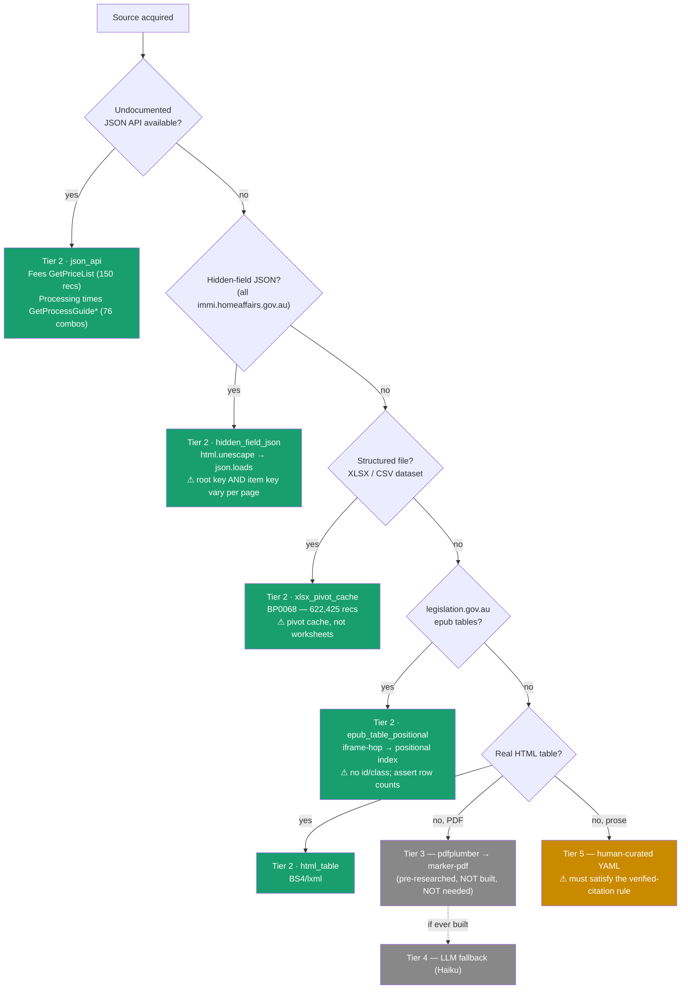
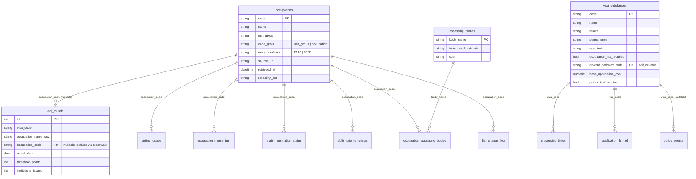
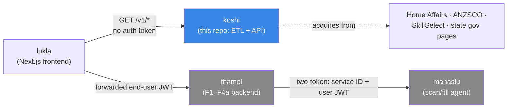
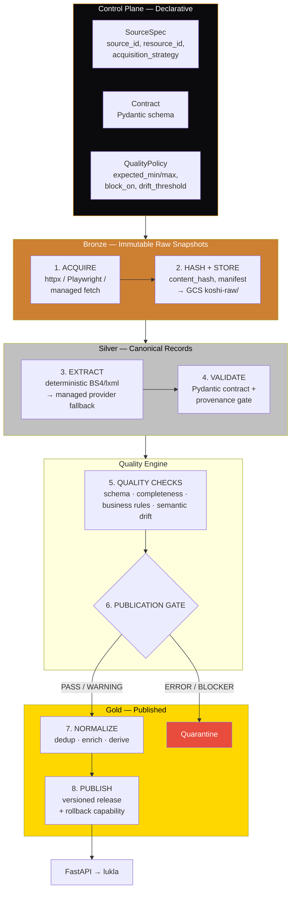
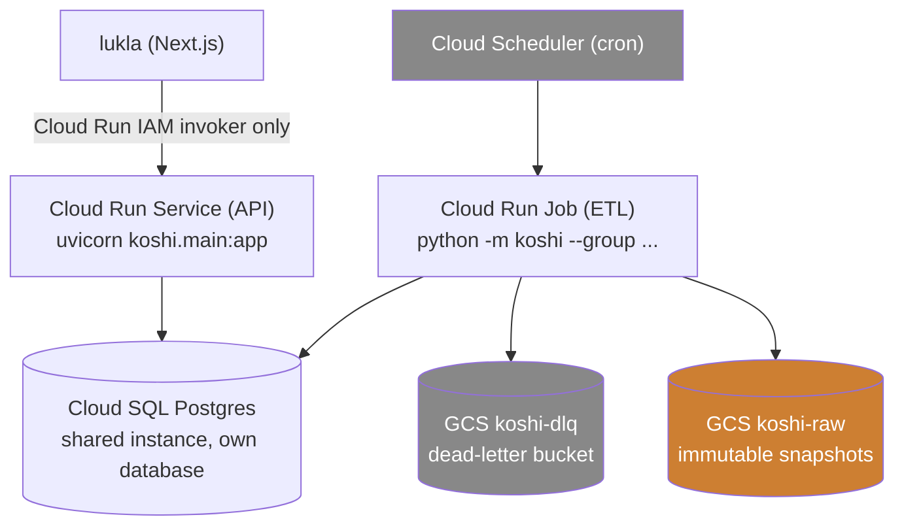

# koshi — ETL Pipeline Architecture (Canonical)

> ### 2026-08-18 (latest) — restructured: built leads, deferred follows
>
> This doc previously opened with ~700 lines of unbuilt medallion/control-plane
> design before reaching anything that runs today, and a reader couldn't tell
> "built" from "planned" without spotting status banners embedded mid-section.
>
> It is now three parts, **in this order**:
>
> - **Part I — What's Built and Running** (§1–§9): the real system. 6 sources,
>   8 tables (7 populated — `ceiling_usage` exists but is empty by design),
>   `python -m koshi` exits 0. Start here.
> - **Part II — Reference Architecture** (§10–§19): the medallion pipeline,
>   control plane, quality engine, provider ladder — legitimate design for
>   when koshi outgrows hand-run single-machine operation. Every section
>   carries a `⚠ DEFERRED` banner naming the trigger that would justify
>   building it. **Not a roadmap** — nothing here is scheduled.
> - **Part III — History** (§20): the diff against the doc this one replaced.
>
> No content was deleted in this pass — only reordered, banner-labelled, and
> (where a section's own claims had drifted from the code) corrected in
> place. Same file, same path, same canonical status.
>
> ### 2026-08-18 (earlier) — audit + build-out
>
> The 2026-08-17 three-agent audit fetched and decoded all 23 sources, and the
> six weeks that followed built Phase A of the roadmap end to end. Both are
> summarised in Part I; full evidence is in
> `docs/superpowers/research/source-audit/` (`CONSOLIDATED-FINDINGS.md`).

**Status:** Canonical — single source of truth for koshi's architecture.
**Date:** 2026-08-16 (rebuilt) · restructured 2026-08-18
**Author:** Prabin Karki (merged from prior drafts + feedback.md re-architecture)

> This doc **supersedes** the prior
> `2026-08-16-koshi-etl-architecture.md` (itself a merge of two earlier
> drafts). The code-grounded decisions from
> [`2026-08-15-koshi-etl-finalization-design.md`](2026-08-15-koshi-etl-finalization-design.md)
> and the runtime-state audit from
> [`../../ARCHITECTURE.md`](../../ARCHITECTURE.md) are preserved unchanged.
> The delta introduced by `feedback.md` — medallion pipeline, control-plane/data-plane
> separation, acquisition/extraction split, quality engine, provider strategy,
> versioned releases — is called out explicitly in §20.

---

## Table of Contents

**Part I — What's Built and Running**

1. [§1 Executive Summary](#1-executive-summary)
2. [§2 The Pipeline Today](#2-the-pipeline-today)
3. [§3 Source Catalog (Summary)](#3-source-catalog-summary)
4. [§4 Domain Model (Summary)](#4-domain-model-summary)
5. [§5 Regulatory Posture, Provenance & Watermarks](#5-regulatory-posture-provenance--watermarks)
6. [§6 Fault Tolerance & Resilience](#6-fault-tolerance--resilience)
7. [§7 Near-Term Roadmap](#7-near-term-roadmap)
8. [§8 Active Open Design Questions](#8-active-open-design-questions)
9. [§9 Success Criteria — What's True Today](#9-success-criteria--whats-true-today)

**Part II — Reference Architecture (Deferred)**

10. [§10 Target Architecture Overview — The Medallion Pipeline](#10-target-architecture-overview--the-medallion-pipeline)
11. [§11 The Source → Resource → Snapshot Model](#11-the-source--resource--snapshot-model)
12. [§12 Control Plane](#12-control-plane)
13. [§13 Data Plane](#13-data-plane)
    - [§13.1 Acquisition Layer — Immutable Raw Snapshots](#131-acquisition-layer--immutable-raw-snapshots)
    - [§13.2 Extraction Layer — Quality-Aware Provider Fallback](#132-extraction-layer--quality-aware-provider-fallback)
    - [§13.3 Canonical Contracts (Silver)](#133-canonical-contracts-silver)
    - [§13.4 Quality Engine](#134-quality-engine)
    - [§13.5 Normalization & Gold Layer](#135-normalization--gold-layer)
    - [§13.6 Generic Execution Model (pipeline_runs)](#136-generic-execution-model-pipeline_runs)
    - [§13.7 Versioned Releases & Rollback](#137-versioned-releases--rollback)
14. [§14 Provider Strategy & Bake-Off (Superseded)](#14-provider-strategy--bake-off-superseded)
15. [§15 Scheduling & Target Deployment](#15-scheduling--target-deployment)
16. [§16 Technology Alternatives — Every Stack Considered](#16-technology-alternatives--every-stack-considered)
17. [§17 Deferred Roadmap (Stages 1–5)](#17-deferred-roadmap-stages-15)
18. [§18 Deferred Open Design Questions](#18-deferred-open-design-questions)
19. [§19 Success Criteria — Target Vision](#19-success-criteria--target-vision)

**Part III — History**

20. [§20 What Changed vs. the Prior Doc](#20-what-changed-vs-the-prior-doc)

---
---

# Part I — What's Built and Running

---

## 1. Executive Summary

koshi is a headless ETL pipeline plus a read-only REST API for the Australian
skilled-migration system. It acquires structured data from government sources,
resolves it into a domain schema, and serves it as provenance-bearing facts
to `lukla` (the frontend).

**Live today (2026-08-18):**

| | |
|---|---|
| Sources extracted | **6** — JSA/ANZSCO (paginated), SkillSelect current round, SkillSelect round archive, ABS ANZSCO workbook, LIN 19/051, BP0068 |
| Tables | **8**, 7 populated — `occupations` (1,485), `occupation_titles` (1,929), `eoi_rounds` (786, 0 unresolved), `occupation_momentum` (140), `visa_subclasses` (62), `application_funnel` (432), `source_pages` (3). `ceiling_usage` is intentionally empty — the data is not published |
| Migrations | 11 |
| Tests | 136, all passing |
| Pipeline run | `python -m koshi` exits `0` end to end |
| API | `GET /v1/occupations`, `GET /v1/occupations/{code}` — serving real government data with verified provenance |

**What the system does, in one paragraph:** it fetches known government
pages and files (no link-following, no crawling — every source is an
explicit, catalogued URL), decodes them with one parser per source shape,
resolves SkillSelect's occupation *names* to ANZSCO codes via a two-source
crosswalk, persists with per-row isolation so one bad row never blocks the
rest, and computes occupation momentum from the resulting history.

### Key Design Decisions (built)

| Decision | Rationale |
|---|---|
| **Deterministic extraction only** | Every one of 23 catalogued sources is deterministically parseable — JSON API, hidden-field JSON, XLSX, epub tables, or plain HTML. Verified by the 2026-08-17 audit; no source needs JS rendering, a managed provider, PDF, or LLM extraction (§14). |
| **Provenance trio on every fact row** | `source_url`, `retrieved_at`, `reliability_tier` — enforced at construction time by `require_provenance()`, before a row exists. |
| **Two-watermark anti-freeze** | Content-changed and extraction-succeeded are tracked separately, so a parse failure retries automatically on the next run without a re-fetch. |
| **Per-row isolation** | A single bad row (SAVEPOINT-scoped) never aborts the batch it arrived in. |
| **Structural assertions alongside row-level tolerance** | Row-level tolerance and shape assertion pull in opposite directions and both are needed — tolerate the bad row, fail hard on the wrong shape (§6.5). |
| **LIN-first name→code crosswalk** | SkillSelect publishes occupation names, never codes. Two sources are unioned because neither alone is sufficient (132/140 each; union 140/140), and resolved in a fixed precedence order because the sources disagree on 3 titles. |
| **Honesty over completeness** | When a source doesn't exist or resists automation, say so — `ceiling_usage` ships empty rather than fabricated; `submitted_count` is permanently NULL. Never ship a fabricated number. |

Part II documents the **reference architecture** — the medallion pipeline,
control plane, and quality engine `feedback.md` specified. None of it is
wrong to have designed; it is not, however, what runs today, and building it
is gated on explicit triggers (§10–§19), not scheduled.

---

## 2. The Pipeline Today

`python -m koshi` runs these steps in order. Each is isolated — one step's
failure is logged and recorded in the run summary but does not stop the rest:

| Step | What it does |
|---|---|
| `sync_anzsco_occupations` | JSA listing, paginated (103 fetches, throttled via `resilience.Throttler`) |
| `sync_abs_occupations` | ABS Table 5 — the authoritative 1,076-occupation classification |
| `sync_occupation_titles` | Name→code crosswalk from LIN 19/051 + ABS, LIN-first |
| `sync_skillselect_rounds` | Current invitation round |
| `sync_skillselect_previous_rounds` | Historical rounds — what makes momentum possible |
| `sync_bp0068_grants` | Per-subclass grant counts + visa subclass taxonomy |
| `backfill_unresolved_round_codes` | Retries rows the crosswalk could not resolve when first stored |
| `seed_ceiling_usage` | Reads the (currently empty) ceiling seed |

The `backfill` step exists because an unchanged source page is never
re-parsed (§5.2's watermark), so a round unresolved once would stay
unresolved forever even as the crosswalk grew — which is exactly what
happened with `Cabinetmaker`, invited in live rounds under an ANZSCO 2013
code the 2022 classification dropped.

**Orchestration contract**, held by every sync step:

- Returns `list[Model]` (rows persisted this run); an empty list is never an
  error — it means "nothing new."
- A parse failure propagates, and the extraction watermark is **not**
  advanced, so the next run retries automatically.
- Each source is independently runnable and independently isolated from the
  others' failures.

---

## 3. Source Catalog (Summary)

> **Exhaustive URL catalog and source details are in the sibling doc:**
> [`docs/superpowers/research/2026-08-16-koshi-source-urls.md`](../research/2026-08-16-koshi-source-urls.md)
> — 23 sources with exact URLs, verified retrieval methods, tier assignments,
> cadence groups, and per-source notes, plus a `BUILT` vs `VERIFIED` status
> marker for each.

Strategy column names the mechanism, not the library — the mechanism is what
varies between sources, the library (BeautifulSoup4/lxml, stdlib
`zipfile`/`ElementTree`) mostly doesn't.

| # | Source | Tier | Strategy | Feeds | Status |
|---|---|---|---|---|---|
| 1 | ANZSCO occupations | 2 | *superseded by 18* | `occupations` | ✅ **BUILT** — paginated; superseded by source 18 as the authoritative code/title source |
| 2 | EOI invitation rounds | 2 | `hidden_field_json` (`content`) | `eoi_rounds` | ✅ **BUILT** — 140 rows |
| 3 | Migration program planning levels | 2 | `hidden_field_json` | `program_allocation` | VERIFIED, not built |
| 3b | Occupation ceilings | — | — | — | ❌ **404 / not published** |
| 4 | Visa fees | 2 | `json_api` — 150 recs | `visa_fees` (C21) | VERIFIED, not built |
| 5 | Points test criteria | 2 | `hidden_field_json` at `/points-table` | `points_criteria_reference` | VERIFIED, not built |
| 6 | Visa subclass static facts | 5 | YAML seed | `visa_subclasses` | ✅ **BUILT** (via BP0068, not the seed) — 62 rows |
| 7 | Health/character requirements | 5 | YAML seed | `eligibility_requirements` | VERIFIED, not built |
| 8 | Processing times | 2 | `json_api` — 76 combos | `processing_times` | VERIFIED, not built — needs stream key |
| 9 | MLTSSL/STSOL/ROL | 2 | `epub_table_positional` | `occupation_list_membership` (C20) | extractor exists, sync not built |
| 10 | Skills priority list | 2 | embedded JSON (`splData`) | `skills_priority_ratings` | VERIFIED, not built |
| 11 | State nomination status | 5 | YAML seed | `state_nomination_status` | VERIFIED — most columns NO SOURCE |
| 12 | State occupation list changes | 1→5 | hash-diff → YAML seed | `list_change_log` | VERIFIED, not built |
| 13 | Assessing bodies + join | 2 | `epub_table_positional` — LIN 19/051 T5/T6 | `assessing_bodies`, join | extractor exists, sync not built |
| 14 | Policy events | 5 | YAML seed | `policy_events` | VERIFIED — primary URL soft-404 |
| 15 | Funnel — invited | 2 | piggyback on 2 | `application_funnel.invited_count` | `submitted_count` permanently unpublished |
| 16 | Funnel — granted | 2 | `xlsx_pivot_cache` — BP0068 | `application_funnel.granted_count` | ✅ **BUILT** |
| 17 | SkillSelect previous rounds | 2 | `hidden_field_json` (`criteria`, item key `description`) | `eoi_rounds` history | ✅ **BUILT** — 646 rows over 4 usable rounds |
| 18 | ABS ANZSCO structure | 2 | XLSX Table 5 + Table 6 | `occupations`, `occupation_titles` | ✅ **BUILT** — 1,076 occupations + 1,425 titles |
| 19 | ABS ANZSCO↔OSCA correspondence | 2 | XLSX | `anzsco_osca_crosswalk` (C19) | VERIFIED, not built |
| 20 | Name→code crosswalk | derived | LIN-first union | `occupation_titles` (C22) | ✅ **BUILT** — 140/140 (139/140 before the edition fix) |
| 21 | BP0068 outcomes | 2 | `xlsx_pivot_cache` | funnel, visa taxonomy | ✅ **BUILT** — 622,425 records → 432 rows |
| 22 | English test bands | 2 | `epub_table_positional` (rowspan) | `english_test_bands` | VERIFIED, not built |
| 23 | legislation.gov.au OData | 2 | JSON API | `list_change_log.effective_date` | VERIFIED, not built |

**6 of 23 sources are built.** The remaining 17 are researched (URL, page
type, and retrieval method all verified) but have no extraction code yet —
see §7 for which are cheapest to add next.

### Tier Decision Tree

The tree branches on *delivery mechanism*, not markup shape — the original
version branched on "HTML with a stable table?", and for every
`immi.homeaffairs.gov.au` page the answer is *no*, which would have routed
koshi's largest source family to PDF or manual extraction it never needed.



**Tiers 3 and 4 are unused by every catalogued source and every built one.**
No koshi source is a PDF or needs an LLM to parse. Kept pre-researched for a
future source, but on no build path.

**No source requires JS rendering.** The "SharePoint SPA" concern that
justified keeping a headless browser in the stack came from a wrong catalogued
URL, not client-side rendering — see §14.

---

## 4. Domain Model (Summary)

> **Exhaustive schema, ERD, and migration details are in the sibling doc:**
> [`docs/superpowers/research/2026-08-16-koshi-data-model.md`](../research/2026-08-16-koshi-data-model.md)
> — all 22 domain tables with column definitions, constraints, FK
> relationships, migration numbering, and provenance conventions, each
> carrying its own Built/Target status.

### Entity-Relationship Diagram



Note `occupations` and `eoi_rounds` show the columns actually built
(`code_grain`, `anzsco_edition`, `occupation_name_raw`); `visa_subclasses`
and `assessing_bodies` show the originally-planned shape, not all of which is
built yet — see the data-model doc for each table's precise status.

> Standalone reference tables not shown above (for readability):
> `points_criteria_reference`, `english_test_bands`, `eligibility_requirements`,
> `program_allocation`, `policy_events` — all carry provenance but have no FKs.

### Table Inventory

**Built** — actual migration chain:

| Migration | Table / change | Key constraints |
|---|---|---|
| `0001`–`0006` | `occupations`, `eoi_rounds`, `ceiling_usage`, `occupation_momentum`, `source_pages` | Provenance trio on all fact tables |
| `0007` | `eoi_rounds.occupation_name_raw` | Unique key moved to `(visa_code, occupation_name_raw, round_date)` — the code is NULL when unresolved, and Postgres treats NULLs as distinct |
| `0008` | `occupations.code_grain` | CHECK `unit_group`/`occupation` |
| `0009` | `occupation_titles` (C22) | `UniqueConstraint(title_normalized, title_source)`; **no FK** to `occupations` |
| `0010` | `occupations.anzsco_edition` | Lets ANZSCO-2013-only codes coexist with 2022 |
| `0011` | `visa_subclasses` (C6) + `application_funnel` (C16) | `code` PK; `UniqueConstraint(visa_code, program_year)` |

⚠ **`application_funnel` deviates from the original plan in three ways**, each
deliberate: no `as_of_date` in the unique key (BP0068 is an annual
restatement, not a snapshot series), a single provenance trio rather than a
second one scoped to `granted_count` (only granted is sourced), and **no
funnel-order or non-negative CHECK** — BP0068 is confidentialised and one real
row reports **-2**.

**Not built** — no migration numbers are pre-allocated, since a stale plan
that contradicts the code is worse than none:

`english_test_bands`, `assessing_bodies`, `occupation_assessing_bodies`,
`points_criteria_reference`, `policy_events`, `state_nomination_status`,
`list_change_log`, `processing_times`, `program_allocation`,
`eligibility_requirements`, `skills_priority_ratings`, plus the audit's
additions `anzsco_osca_crosswalk` (C19), `occupation_list_membership` (C20)
and `visa_fees` (C21).

Constraint details for these live in the data-model doc, which is the single
source of truth for schema.

**Control plane tables** (Part II §12, not part of the domain tables):
`sources`, `resources`, `snapshots`, `extraction_strategies`, `contracts`,
`quality_policies`, `schedules`, `pipeline_runs`, `dataset_releases`.

### Provenance Convention

Every fact table carries `source_url` / `retrieved_at` / `reliability_tier`
(`official_scraped` | `official_curated` | `derived`). `occupation_momentum`
is the only table that omits `source_url` (always `derived`). A reserved
fourth value, `community_sourced`, exists for a future non-official source.

---

## 5. Regulatory Posture, Provenance & Watermarks

### 5.1 Non-Negotiable Regulatory Posture

Every response describes published facts only — never "you should/can/are
eligible/will." No scoring, no ranking as "best," no personalized prediction.
Phrase-ban tests in `tests/test_insights.py` enforce this against advice
language.

### 5.2 Provenance Trio

Every fact row carries:

| Column | Purpose | Example |
|---|---|---|
| `source_url` | The exact URL the fact was acquired from | `https://immi.homeaffairs.gov.au/...` |
| `retrieved_at` | UTC timestamp of acquisition | `2026-08-16T03:00:00Z` |
| `reliability_tier` | Confidence classification | `official_scraped` |

**Tier values**:
- `official_scraped` — Deterministic parser from an official government page.
- `official_curated` — Human-curated YAML seed, cited against an official source.
- `derived` — Computed from koshi's own rows (no `source_url`; cites source rows instead).
- `community_sourced` — **Reserved**, not used yet. For future non-official sources.

⚠ **A citation must point at a page that actually contains the fact.**
`require_provenance()` tests that `source_url`/`retrieved_at` are non-null,
not that the citation is *true* — which is how two `ceiling_usage` rows
shipped citing a page that does not contain per-occupation ceilings. Those
rows were removed; the verified-citation rule (data-model doc) now governs
every tier-5 seed.

### 5.3 The Two-Watermark Design

| Watermark | Column | Meaning | When Committed |
|---|---|---|---|
| Content changed | `source_pages.last_changed_at` | The page bytes changed | Before extraction is attempted |
| Extraction succeeded | `source_pages.last_extracted_at` | We successfully parsed + persisted | After parse + persist both succeed |

This is the anti-freeze mechanism: if parsing fails, `last_extracted_at` is
NOT advanced, so `_needs_extraction()` returns `True` on every subsequent run
until the parse finally succeeds. Built and live — every one of the 6 sync
steps in §2 checks `_needs_extraction()` before doing any work.

---

## 6. Fault Tolerance & Resilience

### 6.1 Modules

| Module | What it does |
|---|---|
| `logging_config.py` | Dual stdout + `RotatingFileHandler` (5MB × 3) → `logs/koshi.log` |
| `resilience.py` | `isolated_item()` (savepoint-scoped per-row isolation), `Throttler`, `parse_int_loose()` |
| `run_summary.py` | JSON run summary per invocation → `logs/summaries/run_<ts>.json` |
| `crawler/fetch.py` | Split timeout (`connect=10/read=15/write=10/pool=10`), tenacity retry (5 attempts, exp backoff 1→30s), typed `FetchError`, plus `fetch_text`/`fetch_bytes` for pages and files fetched outside `source_pages` registration |
| `extraction/homeaffairs.py` | Shared hidden-field decoder for 9 sources; shape/row-floor/root-key/item-key assertions |
| Every parser | Per-row `try/except`, `parse_int_loose`, return `ParseResult(rows, skipped)` |
| `seeds/loader.py` | Per-entry isolation via `load_seed_rows(path, *, row_builder)` |
| `pipeline.py` | Per-occupation try/except around the momentum-refresh loop (`refresh_momentum_for_codes`) |
| `__main__.py` | Per-step try/except + rollback + exit codes + run-summary wiring |

### 6.2 Failure Modes

| Failure mode | Built behavior |
|---|---|
| Network timeout / transient 5xx | Retry w/ backoff (tenacity), then `FetchError` |
| Malformed row | Skip + log that row, keep the rest |
| DB commit failure | `session.rollback()` per step; `isolated_item()` per row |
| One step fails | Per-step try/except — every step attempts; summary + exit code report which |
| 404/410 | Not specially distinguished yet — open question, §8 |

### 6.3 Exit Code Signaling

- `0` — clean success, all steps passed.
- `2` — partial failure (expected common state at 23 sources).
- `3` — total failure (no steps succeeded).
- `1` — fatal init (DB unreachable before any step runs, caught by an
  explicit liveness check — `SessionLocal()` alone doesn't open a
  connection).

### 6.4 Idempotency Guarantee

1. **Content hash** — unchanged snapshot → `_needs_extraction` returns `False` → no-op.
2. **Natural-key unique constraint** — re-extracted same data → DB rejects duplicates.
3. **`staged_keys`** — in-batch dedup prevents `UniqueViolation` rollback.
4. **`merge()`** for reference tables — upsert by primary key.

The whole pipeline is safe to re-run from scratch.

### 6.5 Structural Assertions

Row-level tolerance (per-row isolation, skip-and-continue) and structural
assertion pull in opposite directions, and both are needed. **These are not
hypothetical failure modes** — every one below either already happened in
production or was caught by building against real pages instead of synthetic
fixtures.

| # | Failure mode | Why row-level tolerance misses it | Built assertion |
|---|---|---|---|
| 1 | **100% skip rate** | Per-row isolation working as designed: every row fails, each is caught and skipped, the step reports `ok` with `count=0` | ✅ `assert_table_shape` asserts a row floor before the row loop — both parsers previously exited clean while extracting **zero rows**; now fixed |
| 2 | **Soft-404** | HTTP 200 with a "Page not found" body — `raise_for_status()` passes | ⬜ `homeaffairs.assert_not_soft_404` is written but not yet wired into the fetcher. `budget.gov.au/content/migration.htm` does this today |
| 3 | **Positional table drift** | LIN 19/051's epub tables have no `id`/`class`; if the document gains a table, a positional index silently becomes different data | ✅ `lin19051.py` asserts expected row counts (e.g. Table 5 = 505 incl. header) before trusting a positional index |
| 4 | **JSON key mismatch** | `previous-rounds` uses root key `criteria` and item key `description`, where every other page uses `content`/`block`; hard-coding either raises `KeyError` | ✅ `homeaffairs.decode_hidden_field` takes both keys as required arguments — no default, no sniffing |
| 5 | **Shape drift within a decoded page** | The SkillSelect parser expected 3 columns from a 2-column table; the `ValueError` was caught by the per-row handler and looked like 140 individual data-quality skips | ✅ Column count and header shape asserted before the row loop — a redesign now fails once, loudly, not 140 times |
| 6 | **False provenance** | `require_provenance` tests that `source_url`/`retrieved_at` are non-null, not that the citation is true | ✅ Caught in production (§5.2) — the fabricated `ceiling_usage` rows were removed; the verified-citation rule now governs tier-5 seeds |
| 7 | **Pivot-cache silence** | `openpyxl` would open BP0068 and return empty worksheets — no error, no data | ✅ `bp0068.py` reads the pivot cache directly (not the worksheets) and raises `Bp0068Error` if the record count is zero |

**Design principle:** tolerate the *individual bad row*; fail hard on *the
shape being wrong*. The distinguishing question is whether continuing would
produce a partial result or a silently empty/wrong one.

---

## 7. Near-Term Roadmap

The build order below is what actually happened and what's cheapest next —
**not** the medallion/control-plane roadmap in §17, which is deferred and
unscheduled. It optimises for *dependency order and source availability*, not
curation effort: the audit reclassified most remaining sources to Tier 2, so
almost nothing left is manual-curation work.

**Phase A — repair what exists** — ✅ **COMPLETE**

1. ✅ **Home Affairs hidden-field decoder** — `extraction/homeaffairs.py`;
   unblocks 9 sources. Takes root key *and* item key explicitly: both vary.
2. ✅ **SkillSelect parser** — 2-column fix + structural assertions (§6.5).
   0 → 140 rows.
3. ✅ **`occupation_titles` crosswalk** (C22) — LIN-first; 140/140 resolved.
4. ✅ **ANZSCO re-source** — to ABS **Table 5**, not Table 6. Table 6 is the
   coder list and includes non-occupations (`099960 Retired`), which makes it
   right for name→code resolution and wrong for defining the occupation set.
   Plus `anzsco_edition` (migration `0010`) and `code_grain` (`0008`).

**Phase A+ — not planned, forced by live runs.** Both were invisible to unit
tests and only appeared against real sources:

- **Pagination for the JSA listing.** One fetch returns 12 of 1,236
  occupations; the pager needs 103 sequential fetches. This is what finally
  wired up `resilience.Throttler`.
- **Historical round backfill** (source 17). Momentum needs a trailing window
  of three rounds and the current page publishes one, so the trend was null
  regardless of how well the crosswalk worked.
- **`backfill_round_codes` step.** A row unresolved once stayed unresolved
  forever: the page hasn't changed, so it is never re-parsed, even though the
  *crosswalk* may have grown since — §2's note on `Cabinetmaker`.

**Phase B — free wins, no new research required** (all verified, all Tier 2,
all still unbuilt). These are the cheapest remaining work: the decoder
exists, so each needs a parser and a table, not investigation.

5. Visa fees (`json_api`, 150 recs) → C21
6. Processing times (`json_api`, 76 combos) — **after** the stream migration
7. Points criteria (`/points-table`)
8. Program allocation (planning levels — Tier 2, not 5)
9. Eligibility requirements (decoded prose)

**Phase C — new domains, verified sources:**

10. English bands (`F2025L00905`, rowspan-aware) → replaces the Home Affairs page
11. Assessing bodies + join (LIN 19/051 T5/T6) — needs the abbreviation
    mapping. **The extractor exists** (`extraction/lin19051.py` reads Table 6);
    only the tables and sync are missing.
12. Occupation list membership (C20) + `list_change_log` via OData. **The
    extractor exists** (`parse_lin_occupation_lists`, verified 212/215/77).
13. Skills priority (JSA, vocabulary now confirmed)
14. ✅ **BP0068 → `granted_count` + visa taxonomy** — done, migration `0011`

**Phase D — hardest, least sourced (deliberately last):**

15. State nomination — most columns have **NO SOURCE**; VIC still blocked
16. Policy events — editorial; primary URL is a soft-404

**Prerequisite migrations:**

- ✅ `occupations`: `anzsco_edition` + code grain (F3, F9) — migrations
  `0008` and `0010`
- ⬜ `processing_times`: stream key + percentile fields (F1). **Not a
  migration** — the table does not exist, so this lands *with* the source
  rather than ahead of it.
- ✅ `visa_subclasses`: widened beyond 6 rows (F10) — 62 from BP0068,
  migration `0011`

**Dropped or deferred**: `ceiling_usage` (not published — see source 3b);
`application_funnel.submitted_count` (not published); `points_distribution`
(no confirmed source); tiers 3/4 (no catalogued source needs them);
Playwright and the managed-provider bake-off (no source needs them — §14);
serving-layer expansion (a wider endpoint inventory — separately deferred,
not part of this doc's near-term plan).

---

## 8. Active Open Design Questions

Questions about built or near-term-domain concerns. Deferred questions about
unbuilt control-plane/data-plane machinery are in §18.

**Closed:**

1. ~~`list_change_log`'s HTML structure~~ — **CLOSED.** Content is in an epub
   doc one iframe-hop away: 12 tables, no `id`/`class`, positional access.
   Version history comes from the OData API.
2. ~~`skills_priority_ratings`' rating vocabulary~~ — **CLOSED.** Exactly
   four values: `S` / `M` (metropolitan) / `R` (regional) / `NS`. `Ns` is a
   casing bug. `future_demand_rating` has no source at all.
3. ~~`application_funnel` dual provenance~~ — **CLOSED.** Only `granted_count`
   is sourced (from BP0068), so a single provenance trio describes the row
   honestly. A second trio is added if/when `invited_count` lands — see §4's
   deviation note.
4. ~~Parser return-type change (`ParseResult(rows, skipped)`)~~ — **CLOSED.**
   Shipped; every parser follows this shape.
5. `visa_subclasses.base_application_cost` provenance — **resolved in
   principle:** promote to a dedicated `visa_fees` table (data model C21).
   The fee API returns 150 records with per-stream variation, which cannot
   live as one scalar on a 6-row table regardless of provenance. Not yet
   built (Phase B item 5).
6. **404/410 handling** — still open. `crawler/fetch.py`'s `FetchError` does
   not currently distinguish a permanent 404 from a transient failure worth
   retrying.
7. ~~Migration numbering vs. landing order~~ — **CLOSED.** §4's Table
   Inventory now reflects the actual `0007`–`0011` chain rather than a
   catalog-index plan that had drifted from it.

**Open — from the 2026-08-17 audit:**

8. **What is `occupations`' primary key, exactly?** Sources join at 4-digit
   *and* 6-digit grain, across three simultaneously-live editions (ANZSCO
   2013, ANZSCO 2022, OSCA). The built answer keeps ANZSCO with an explicit
   `anzsco_edition` column and a crosswalk table — but the composite-key
   shape, and whether 4-digit rows coexist with 6-digit rows in one table or
   live in a separate `unit_groups` dimension, is still undecided. **This
   blocks 7 FKs**, so it should be settled before any new domain table lands.
9. **How are "either body" assessment requirements modelled?** LIN 19/051
   Table 5 lists some occupations as assessable by *either* of two
   authorities. A `(occupation, body)` join row cannot express a disjunction:
   two rows asserts both are required, one row loses information. Needs a
   `requirement_group` or an explicit `alternative_of` relationship.
10. **Does `ceiling_usage` survive?** The data is not published at 6-digit
    grain. Retire the table, re-grain it to 4-digit from an FOI release with
    no update cadence, or derive `issued` from BP0068 and drop `ceiling`
    altogether. All three are defensible; the choice is product, not
    technical.
11. **How are NO SOURCE columns surfaced in the API?** Roughly a dozen
    columns will permanently be NULL. A consumer cannot currently
    distinguish "not yet loaded" from "never published." Consider an
    explicit availability marker in the `SourcedFact` contract rather than a
    bare null.
12. **What is koshi's ANZSCO→OSCA migration trigger?** ANZSCO is being
    retired. The crosswalk defers the decision, but not indefinitely — what
    event (JSA dropping ANZSCO, the binding instrument being re-coded)
    forces the switch, and is the crosswalk sufficient to execute it when it
    comes?

---

## 9. Success Criteria — What's True Today

- Every fact row carries the provenance trio (or is explicitly `derived`),
  and the citation is verified to actually contain the fact (§5.2) — not
  just non-null.
- A malformed row in any parser or seed file is skipped and logged, never
  crashing the run — while a whole-*shape* failure (§6.5) is raised, not
  swallowed.
- `__main__.py`'s steps run independently; exit codes `0`/`2`/`3`/`1` signal
  clean/partial/total/fatal.
- Extraction stays fully deterministic. **No catalogued source requires a
  managed provider, JS rendering, PDF extraction, or LLM extraction** (§14)
  — verified by the audit across all 23 sources, not assumed.
- No PDF or Claude-fallback code exists (tiers 3/4 pre-researched only).
- No deployment/Terraform work has happened — local setup is not yet proven
  as the trigger for that work.
- No row ships without a source; no generated string states or implies a
  personalized outcome; zero end-user-identity code anywhere.
- This document references sibling docs for the exhaustive URL catalog and
  schema details rather than duplicating them inline.

Part II's §19 lists the criteria that describe the full target vision and
are **not** true yet.

---
---

# Part II — Reference Architecture (Deferred)

Everything below is legitimate design for koshi at a scale it has not
reached: many more sources, scheduled unattended runs, and enough data volume
that a bad row silently reaching the API becomes a real risk rather than a
theoretical one. None of it is on the near-term roadmap (§7). Each section
below states the trigger that would justify building it.

### What's Real Today vs. Target

| Dimension | Today (Part I) | Target (this Part) |
|---|---|---|
| Sources extracted | 6 | 23 cataloged sources |
| Tables populated | 7 of 8 | 22 domain tables |
| Extraction tiers in use | 2 — deterministic + manual curation | Same. **Tiers 3/4 are not needed by any catalogued source** |
| Fault tolerance | Retry/backoff, per-item isolation, structured logging, run summaries, structural assertions | + quality engine, quarantine, releases |
| Scheduling | Manual (`python -m koshi`) | Cadence groups documented, not active |
| Deployment | Local only | Local-first; GCP target documented |
| Medallion pipeline | Not built | Bronze snapshots → Silver contracts → Gold releases |

---

## 10. Target Architecture Overview — The Medallion Pipeline

> ⚠ **DEFERRED — not on the near-term roadmap.** Build when: Bronze snapshots
> become worth it — replay-without-refetch or snapshot diffing is actually
> needed, which realistically means either a managed-provider cost the team
> wants to amortise, or a source volatile enough that "what changed since
> last time" is a recurring question.

koshi is a **domain-agnostic ingestion and data-quality engine with
domain-specific contracts and normalization** for the Australian
skilled-migration system. It acquires structured data from web sources
(APIs, HTML, PDFs, files), validates it against canonical contracts, and
serves it as versioned, provenance-bearing facts via a read-only REST API.

The architecture adopts a **medallion (Bronze → Silver → Gold) pipeline**:

| Layer | Purpose | Immutability |
|---|---|---|
| **Bronze** | Raw, immutable snapshots of every source acquisition | ✅ Append-only, content-hashed |
| **Silver** | Cleaned, validated canonical records validated against Pydantic contracts | ✅ Filtered through quality gates |
| **Gold** | Normalized, query-optimized facts ready for the serving API | ✅ Published as versioned releases |

The engine separates **control** ("what should happen" — sources, contracts,
schedules, quality policies, provider policies) from **data** ("what needs to
happen" — acquisition, extraction, validation, publication), modeled as a
**source → resource → snapshot** hierarchy.

### Key Design Decisions (target)

| Decision | Rationale |
|---|---|
| **Separate acquisition from extraction** | Raw snapshots capture the original source artifact before any processing for true replayability |
| **Deterministic-first extraction** | Use cheapest mechanism (httpx + BS4) for simple HTML; managed providers (Firecrawl/Apify/Zyte) only when deterministic extraction fails quality gates |
| **Quality-aware provider fallback** | Don't accept extraction just because `success=True`; validate against quality gates before trying next provider |
| **Control plane + data plane** | Separate "what should happen" (configuration) from "what needs to happen" (execution) |
| **Source → Resource → Snapshot model** | One source may have multiple resources (URL, PDF, API); each resource has independent snapshots |
| **Generic execution model** | Unified `pipeline_run` with child tasks (acquisition, extraction, validation, quality, publication) for full lineage |
| **Severity-based quality** | INFO, WARNING, ERROR, BLOCKER levels with configurable publication policies and a quarantine path |
| **Dataset-specific quality rules** | Each contract defines its own expected record counts, required fields, uniqueness constraints, and semantic-drift thresholds |
| **Semantic drift detection** | LLM compares source text across snapshots to detect meaning changes, not just schema changes |
| **Versioned releases with rollback** | Every publication is a named `dataset_release`; rollback reverts `is_current` to any prior known-good release |
| **Domain-agnostic, reusable engine** | The ingestion/quality pipeline is designed to power NepalEarth (trekking routes, conservation data) with new contracts only |

### 10.1 Context Diagram



koshi is one of five repos in the Saathi product family, and the only one
with no end-user identity anywhere.

### 10.2 Medallion Architecture — End-to-End Flow

```mermaid
flowchart TB
    subgraph CONTROL["CONTROL PLANE"]
        SR["Source Registry"]
        CT["Contracts (Pydantic)"]
        SC["Schedules"]
        QP["Quality Policies"]
        PP["Provider Policies"]
        RM["Release Management"]
    end

    subgraph ACQUISITION["ACQUISITION — Bronze (Immutable)"]
        SRC["Source<br/>API / HTML / PDF / File"]
        ACQ["Acquisition<br/>HTTP · Browser · API client · Managed fetch"]
        RAW["Bronze Snapshot<br/>request.json · response.html · headers.json<br/>screenshot.png · manifest.json<br/>(Content-hashed, GCS koshi-raw/)"]
    end

    subgraph EXTRACTION["EXTRACTION → Silver"]
        EXT["Extraction<br/>HTML parser · PDF parser<br/>Firecrawl · Apify · Zyte · LLM"]
        CONTRACT["Canonical Contract<br/>Pydantic + version"]
    end

    subgraph QUALITY["QUALITY ENGINE"]
        QE["Quality Checks<br/>Schema · Completeness · Business rules<br/>Anomaly · Semantic drift"]
        GATE{"Publication Gate"}
    end

    subgraph STORAGE["GOLD — Published"]
        QUARANTINE["Quarantine"]
        NORM["Normalization"]
        GOLD["Gold Facts"]
        RELEASE["Versioned Release<br/>dataset_releases"]
        API["FastAPI → lukla"]
    end

    CONTROL --> ACQUISITION
    SRC --> ACQ
    ACQ --> RAW
    RAW --> EXT
    EXT --> CONTRACT
    CONTRACT --> QE
    QE --> GATE
    GATE -->|"PASS / WARNING"| NORM
    GATE -->|"BLOCKER"| QUARANTINE
    NORM --> GOLD
    GOLD --> RELEASE
    RELEASE --> API

    style CONTROL fill:#0b0b0d,color:#fff,stroke:#f5a623
    style ACQUISITION fill:#cd7f32,color:#fff,stroke:#cd7f32
    style EXTRACTION fill:#c0c0c0,color:#000,stroke:#c0c0c0
    style QUALITY fill:#888,color:#fff,stroke:#888
    style STORAGE fill:#ffd700,color:#000,stroke:#ffd700
    style QUARANTINE fill:#e74c3c,color:#fff
```



### 10.3 Medallion Layer Definitions

| Layer | Medallion | Purpose | Immutability | Storage |
|---|---|---|---|---|
| **Raw Snapshots** | Bronze | Original source artifact — request/response/headers/manifest — captured before any processing | ✅ Append-only, never mutated | GCS `koshi-raw/` + manifest in Postgres |
| **Canonical Records** | Silver | Cleaned, validated records extracted via contracts — deduped by natural key, quality-checked | ✅ Idempotent inserts; existing rows never mutated | Postgres fact tables |
| **Normalized Facts** | Gold | Denormalized, query-optimized facts ready for the API — joined, enriched, versioned as releases | ✅ Published as immutable `dataset_releases` | Postgres (serving schema) + Parquet (analytics) |

### 10.4 Pipeline Flow (target, stage-by-stage)



1. **Acquire** — HTTP/browser/managed fetch per resource's `acquisition_strategy`. Content is hashed (SHA-256) and stored immutably in GCS `koshi-raw/` with a manifest.
2. **Hash + Store** — Content hash and manifest committed to Postgres `snapshots` table. The snapshot exists before any extraction is attempted.
3. **Extract** — Tier-dispatched extraction from the raw snapshot (not a re-fetch). Deterministic BS4/lxml first; managed providers (Firecrawl/Apify/Zyte) only if quality gates fail.
4. **Validate** — Pydantic contract validation enforces schema at the boundary. `require_provenance()` (already built, §5.2) rejects invalid tier values, non-derived rows without `source_url`/`retrieved_at`, and future-dated `retrieved_at`.
5. **Quality Checks** — Severity-based checks (INFO/WARNING/ERROR/BLOCKER) against dataset-specific quality policies. Includes semantic drift detection.
6. **Publication Gate** — PASS/WARNING → proceed to normalization; ERROR/BLOCKER → quarantine.
7. **Normalize** — Dedup by natural key, enrich via joins, derive computed facts (momentum).
8. **Publish** — Versioned `dataset_release` created; `is_current` flag updated. Previous known-good release preserved for rollback.

**Orchestration, in the target shape:** the source registry
(`src/koshi/source_registry.py`, not built) would replace the current
hand-written `sync_*` functions (§2) with declarative registration — each
sync step is currently its own named function precisely because this
registry doesn't exist yet.

---

## 11. The Source → Resource → Snapshot Model

> ⚠ **DEFERRED — not on the near-term roadmap.** Same trigger as §10:
> Bronze snapshots need to be worth building before this hierarchy does.

The acquisition architecture models sources hierarchically:

```
Source (e.g., homeaffairs.gov.au)
  └── Resource (e.g., /visa-fees page)
        ├── Snapshot (2026-08-16, content_hash=abc123)
        │     ├── request.json
        │     ├── response.html
        │     ├── headers.json
        │     ├── manifest.json
        │     └── extraction_result.json  ← populated after extraction
        └── Snapshot (2026-09-01, content_hash=def456)
              └── ...
```

**Key insight**: One source may have multiple resources (a fees page, a PDF
report, an API endpoint), and each resource has independent snapshot history.
This lets koshi:

- Compare providers on the same input (re-extract from snapshot, not re-fetch).
- Replay extraction without re-acquiring (cost saving for managed providers).
- Debug extraction failures with full request/response context.
- Audit any published fact back to the exact bytes it came from.

### Source Types

| Type | Acquisition Strategy | Example |
|---|---|---|
| **URL** (HTML page) | `httpx` (deterministic) or Playwright (JS-rendered) or managed fetch (anti-bot) | Home Affairs visa fees page |
| **API** (JSON endpoint) | `httpx` with API-specific auth | Government open-data APIs |
| **PDF** (report) | `httpx` download → `pdfplumber` / `marker-pdf` | Occupation ceiling PDF |
| **File** (static dataset) | Download → `pandas` / `openpyxl` | JSA skills priority spreadsheet |

### Control Plane Tables (target)

```sql
CREATE TABLE sources (
    source_id TEXT PRIMARY KEY,
    name TEXT,
    description TEXT,
    domain TEXT,
    created_at TIMESTAMPTZ,
    updated_at TIMESTAMPTZ
);

CREATE TABLE resources (
    resource_id TEXT PRIMARY KEY,
    source_id TEXT REFERENCES sources(source_id),
    resource_type TEXT,  -- "url" | "pdf" | "api" | "file"
    locator JSONB,       -- {url: "...", method: "GET", headers: {...}}
    acquisition_strategy TEXT,  -- "http" | "browser" | "api_client" | "managed"
    created_at TIMESTAMPTZ
);

CREATE TABLE snapshots (
    snapshot_id UUID PRIMARY KEY,
    resource_id TEXT REFERENCES resources(resource_id),
    retrieved_at TIMESTAMPTZ,
    acquisition_strategy TEXT,
    http_status INT,
    content_type TEXT,
    content_hash TEXT,    -- sha256:abc123...
    etag TEXT,
    last_modified TEXT,
    gcs_path TEXT,        -- gs://koshi-raw/source_id=.../resource_id=.../...
    request_json JSONB,
    response_headers JSONB,
    manifest JSONB,
    acquisition_duration_ms INT,
    created_at TIMESTAMPTZ
);
```

---

## 12. Control Plane

> ⚠ **DEFERRED — not on the near-term roadmap.** Build when: hardcoded
> source constants in `pipeline.py` become painful to maintain by hand —
> realistically, once source count is well past today's 6, or once adding a
> source means touching more than one file.

**Purpose**: Define what should happen — configuration, policies, schedules.
The control plane is declarative: adding a new source means registering it
in the control plane, not writing new boilerplate orchestration code.

### Tables (target)

```sql
CREATE TABLE sources (           -- see §11)
CREATE TABLE resources (         -- see §11)
CREATE TABLE snapshots (         -- see §11)

CREATE TABLE extraction_strategies (
    strategy_id TEXT PRIMARY KEY,
    strategy_type TEXT,  -- "html_table" | "pdf_parser" | "semantic_extraction"
    provider TEXT,       -- "custom" | "firecrawl" | "apify" | "zyte"
    config JSONB,        -- schema, prompt, CSS selector
    priority INT,        -- 0 = first try, 1 = fallback
    created_at TIMESTAMPTZ
);

CREATE TABLE contracts (
    contract_id TEXT PRIMARY KEY,
    name TEXT,           -- "VisaFeeRecord", "OccupationRecord"
    version TEXT,        -- "v1"
    schema JSONB,        -- Pydantic schema as JSON
    domain TEXT,         -- "visa" | "nepal_earth"
    created_at TIMESTAMPTZ
);

CREATE TABLE quality_policies (
    policy_id TEXT PRIMARY KEY,
    contract_id TEXT REFERENCES contracts(contract_id),
    expected_min_records INT,
    expected_max_records INT,
    max_change_percent DECIMAL,
    required_fields TEXT[],
    uniqueness_fields TEXT[],
    block_on TEXT[],     -- ["schema_error", "required_field_missing", ...]
    semantic_drift_threshold DECIMAL DEFAULT 0.8,
    created_at TIMESTAMPTZ
);

CREATE TABLE schedules (
    schedule_id TEXT PRIMARY KEY,
    source_id TEXT REFERENCES sources(source_id),
    cadence TEXT,        -- "daily" | "weekly" | "monthly" | "quarterly" | "annual"
    freshness_sla INTERVAL,
    priority INT,        -- 1-10
    enabled BOOLEAN DEFAULT true
);
```

### Source Registry (Domain Config, target)

`src/koshi/sources/domains.yaml` would port the politeness settings from
`research/au-visa-sources/config.yaml`:

```yaml
domains:
  homeaffairs.gov.au:
    max_pages_per_domain: 15
    request_delay: 1.0
    timeout: 15
  jobsandskills.gov.au:
    max_pages_per_domain: 10
    request_delay: 1.0
    timeout: 15
  # ...

crawler:
  max_pages_per_run: 300
```

**Scoping call**: This is politeness limits, **not** an autonomous
link-following crawler. koshi's whole catalog is specific, already-known URLs,
each an explicit `SourceSpec` in the registry. The politeness pattern is
already followed today, just hardcoded — `resilience.Throttler` at a
1-second interval for the JSA pager (§7's Phase A+), not yet generalised into
per-domain config.

---

## 13. Data Plane

> ⚠ **DEFERRED — not on the near-term roadmap.** Build when: scheduling
> stops being manual (§15), or a bad row reaches the API unnoticed and
> there's no quarantine to have caught the next one.

**Purpose**: Execute what needs to happen — acquisition, extraction,
validation, quality checks, normalization, and publication.

### 13.1 Acquisition Layer — Immutable Raw Snapshots

Acquisition is **separate from extraction**. The raw source artifact is
captured before any processing occurs.

**Acquisition strategies**:
- **HTTP**: `httpx` for HTML, PDF, JSON APIs.
- **Browser**: Playwright for JS-rendered pages.
- **API client**: Specialized clients (e.g., government API SDKs).
- **Managed fetch**: Zyte API for blocked/anti-bot sites.

**Snapshot storage layout** (GCS):

```text
gs://koshi-raw/
  source_id=homeaffairs-visa-fees/
    resource_id=/visa-fees/
      retrieved_date=2026-08-16/
        content_hash=abc123/
          request.json          # {method, url, headers, body}
          response.html         # or response.json, response.pdf
          headers.json          # HTTP response headers
          screenshot.png        # optional, for browser acquisition
          manifest.json         # metadata
          extraction_result.json  # populated after extraction
```

**Manifest schema**:

```json
{
  "source_id": "homeaffairs-visa-fees",
  "resource_id": "/visa-fees",
  "retrieved_at": "2026-08-16T03:00:00Z",
  "acquisition_strategy": "http",
  "http_status": 200,
  "content_type": "text/html",
  "content_hash": "sha256:abc123...",
  "etag": "\"xyz789\"",
  "last_modified": "2026-08-15T12:00:00Z",
  "request_id": "req_abc123",
  "acquisition_duration_ms": 1234
}
```

**Conditional requests**: Use ETag/Last-Modified to avoid re-downloading
unchanged content. The snapshot is only created when content actually changes.

**Why immutable snapshots matter**:
- Replay any extraction without re-acquiring (cost-saving for managed providers).
- Compare providers on identical input.
- Debug extraction failures with full context.
- Audit published facts back to original source bytes.

### 13.2 Extraction Layer — Quality-Aware Provider Fallback

**Deterministic-first, managed-fallback** strategy. The provider ladder:

1. **Custom (`httpx` + `lxml`/BeautifulSoup)** — zero cost, fastest, used for
   deterministic HTML tables.
2. **Firecrawl** — LLM-powered schema extraction for complex pages. ~$0.05/verified extraction.
3. **Apify** — Actor-based extraction with custom logic. ~$0.05–0.50/1K pages.
4. **Zyte** — Anti-bot / JS-rendered page extraction. Cost varies.

**Quality-aware fallback algorithm**:

```python
async def extract_with_quality_aware_fallback(
    resource: Resource,
    strategies: list[ExtractionStrategy],
    contract: Contract,
    quality_policy: QualityPolicy,
) -> ExtractionResult:
    """Try providers in priority order. Only accept if quality gates pass."""
    for strategy in sorted(strategies, key=lambda s: s.priority):
        # Try extraction
        result = await strategy.extract(resource, strategy.config)

        # Validate against contract schema
        if not validate_schema(result.records, contract.schema):
            logger.warning("Schema validation failed for provider=%s", strategy.provider)
            continue

        # Run quality checks
        quality = await run_quality_checks(
            result.records, quality_policy,
            previous_snapshot=resource.last_snapshot,
        )

        if quality.status == "PASS":
            return result
        elif quality.status == "WARNING":
            log_warnings(quality.warnings)
            return result  # Accept with warnings logged
        # If ERROR/BLOCKER, try next provider

    raise ExtractionFailedError("All providers failed quality gates")
```

**Provider selection config**:

```yaml
extraction_strategies:
  - strategy_id: homeaffairs-visa-fees-extract
    strategy_type: html_table
    provider: custom          # priority 0 — try first
    config:
      css_selector: "#visa-fees-table"
      field_mapping: { ... }

  - strategy_id: homeaffairs-visa-fees-extract-fallback
    strategy_type: semantic_extraction
    provider: firecrawl       # priority 1 — fallback
    config:
      schema: { ... }
```

**Cost optimization**:
- Custom HTML parser: ~$0 (your infra).
- Firecrawl: $0.05/verified extraction or credits + token subscription.
- Apify: $0.05–$0.50/1K pages depending on Actor.
- Zyte: Variable (anti-bot proxy costs).

Use managed providers only when deterministic extraction fails quality gates
— and per §14, no source has needed one yet.

### 13.3 Canonical Contracts (Silver)

**Purpose**: Decouple extraction from storage. Domain-agnostic engine,
domain-specific contracts defined as Pydantic models.

```python
class VisaFeeRecord(BaseModel):
    """Silver contract for visa fee extraction."""
    visa_code: str
    base_application_cost: Decimal
    effective_date: date
    source_url: str
    retrieved_at: datetime
    reliability_tier: Literal["official_scraped", "official_curated", "derived"]
    provider: str
    extraction_timestamp: datetime
    schema_version: str = "v1"

class OccupationRecord(BaseModel):
    """Silver contract for ANZSCO occupation extraction."""
    code: str
    name: str
    unit_group: str
    source_url: str
    retrieved_at: datetime
    reliability_tier: Literal["official_scraped"]
    provider: str = "custom"
    extraction_timestamp: datetime
    schema_version: str = "v1"
```

**Benefits**:
- Parser tests are independent of database schema.
- Multiple storage projections (Postgres, Parquet, BigQuery).
- Schema evolution without breaking extraction.
- Validation at the boundary (Pydantic rejects invalid data before it reaches storage).

### 13.4 Quality Engine

The quality engine gates every record before it reaches Gold publication.

#### Severity Levels

| Level | Meaning | Publication Behavior |
|---|---|---|
| **INFO** | Minor anomalies | Logged, always passes |
| **WARNING** | Notable changes, may require review | Passes with warnings logged, alert sent |
| **ERROR** | Significant issues | Blocks publication unless explicitly overridden |
| **BLOCKER** | Critical failures | Always blocks publication; records → quarantine |

#### Quality Checks

| Check | Severity on Failure | Description |
|---|---|---|
| **Schema validation** | BLOCKER | Pydantic model validation rejects invalid records |
| **Row-count drift** | WARNING (>30%), BLOCKER (>80%) | Compare against dataset-specific expected range |
| **Duplicate detection** | BLOCKER | Natural key uniqueness constraint violation |
| **Required fields** | BLOCKER | Expected required fields missing |
| **Enumerated values** | ERROR | Value not in known vocabulary |
| **Date plausibility** | WARNING | `effective_date` in the future or implausible |
| **Cross-field consistency** | ERROR | e.g., `base_application_cost > 0` |
| **Semantic drift** | WARNING or ERROR | LLM-detected meaning change in source text |

#### Dataset-Specific Quality Policies

```yaml
quality_policies:
  - contract_id: VisaFeeRecord
    expected_min_records: 10
    expected_max_records: 50
    max_change_percent: 30
    required_fields: [visa_code, base_application_cost]
    uniqueness_fields: [visa_code]
    block_on: [schema_error, required_field_missing, duplicate_primary_key]

  - contract_id: EOIRoundRecord
    expected_min_records: 1
    expected_max_records: 10
    max_change_percent: 100  # EOI rounds vary widely
    required_fields: [visa_code, occupation_code, round_date]
    uniqueness_fields: [visa_code, occupation_code, round_date]
```

#### Semantic Drift Detection

Uses an LLM to compare source text across snapshots, detecting when the
*semantic meaning* changes — not just the schema or byte-level content:

```python
async def detect_semantic_drift(
    current_snapshot: Snapshot,
    previous_snapshot: Snapshot,
) -> SemanticDriftResult:
    prompt = f"""
    Compare these two versions of a government policy page.
    Has the meaning changed materially (not just formatting)?

    Previous version:
    {previous_snapshot.text[:5000]}

    Current version:
    {current_snapshot.text[:5000]}

    Respond with JSON:
    {{
      "semantic_drift_detected": true/false,
      "summary": "...",
      "confidence": 0.0-1.0
    }}
    """
    response = await llm.generate(prompt, response_format="json")
    return SemanticDriftResult(**response)
```

#### Publication Gate

```python
if quality_result.status == "PASS":
    publish(canonical_records)
elif quality_result.status == "WARNING":
    publish(canonical_records)
    alert_team(quality_result.warnings)
elif quality_result.status in ("ERROR", "BLOCKER"):
    quarantine(quality_result.rejected_records)
    alert_team(quality_result.errors)
    # Optionally: publish previous known-good release to avoid data gaps
```

### 13.5 Normalization & Gold Layer

Silver canonical records are normalized into Gold facts:

- **Deduplication** by natural key (DB unique constraint + in-batch `staged_keys` — the `staged_keys` half is already built, §6.4).
- **Enrichment** — joins across tables (e.g., occupation name onto EOI rounds).
- **Derivation** — computed facts (momentum) from Gold rows, citing source rows.
- **Projection** — storage-optimized schemas for Postgres serving and Parquet analytics.

### 13.6 Generic Execution Model (pipeline_runs)

Every run is tracked in a unified `pipeline_runs` table for end-to-end lineage:

```sql
CREATE TABLE pipeline_runs (
    run_id UUID PRIMARY KEY,
    parent_run_id UUID REFERENCES pipeline_runs(run_id),  -- for nested tasks
    run_type TEXT,  -- "acquisition" | "extraction" | "validation" | "quality" | "publication"
    source_id TEXT,
    resource_id TEXT,
    snapshot_id UUID REFERENCES snapshots(snapshot_id),
    status TEXT,    -- "pending" | "running" | "success" | "failure" | "blocked"
    started_at TIMESTAMPTZ,
    finished_at TIMESTAMPTZ,
    input JSONB,    -- serialized input (snapshot ref, contract ref, strategy ref)
    output JSONB,   -- serialized output (record count, quality result, release_id)
    error TEXT,
    metadata JSONB
);
```

**Benefits**:
- Unified lineage across all stages — trace any Gold fact back to its acquisition.
- Supports nested tasks (e.g., a publication run has child quality runs).
- Enables replay of specific stages without re-running the whole pipeline.
- Audit trail for every decision the quality engine made.

Today's `logs/summaries/run_<ts>.json` (§6.1) is the built, much simpler
analogue — one flat JSON file per invocation, no lineage graph, no nesting.

### 13.7 Versioned Releases & Rollback

Every publication creates an immutable `dataset_release`:

```sql
CREATE TABLE dataset_releases (
    release_id UUID PRIMARY KEY,
    created_at TIMESTAMPTZ,
    status TEXT,        -- "complete" | "partial" | "degraded"
    contract_id TEXT REFERENCES contracts(contract_id),
    pipeline_run_ids UUID[],
    record_count INT,
    quality_summary JSONB,
    metadata JSONB,
    is_current BOOLEAN DEFAULT false
);
```

**Release workflow**:
```
raw snapshot → extraction → canoncial records → quality gates → candidate release → published release
```

**API response metadata**:

```json
{
  "data": [...],
  "metadata": {
    "release_id": "2026-08-16T03:00:00Z",
    "status": "complete",
    "contract_id": "VisaFeeRecord",
    "source_last_updated": "2026-08-10T00:00:00Z",
    "freshness": "current",
    "partial": false
  }
}
```

**Rollback**: If a release is discovered to be wrong (semantic drift missed,
source error), roll back to any prior release:

```sql
-- Deactivate current release
UPDATE dataset_releases
SET is_current = false
WHERE contract_id = 'VisaFeeRecord' AND is_current = true;

-- Activate previous known-good release
UPDATE dataset_releases
SET is_current = true
WHERE release_id = 'previous_release_id';
```

The API always serves `is_current = true` releases. Rollback is instantaneous
— no data migration, no re-extraction.

---

## 14. Provider Strategy & Bake-Off (Superseded)

> ⚠ **DEFERRED, and unlikely to be revived as designed.** The 2026-08-17
> audit found no catalogued source that needs it — see the finding below.
> Kept for reference: if a future source genuinely resists deterministic
> parsing, the ladder and its cost model are ready to use.

### 14.1 Provider Ladder (target, unused)

koshi's original design used a **quality-aware fallback** provider strategy —
providers tried in priority order, the first that passes quality gates wins:

| Priority | Provider | Use Case | Cost | When to Use |
|---|---|---|---|---|
| 0 (first) | **Custom** (`httpx` + `lxml`/BS4) | Deterministic HTML tables | $0 | Always first choice |
| 1 | **Firecrawl** | LLM-powered schema extraction | ~$0.05/record | Complex HTML needing semantic extraction |
| 2 | **Apify** | Actor-based custom extraction | $0.05–0.50/1K pages | Sites needing JS rendering or custom logic |
| 3 | **Zyte** | Anti-bot, JS-rendered, blocked sites | Variable | Sites that block direct access |

### 14.2 The Finding That Superseded It

> **The bake-off's premise is largely gone.**
>
> The ladder existed to answer "when does `custom` (httpx + BS4) stop being
> enough, and what do we pay to escalate?" The audit fetched all 23 sources
> and the answer is: **it does not stop being enough.**
>
> | Question the bake-off was to answer | Audit finding |
> |---|---|
> | Which sources need JS rendering? | **None.** The one "SharePoint SPA" case was a wrong URL — the real page is static. |
> | Which need a managed extraction provider? | **None.** Every source is deterministic: JSON API, hidden-field JSON, XLSX, or epub tables. |
> | Which need LLM extraction (Tier 4)? | **None.** No source resists deterministic parsing. |
> | Which need PDF extraction (Tier 3)? | **None.** The one PDF-only candidate (occupation ceilings) turned out to be unpublished. |
>
> **Concrete simplifications this permits:**
>
> - **Drop Playwright/headless from the stack.** Nothing needs it. This
>   removes a heavy dependency, a browser install from deployment, and a
>   whole class of flakiness.
> - **Drop the Firecrawl/Apify/Zyte evaluation.** No source is blocked in a
>   way a managed provider fixes. VIC's Cloudflare block is the sole
>   exception and is a *residential-IP* problem, not an
>   extraction-capability one — evaluate a proxy for that single source if
>   it becomes important, not a provider ladder.
> - **Keep the `provider` column** in `extraction_strategies` (§12, unbuilt).
>   It costs nothing, and the fallback machinery stays available if a source
>   later hardens.
>
> **What replaced the ladder as the real risk:** not extraction capability
> but **source fragility** — positional epub tables with no `id`/`class`, a
> JSON root/item key that varies per page, pivot-cache-only workbooks, and
> soft-404s. The engineering effort the bake-off would have consumed went
> into the assertions in §6.5 instead — and, unlike the bake-off, every one
> of those has already caught a real bug.

The original Week-1 bake-off plan (10 test URLs, per-provider accuracy/cost/
latency measurement, feeding results into `extraction_strategies` rows) is
not reproduced here — the finding above made it moot before it was run.

### 14.3 Cost Model (target, unused)

```text
Total cost =
  acquisition_cost/source +
  extraction_cost/record +
  storage_cost/GB +
  compute_cost/run
```

| Component | Cost Driver | Estimate (pre-audit) |
|---|---|---|
| Acquisition | Per-source HTTP/browser calls | $0–50/mo (mostly free for simple HTTP) |
| Extraction | Per-record or per-page | Custom: $0; Firecrawl: $0.05/record; Apify: $0.05–0.50/1K pages |
| Storage | GB/month | GCS: ~$0.02/GB; Postgres: shared ~$25–50/mo |
| Compute | Cloud Run Job minutes | ~$0 for minutes/month |
| API | Cloud Run Service | ~$0–5/mo (min-instances 0) |
| **Total** | | **~$50–150/mo** depending on extraction provider usage — now a ceiling, not an expectation, since koshi is $0 on extraction today |

---

## 15. Scheduling & Target Deployment

> ⚠ **DEFERRED — not on the near-term roadmap.** Build when: moving off
> hand-running `python -m koshi`.

### 15.1 Cadence-Group Model (Documented, Not Active)

Running all 23 sources on one daily cron is wasteful — most change monthly or
less:

| Cadence | Sources | Trigger (once deployed) |
|---|---|---|
| Nightly | EOI rounds, processing times, momentum | Cloud Scheduler, 03:00 AEST |
| Weekly | Visa fees, visa subclass facts, state list changes | Monday 03:00 |
| Monthly | Ceilings, points test, English/health refs, funnel | 1st of month |
| Quarterly | Legislation lists, skills priority | Jan/Apr/Jul/Oct 1st |
| Annual | Funnel granted, assessing bodies | 1 July (program year start) |
| On-demand | Policy events | Manual trigger |

### 15.2 Target GCP Architecture



### 15.3 Deployment Rules (Unchanged)

- **Local-first** — nothing deploys until local setup is proven end to end.
- **Cloud Run (never GKE)** — family standard.
- **GitHub Actions + WIF (never Cloud Build)** — family standard.
- **Terraform in `karki-labs-infra`** — only after local is proven.
- **No end-user auth** — Cloud Run IAM invoker only; `lukla`'s service account is the sole granted identity.

### 15.4 Resource Specs & Marginal Cost

| Resource | Spec | Monthly cost (est.) |
|---|---|---|
| Cloud Run Job (ETL) | 1 vCPU, 2GB, timeout 30 min | ~$0 (runs minutes/month) |
| Cloud Run Service (API) | 1 vCPU, 512MB, min-instances 0 | ~$0–5 |
| Cloud SQL Postgres | Shared with saathi family | ~$25–50 (shared) |
| GCS (raw + DLQ) | Standard, ~5GB | ~$0.10 |
| Cloud Scheduler | 5–6 schedules | Free tier |
| Claude API (reserved) | Haiku, ~10 calls/month | <$0.10 |
| **koshi marginal total** | | **<$10/month** |

---

## 16. Technology Alternatives — Every Stack Considered

> ⚠ **Reference only — no trigger needed.** A record of what was evaluated
> and why, for whoever revisits a choice later. Skippable on a first read.

### 16.1 HTTP Fetch (Acquisition)

| Option | Verdict | Notes |
|---|---|---|
| **httpx** | ✅ Chosen | Modern, sync+async, already in repo |
| requests | ❌ Dropped | httpx already present |
| aiohttp | ❌ Dropped | Async adds complexity for 16 known pages |
| Scrapy | ❌ Dropped | Built for thousands of unknown pages |
| Playwright | ❌ Not needed | Audit confirmed no source is JS-rendered — see §14.2 |

### 16.2 HTML Parsing (Extraction)

| Option | Verdict | Notes |
|---|---|---|
| **BeautifulSoup4 + lxml** | ✅ Chosen | Fast, forgiving, already in repo |
| lxml.etree (raw) | ❌ Dropped | XPath-only, less ergonomic for messy gov HTML |
| parsel | ⚠️ Equivalent | Not worth a new dependency |
| selectolax | ⚠️ Fast | BS4+lxml is sufficient and already standard |

### 16.3 Managed Extraction Providers

| Option | Verdict | Notes |
|---|---|---|
| **Custom (httpx + BS4)** | ✅ Primary — and, per §14, the *only* mechanism any source has needed | $0, fastest |
| **Firecrawl** | ⚠️ Reserved, unused | LLM-powered schema extraction, ~$0.05/record — no source has needed it |
| **Apify** | ⚠️ Reserved, unused | Actor-based, ~$0.05–0.50/1K pages |
| **Zyte** | ⚠️ Reserved, unused | Anti-bot/JS-rendered, variable cost |

### 16.4 PDF Extraction (Tier 3 — Pre-Researched, Not Needed)

| Option | Cost | Verdict |
|---|---|---|
| **pdfplumber** | Free | Would be first choice, if ever needed |
| **marker-pdf** | Free (local) | Would be fallback #2 |
| LlamaParse | ~$0.003/page | Only if marker fails |
| Claude vision | ~$0.01/page | Last resort |
| pypdf | Free | ❌ Text-only, loses tables |

### 16.5 LLM Extraction (Tier 4 — Pre-Researched, Not Needed)

| Model | In/1K | Out/1K | Verdict |
|---|---|---|---|
| **Claude Haiku 4** | $0.001 | $0.005 | Would be chosen, if ever built |
| Claude Sonnet 4 | $0.003 | $0.015 | Complex reasoning only |
| GPT-4o-mini | $0.00015 | $0.0006 | Weaker structured output |

### 16.6 Orchestration / Scheduling

| Option | Verdict | Notes |
|---|---|---|
| **Manual `python -m koshi`** | ✅ Today | Simplest |
| **Cloud Run Jobs + Cloud Scheduler** | ✅ Target | Serverless, per-cadence |
| Airflow / Prefect / Dagster | ❌ Dropped | Operational overhead for 16 independent sources |
| Temporal / Celery | ❌ Dropped | Overkill for batch cadence |

### 16.7 Storage

| Option | Verdict | Notes |
|---|---|---|
| **Postgres (Cloud SQL)** | ✅ Chosen | Relational, FK constraints, family standard |
| **GCS (raw snapshots)** | ⚠️ Target, unbuilt | Immutable Bronze storage — §13.1 |
| BigQuery | ❌ Dropped | <1M rows; Cloud SQL is simpler |
| MongoDB | ❌ Dropped | Data is relational |
| DuckDB | ⚠️ Not needed | API is the consumer, not ad-hoc analytics |

### 16.8 Serving / API

| Option | Verdict | Notes |
|---|---|---|
| **FastAPI** | ✅ Chosen, built | Async, Pydantic validation, already in repo |
| Flask | ❌ Dropped | No native async/Pydantic |
| Django + DRF | ❌ Dropped | Too heavy for read-only API |

### 16.9 Deployment

| Option | Verdict | Notes |
|---|---|---|
| **Cloud Run** | ✅ Chosen, unbuilt | Family standard |
| GKE | ❌ Dropped | Explicitly forbidden per family rules |
| Cloud Build | ❌ Dropped | Explicitly forbidden per family rules |
| **GitHub Actions + WIF** | ✅ Chosen, unbuilt | Family CI/CD standard |
| **Terraform (karki-labs-infra)** | ✅ Target | Only after local is proven |

### 16.10 Fault Tolerance

| Option | Verdict | Notes |
|---|---|---|
| **tenacity** | ✅ Chosen, built | Ported pattern from `research/au-visa-sources` |
| **stdlib `logging`** | ✅ Chosen, built | Dual stdout + rotating file + JSON run summary |
| stamina / backoff | ⚠️ Equivalent | tenacity already the family pattern |

---

## 17. Deferred Roadmap (Stages 1–5)

> ⚠ **DEFERRED, entirely.** This is the medallion/control-plane/quality-engine
> build sequence `feedback.md` proposed. **Stage 1's fault-tolerance half is
> done** (§6) — its provider-bake-off half is superseded (§14). Stages 2–5
> have not started and have no trigger beyond "the Part II sections they
> build become worth building" (§10–§16's individual banners).
>
> This is a different sequence from §7's Phase A–D, which is real, current,
> and short. Do not conflate "Stage" (this section, deferred) with "Phase"
> (§7, active).

### Stage 1: Provider Bake-Off + Fault-Tolerance Retrofit

**Fault-tolerance retrofit — ✅ done.** Everything in §6's module list:
`logging_config.py`, `resilience.py`, `run_summary.py` — new modules.
`crawler/fetch.py` — split timeout, tenacity retry, `FetchError`. Every
parser — per-row isolation, `ParseResult(rows, skipped)`. `seeds/loader.py`
— per-entry isolation. `__main__.py` — per-step isolation + exit codes.

**Provider bake-off — superseded, not run.** See §14.

### Stage 2: Control Plane + Raw Snapshots

**Goal**: Build the control plane infrastructure and immutable snapshot storage.

**Tasks**:
- Create GCS bucket `koshi-raw/`.
- Implement `acquire_and_store_snapshot()` — capture request/response/headers/manifest.
- Persist snapshot metadata in Postgres `snapshots` table.
- Add replay from local snapshot (no network call required for re-extraction).
- Add conditional requests (ETag/Last-Modified to skip unchanged content).
- Build control plane tables: `sources`, `resources`, `contracts`, `schedules`, `extraction_strategies`, `quality_policies`.
- Source-registry refactor (`src/koshi/source_registry.py`) — generalize the orchestration skeleton.

**Deliverable**: Can acquire any source and store raw response immutably with
full replay capability.

### Stage 3: Three Vertical Slices

**Goal**: Build 3 representative end-to-end slices demonstrating the full
medallion pipeline, rather than all 18 contracts upfront.

**Slice A — Easy (HTML table)**:
- Source: ANZSCO occupations (already built — adapt to medallion pipeline).
- Acquisition: `httpx`.
- Extraction: `lxml`/BeautifulSoup.
- Contract: `OccupationRecord`.
- Quality: Schema validation, row-count checks.
- Storage: Postgres → Gold release.

**Slice B — was "difficult (JS/PDF or complex HTML)."** Superseded by the
audit (§14.2) — no such source exists in the catalog. If a genuinely
difficult source ever appears, design a slice around it then; there is
nothing to build against today.

**Slice C — Semantic (LLM extraction)**:
- Source: Unstructured policy page.
- Acquisition: `httpx`.
- Extraction: LLM with Pydantic schema.
- Contract: `PolicyEventRecord`.
- Quality: Semantic drift detection, human-review flag.
- Storage: Postgres → Gold release.

**Deliverable**: Vertical slices demonstrating the full Bronze → Silver →
Gold pipeline with quality gates.

### Stage 4: Quality Engine + Publication

**Goal**: Build severity-based quality gates, quarantine, and versioned releases.

**Tasks**:
- Implement severity-based quality checks (INFO/WARNING/ERROR/BLOCKER).
- Add dataset-specific quality policies (per-contract expected ranges, required fields, uniqueness).
- Implement semantic drift detection (LLM comparing snapshot text across versions).
- Build `quarantine` table/storage for rejected records.
- Implement publication gate (PASS/WARNING → publish; ERROR/BLOCKER → quarantine).
- Add `pipeline_runs` table for full lineage tracking.
- Add `dataset_releases` table with `is_current` flag.
- Implement release publication and rollback via `is_current` toggle.

**Deliverable**: Can validate extracted data against quality policies, block
bad records to quarantine, publish versioned releases, and roll back to any
prior known-good release.

### Stage 5: API + Deployment, Then Remaining Sources

**API + Deployment goal**: Build FastAPI serving layer (already built —
§1, §2) and deploy to Cloud Run.

**Tasks**:
- ~~Implement FastAPI endpoints~~ — done, `GET /v1/occupations{,/{code}}`.
- Separate ETL Job container from API Service container.
- Add Cloud Scheduler for per-cadence cron triggers.
- Add Cloud Monitoring alerts on exit codes 2/3.
- Wire GitHub Actions + WIF for CI/CD.

**Remaining sources goal**: Add the sources §7's Phase B–D don't cover, as
control-plane configuration + contracts, once the control plane (Stage 2)
exists. Until then, they land the way Phase B–D describes — as plain Python
parsers and tables, control-plane-free.

**Tasks**:
- Define contracts for remaining tables (§4).
- Configure extraction strategies per source.
- Add dataset-specific quality policies for each contract.
- Test end-to-end for each source.

**Deliverable**: Full 23-source catalog operational with quality-gated,
versioned releases.

---

## 18. Deferred Open Design Questions

Questions about unbuilt control-plane/data-plane machinery. Questions about
built or near-term-domain concerns are in §8.

1. **Multi-table `SourceSpec`** — `tables` is a tuple but a generalized
   `run_source_sync` would take one parser/persist; the SkillSelect→funnel
   piggyback (§2) can't be expressed by that contract as designed. Relevant
   once the source registry (§12) exists.
2. **Snapshot vs. overwrite** — most unbuilt reference tables don't say
   whether a change overwrites (losing prior value + `retrieved_at`) or
   appends. Decide point-in-time vs. current-state per table before Bronze
   snapshots (§10) make the distinction load-bearing.
3. ~~Two-pass `visa_subclasses` seed~~ — **CLOSED, moot.** `visa_subclasses`
   ended up built from BP0068 (§4), not the seed-loader pattern this
   question assumed — `sync_bp0068_grants` merges the subclass rows and
   flushes before the FK-dependent funnel insert in one straight pass. The
   deferred-FK hook this question asked for was never needed.
4. **GCS snapshot cost** — immutable append-only Bronze storage accumulates
   over time. Define a retention policy (e.g., keep last N snapshots per
   resource, or time-based TTL) before building §13.1.
5. ~~Provider bake-off ground truth~~ — **CLOSED, question dissolved.** No
   source needs a managed provider, JS rendering, PDF extraction or LLM
   extraction, so there is no bake-off to validate. See §14.
6. **Quarantine replay** — when a fix ships for a quarantined record, how
   does it re-enter the pipeline? Dedicated `replay --quarantine` command or
   re-extraction from the original snapshot? Relevant once quarantine
   (§13.4) exists.

---

## 19. Success Criteria — Target Vision

The parts of the full architecture that are **not** true yet — contrast with
§9's built criteria.

- Every acquisition produces an immutable Bronze snapshot with manifest,
  content hash, and full request/response/headers before any extraction.
- Every extraction validates against a versioned Pydantic contract before
  reaching storage.
- The quality engine gates every record: PASS → publish, WARNING → publish
  + alert, ERROR/BLOCKER → quarantine + alert.
- Every publication is a named, versioned `dataset_release` with rollback
  capability.
- `pipeline_runs` tracks every stage with parent/child lineage.
- Semantic drift detection runs on every extraction, comparing against the
  previous snapshot.

---
---

# Part III — History

---

## 20. What Changed vs. the Prior Doc

This section summarizes the delta that `feedback.md` introduces into the prior
canonical architecture doc (`2026-08-16-koshi-etl-architecture.md`, the
version this file overwrote back in the 2026-08-16 rebuild).

### Structural Changes

| Change | Prior Doc | This Doc |
|---|---|---|
| **Pipeline framing** | 8-stage ETL flow (Extract → Hash → Decide → Transform → Validate → Load → Derive → Advance) | Medallion pipeline: Bronze (acquisition) → Silver (contracts + extraction) → Gold (normalization + releases) |
| **Acquisition model** | Single `fetch_and_register()` — acquisition and extraction tightly coupled | **Acquisition separated from extraction** — immutable raw snapshots (request/response/headers/manifest) stored before any processing |
| **Source hierarchy** | Flat `SourceSpec` with one URL per source | **Source → Resource → Snapshot model** — one source may have multiple resources; each resource has independent snapshot history |
| **Control plane** | Implicit in `source_registry.py` and `SourceSpec` dataclass | **Explicit control plane** with dedicated tables: `sources`, `resources`, `snapshots`, `extraction_strategies`, `contracts`, `quality_policies`, `schedules` |
| **Execution lineage** | Implicit via watermarks | **Generic execution model** — `pipeline_runs` table with parent/child runs for full lineage from acquisition through publication |

### New Components

| Component | Description |
|---|---|
| **Quality engine** | Severity-based quality checks (INFO/WARNING/ERROR/BLOCKER) with dataset-specific policies, publication gate, and quarantine path |
| **Semantic drift detection** | LLM compares source text across snapshots to detect meaning changes, not just byte-level diffs |
| **Quality-aware provider fallback** | Custom (httpx+BS4) first; Firecrawl/Apify/Zyte only when deterministic extraction fails quality gates |
| **Versioned releases + rollback** | Every publication is a named `dataset_release`; rollback reverts `is_current` to any prior known-good release |
| **Provider bake-off** | Phase 0: empirical comparison of custom, Firecrawl, Apify on 10 URLs before committing to provider spend |

### Roadmap Changes (at the time of that comparison)

| Prior Doc | This Doc (as originally written) |
|---|---|
| Fault-tolerance → source registry → 12 sources in curation-effort order | Provider bake-off → control plane + raw snapshots → three vertical slices (easy HTML, difficult JS/PDF, semantic LLM) → quality engine + publication → API + deployment → remaining 13 sources |

Superseded since: the audit found no JS/PDF/LLM source (§14), so "difficult"
never had a slice to build (§17 Stage 3); "quality-aware fallback" never had
a case to trigger; the roadmap that actually executed is §7, not the table
above.

### Preserved Unchanged (at the time of that comparison)

- All source catalog entries and tier assignments (16 at the time; **23**
  after the 2026-08-17 audit — see §3).
- All domain tables and their migration mappings (18 at the time; **22**
  after the audit added C19–C22 — see §4).
- Regulatory posture, provenance trio, two-watermark design (§5).
- Local-first deployment rules (Cloud Run, never GKE; GitHub Actions + WIF, never Cloud Build).
- Technology alternatives analysis (§16).
- Fault-tolerance retrofit design (§6) — since built.
- Architecture principles.
- Mermaid diagrams (context, ERD, tier decision tree, GCP target) — adapted and extended, not removed.
- Sibling doc references: `docs/superpowers/research/2026-08-16-koshi-source-urls.md` and `docs/superpowers/research/2026-08-16-koshi-data-model.md`.

---

## Document History

| Date | Change |
|---|---|
| 2026-08-14 | Original design spec (why koshi exists + full intended model). |
| 2026-08-15 | Independent ETL architecture draft (survey + ERD + serving + deployment). |
| 2026-08-15 | Code-grounded ETL finalization spec (fault-tolerance audit, tier reconciliation). |
| 2026-08-16 | Canonical merge — mermaid diagrams, full technology-alternatives record. |
| 2026-08-17 | Three-agent source audit — 16 → 23 sources, tier tree rewritten, provider bake-off found unnecessary. |
| 2026-08-18 | Phase A built end-to-end: parsers fixed, crosswalk added, ANZSCO re-sourced, BP0068 ingested. `python -m koshi` exits 0. |
| 2026-08-18 (later) | Restructured into Part I (built) / Part II (deferred) / Part III (history) — no content removed, reordered and banner-labelled so built leads unbuilt. |
